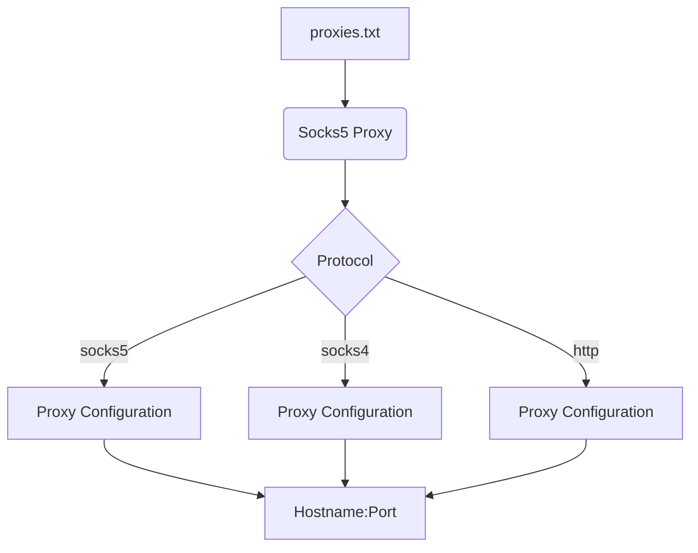

# Анализ кода

**1. <input code>**

```
socks5://208.102.51.6:58208
socks5://184.178.172.17:4145
socks5://192.252.208.67:14287
socks5://192.252.208.70:14282
socks5://192.111.129.145:16894
socks5://192.111.139.163:19404
socks5://184.178.172.25:15291
socks5://70.166.167.55:57745
socks5://70.166.167.38:57728
socks5://103.156.74.154:8199
socks5://5.39.69.35:29690
socks5://5.39.69.35:46544
socks5://34.124.190.108:8080
socks5://5.39.69.35:60096
socks5://172.104.209.44:1080
socks5://172.233.155.25:1080
socks5://172.104.164.41:1080
socks5://163.172.187.22:16379
socks5://184.168.121.153:47137
socks5://208.109.14.49:18854
socks5://184.168.121.153:11609
socks5://139.84.135.239:1080
socks5://188.166.230.38:20507
socks5://188.166.230.38:57946
socks5://103.143.88.9:1080
socks5://184.168.121.153:1052
socks5://184.168.121.153:20974
socks5://5.39.69.35:38322
... (many more lines)
```

**2. <algorithm>**

The code does not have an algorithm in the traditional sense. It's a list of proxy server configurations, formatted as strings. Each string represents a proxy, including its protocol (e.g., socks5, socks4, http), hostname, and port.  There's no execution flow to describe; the data is static.

**3. <mermaid>**



**4. <explanation>**

* **File Content:** The file `proxies.txt` contains a list of proxy server configurations in the format "protocol://hostname:port".  This is a very common format for specifying proxy servers to various applications.

* **No Code Structure:** There are no classes, functions, or imports in the provided text. It's a simple text file where each line represents a single proxy entry.


* **Data Format:** Each line is a string. Each string consists of the proxy protocol (socks5, socks4, http), followed by the hostname, and ending with the port number.  Examples: "socks5://192.168.1.1:1080", "http://example.com:80".

* **Potential Errors and Improvements:**
    * **Lack of Validation:**  The data in `proxies.txt` is not validated.  This file should be checked to ensure each line adheres to the correct format.  This would prevent errors later on if the code tries to parse an invalid line.
    * **Scalability:** If the file contains hundreds or thousands of proxies, loading all of them into memory at once could lead to performance issues. A more scalable approach would involve reading the file line by line, processing each proxy entry as needed, and possibly using a queue for storing and managing proxies.
    * **Error Handling:** Error handling should be implemented in any code that reads and uses the data from this file.  If a line does not match the required format, the code should gracefully handle the error and not crash.
    * **Security Considerations:** Ensure proper sanitization of proxy addresses in case external proxy configurations are being used. Improper input validation could allow malicious users to inject harmful proxies.
    * **Maintainability:** Using a more structured format, like JSON, to store proxies is a more maintainable approach for larger projects.


* **Relationship to other parts of the project:** The proxy list in `proxies.txt` would typically be used by a `webdriver` or a similar class in the project. This class would take this list as input to automate interactions with websites through a web browser (e.g., Selenium WebDriver) by using one of the entries for each website it needs to access.  The selection of a proxy should be handled reasonably to evenly distribute traffic among available proxies.


**In Summary:** The file `proxies.txt` is a simple, unprocessed list of proxy configurations. While straightforward, for production use, validation and better data structures are strongly recommended.