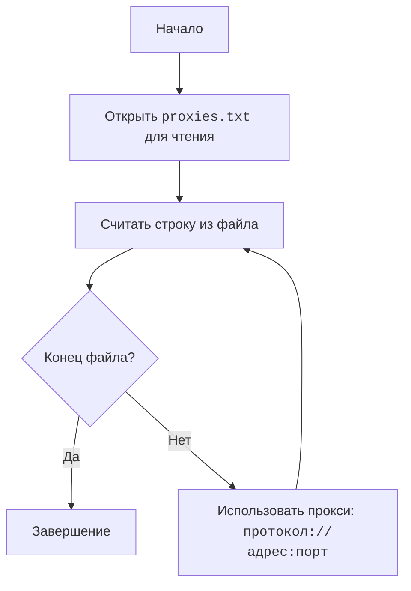

## ИНСТРУКЦИЯ:

Анализируй предоставленный код подробно и объясни его функциональность. Ответ должен включать три раздела:

1. **<алгоритм>**: Опиши рабочий процесс в виде пошаговой блок-схемы, включая примеры для каждого логического блока, и проиллюстрируй поток данных между функциями, классами или методами.
2. **<mermaid>**: Напиши код для диаграммы в формате `mermaid`, проанализируй и объясни все зависимости,
    которые импортируются при создании диаграммы.
    **ВАЖНО!** Убедитесь, что все имена переменных, используемые в диаграмме `mermaid`,
    имеют осмысленные и описательные имена. Имена переменных вроде `A`, `B`, `C`, и т.д., не допускаются!

    **Дополнительно**: Если в коде есть импорт `import header`, добавьте блок `mermaid` flowchart, объясняющий `header.py`:\
    ```mermaid
    flowchart TD
        Start --> Header[<code>header.py</code><br> Determine Project Root]

        Header --> import[Import Global Settings: <br><code>from src import gs</code>]
    ```

3. **<объяснение>**: Предоставьте подробные объяснения:
   - **Импорты**: Их назначение и взаимосвязь с другими пакетами `src.`.
   - **Классы**: Их роль, атрибуты, методы и взаимодействие с другими компонентами проекта.
   - **Функции**: Их аргументы, возвращаемые значения, назначение и примеры.
   - **Переменные**: Их типы и использование.
   - Выделите потенциальные ошибки или области для улучшения.

Дополнительно, постройте цепочку взаимосвязей с другими частями проекта (если применимо).

Это обеспечивает всесторонний и структурированный анализ кода.
## Формат ответа: `.md` (markdown)
**КОНЕЦ ИНСТРУКЦИИ**

## <алгоритм>

Файл `hypotez/src/webdriver/proxies.txt` содержит список строк, каждая из которых представляет собой прокси-сервер в формате `протокол://адрес:порт`. 
Процесс обработки файла заключается в последовательном чтении каждой строки и дальнейшем её использовании в качестве прокси для веб-драйвера. Поскольку в данном файле не представлен код обработки, его алгоритм выглядит следующим образом:

1. **Начало**: Процесс начинается с открытия файла `hypotez/src/webdriver/proxies.txt` для чтения.

    *Пример*: Файл открыт и готов к чтению.

2. **Чтение строки**: Из файла считывается одна строка.

    *Пример*: Первая строка файла - `socks5://208.102.51.6:58208`

3. **Проверка на конец файла**: Проверяется, была ли считанная строка пустой или равна None (если это конец файла).
    - Если строка пустая или `None`, переход к шагу 5 (Завершение).
    - Если строка не пустая, переход к шагу 4 (Использование строки).

    *Пример*: Строка не пустая и не None.

4. **Использование строки**: Считанная строка, представляющая прокси, используется для настройки веб-драйвера, например, передается в аргумент `--proxy-server` для Chrome или аналогичный параметр для других веб-драйверов.
   
    *Пример*: Строка `socks5://208.102.51.6:58208` используется для настройки прокси в веб-драйвере.

5. **Переход к следующей строке**: Процесс возвращается к шагу 2 (Чтение строки) для чтения следующей строки.
    
    *Пример*: Следующая строка `socks5://184.178.172.17:4145` считывается.

6. **Завершение**: Процесс завершается, когда все строки файла были обработаны.

    *Пример*: Когда файл закончится, чтение строк прекращается.

## <mermaid>


Данная `mermaid` диаграмма описывает поток управления процесса обработки прокси-серверов. 
- `Start` - это начало процесса.
- `OpenFile` - операция открытия файла `proxies.txt` для чтения. 
- `ReadLine` - чтение одной строки из файла.
- `CheckEOF` - логический блок проверки, достигнут ли конец файла.
- `End` - конец процесса.
- `UseProxy` -  использование считанной строки, содержащей информацию о прокси-сервере, для настройки веб-драйвера.

Зависимости:
Диаграмма не имеет прямых импортируемых зависимостей. В контексте реального кода, для работы с файлами и веб-драйверами могут использоваться библиотеки, однако, эти зависимости не отображаются в этом файле, так как это всего лишь текстовый файл с прокси, а не код.

## <объяснение>

Файл `hypotez/src/webdriver/proxies.txt` - это текстовый файл, содержащий список прокси-серверов, каждый на новой строке. Эти прокси могут быть разных типов (socks5, socks4, http), что указывается в начале каждой строки.

**Формат строк**:
- `socks5://<ip_address>:<port>`:  SOCKS5 прокси
    *Пример*: `socks5://103.156.74.154:8199`
- `socks4://<ip_address>:<port>`: SOCKS4 прокси
    *Пример*: `socks4://72.49.49.11:31034`
- `http://<ip_address>:<port>`: HTTP прокси
    *Пример*: `http://5.161.108.56:8888`

**Назначение**:
- Файл используется для хранения списка прокси-серверов, которые могут быть использованы при автоматизации веб-браузеров для обхода ограничений доступа, тестирования, скрапинга данных и прочих целей, где требуется использование прокси.

**Взаимосвязь с другими частями проекта**:
-  В проекте `hypotez`, данный файл, вероятно, используется модулем, который отвечает за настройку веб-драйвера. Это может быть компонент, который читает этот файл, парсит строки, и использует их для инициализации прокси-настроек при создании экземпляров веб-драйвера (например, Selenium).
-  Файл, вероятно, считывается через функцию `open` и `read`, а затем полученные строки используются для конфигурации webdriver.

**Переменные**:
- В данном файле переменных нет, так как это текстовый файл. 
В коде обработки, могут быть, например, строки `proxy_url`, которые будут считываться из файла и использоваться для настройки веб-драйвера.

**Потенциальные ошибки и области для улучшения**:

- **Формат файла**: Если в файле окажется строка, которая не соответствует ожидаемому формату `протокол://адрес:порт`, то в коде, который использует этот файл, может возникнуть ошибка. Код должен иметь валидацию формата.
- **Нерабочие прокси**: Не все прокси из списка могут быть работоспособными. Код, использующий этот файл, должен иметь механизм проверки работоспособности прокси-серверов (например, проверка подключения).
- **Обновление прокси**: Для обеспечения надежности, список прокси следует регулярно обновлять, и, возможно, добавить логику для автоматического обновления списка.
- **Количество прокси**: Файл очень большой, и это может замедлить работу, если все прокси будут считываться в память.
- **Уязвимость**: При использовании HTTP прокси, данные могут быть перехвачены, рекомендуется использовать зашифрованные протоколы (например, HTTPS или SOCKS5).

**Цепочка взаимосвязей**:

1. `proxies.txt` →  `webdriver_module` (Модуль, обрабатывающий прокси в веб-драйвере)
2. `webdriver_module` →  `selenium/playwright` (Инструмент для автоматизации браузера)
3. `selenium/playwright` → `browser` (Запущенный браузер)

Таким образом, файл `proxies.txt` является источником данных для настройки прокси-серверов, которые применяются в процессе автоматизации браузеров с использованием Selenium или Playwright. Этот файл помогает обходить сетевые ограничения и выполнять действия через прокси-серверы.