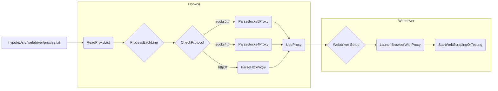

## Анализ файла `hypotez/src/webdriver/proxies.txt`

Этот файл содержит список прокси-серверов, каждый прокси представлен на отдельной строке. Прокси-серверы могут быть разных типов: `socks5`, `socks4` и `http`. Они используются для маршрутизации веб-запросов через другие IP-адреса, скрывая реальный IP-адрес пользователя.

### 1. <алгоритм>

Файл `proxies.txt` не является исполняемым кодом, поэтому его анализ не предполагает пошаговой блок-схемы. Вместо этого, алгоритм можно представить как процесс чтения и обработки каждой строки файла:

1.  **Открытие файла**: Файл `hypotez/src/webdriver/proxies.txt` открывается для чтения.
    *   Пример:  `with open("hypotez/src/webdriver/proxies.txt", "r") as f:`
2.  **Чтение строки**: Построчно считывается содержимое файла.
    *   Пример: `for line in f:`
3.  **Обработка строки**: Для каждой строки:
    *   **Разделение**: Строка проверяется и разбирается на составляющие части (протокол, IP-адрес, порт).
    *   Пример: `if line.startswith("socks5://"): ...`
    *   **Использование**: Каждая строка (прокси) может использоваться для настройки веб-драйвера при запуске браузера.
    *   Пример: `webdriver.Chrome(..., proxy = <прокси из строки>)`

Таким образом, файл предоставляет данные для последующего использования в других частях проекта, связанных с веб-драйверами и настройкой прокси.

### 2. <mermaid>

**Объяснение диаграммы `mermaid`:**

*   **A (proxies.txt):** Представляет сам файл `hypotez/src/webdriver/proxies.txt` как источник данных.
*   **B (ReadProxyList):** Представляет действие чтения списка прокси из файла.
*   **C (ProcessEachLine):** Представляет итерацию по каждой строке, считанной из файла.
*   **D (CheckProtocol):** Представляет проверку протокола, указанного в начале каждой строки (например, `socks5://`, `http://` и др.).
*   **E (ParseSocks5Proxy):**  Представляет функцию или блок кода, обрабатывающий прокси типа SOCKS5.
*   **F (ParseSocks4Proxy):**  Представляет функцию или блок кода, обрабатывающий прокси типа SOCKS4.
*   **G (ParseHttpProxy):** Представляет функцию или блок кода, обрабатывающий HTTP прокси.
*   **H (UseProxy):** Представляет действие передачи полученных данных прокси веб-драйверу.
*    **I (Webdriver Setup):** Представляет блок, где происходит настройка веб-драйвера с использованием информации прокси.
*   **J (LaunchBrowserWithProxy):** Представляет действие запуска браузера с заданными настройками прокси.
*   **K (StartWebScrapingOrTesting):** Представляет действие запуска процесса веб-скрейпинга или тестирования с использованием настроенного прокси.

**Зависимости, импортируемые при создании диаграммы `mermaid`:**
Диаграмма `mermaid` сама по себе не импортирует какие-либо зависимости, так как это просто описание графа. Однако, код, который будет использовать этот файл и данную диаграмму, может импортировать зависимости для работы с файлами, обработки строк и для работы с веб-драйверами:
* `open()`: для открытия файла `proxies.txt` и чтения его содержимого.
* `str.startswith()`: для проверки типа прокси.
* `str.split()`: для разделения строки на протокол, IP-адрес и порт.
*  Библиотеки веб-драйверов (например, `selenium` или `webdriver-manager`) для настройки и запуска браузера с заданным прокси.

### 3. <объяснение>

**Импорты**:
Так как файл `proxies.txt` это текстовый файл, то в нем самом нет импортов. Но, при использовании этого файла в других частях проекта,  могут потребоваться импорты, например:

   - `src.config`  - для получения пути к файлу proxies.txt, если он находится в конфигурации проекта
   - `selenium` или другие библиотеки для работы с webdriver - для настройки и управления браузерами
   - `webdriver_manager` - для управления версиями webdriver
   -  `logging` - для логирования ошибок или процесса обработки

**Классы**:
Файл `proxies.txt` не содержит классов, так как это файл данных, а не кода.
Примеры классов в контексте работы с proxies.txt, которые могут использоваться в проекте:

   -  `Proxy`: Класс для хранения данных прокси (протокол, IP, порт) и возможно какой-либо логики валидации или тестирования прокси.
   -  `ProxyList`: Класс для управления списком прокси, например, чтения из файла, выбор случайного или валидного прокси.

**Функции**:
Файл `proxies.txt` не содержит функций, так как это файл данных, а не кода.
Примеры функций в контексте работы с proxies.txt:

   - `read_proxies(file_path)`: Функция для чтения прокси из файла, которая принимает путь к файлу `proxies.txt` и возвращает список прокси в виде строк или объектов.
   -  `parse_proxy(proxy_string)`: Функция, которая принимает строку с прокси и возвращает разобранный объект прокси (протокол, ip, порт).
   - `validate_proxy(proxy_obj)`: Функция, которая проверяет, является ли прокси валидным и доступным.
   -  `select_proxy(proxy_list, strategy='random' )`: Функция, которая выбирает прокси из списка по какой-то стратегии, например, случайный или первый доступный прокси.
   - `configure_webdriver(browser, proxy)`: Функция, которая настраивает webdriver c конкретным прокси.
   - `generate_proxy_list(file_path)`: функция которая разбирает все строки файла в объекты прокси

**Переменные**:
Файл `proxies.txt` не содержит переменных, так как это файл данных, а не кода. Однако, в коде, который будет обрабатывать этот файл, могут быть следующие переменные:
    - `file_path` (str): Путь к файлу `proxies.txt`.
    -  `proxy_list` (list): Список строк, прочитанных из файла или объектов `Proxy`.
    - `line` (str): Строка, прочитанная из файла.
    - `protocol` (str):  Протокол прокси (например, "socks5", "http").
    - `ip_address` (str): IP-адрес прокси.
    - `port` (int): Порт прокси.

**Потенциальные ошибки и области для улучшения:**
    -   **Отсутствие проверки**: Код, считывающий данные из файла, должен проверять строки на корректность (наличие протокола, корректный формат IP-адреса и порта).
    -   **Нет механизма валидации**: Необходимо добавить функционал проверки доступности прокси (например, с помощью запроса), чтобы избежать использования неработающих прокси.
    -   **Нет стратегии выбора**: Требуется определить логику выбора прокси из списка (случайно, по порядку, с наилучшей скоростью и т.д.).
    -   **Не все типы прокси поддерживаются**: Нужно предусмотреть обработку новых или более сложных форматов прокси, если они появятся.
    -   **Обновление прокси**: Список прокси, может стать неактуальным. Необходим механизм обновления списка и перепроверки валидности прокси.
   -  **Обработка ошибок**:  Необходимо добавить обработку ошибок при чтении файла, парсинге строк и подключении к прокси.
   - **Мультипоточная обработка**: Если необходимо обрабатывать большое количество прокси, то стоит использовать мультипоточность для ускорения процесса проверки.
   - **Хранение информации**: Можно хранить информацию по использованным прокси (количество запросов, время использования, результат проверки).

**Взаимосвязи с другими частями проекта:**

- Файл `proxies.txt` является одним из ресурсов проекта `hypotez`, который используется модулями веб-драйвера для настройки прокси.
- Данные из этого файла используются при запуске браузеров через веб-драйверы для скрытия реального IP-адреса.
- Файл связан с частями проекта, отвечающими за веб-скрейпинг, тестирование, где требуется использование анонимных прокси.

Этот анализ дает полное представление о роли файла `proxies.txt` и его интеграции в проекте.