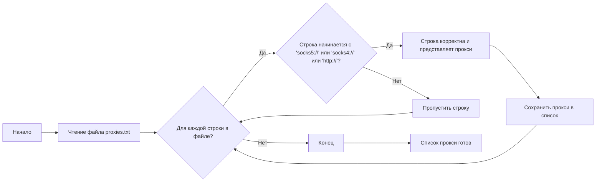

## Анализ кода: Список прокси-серверов

Этот файл `proxies.txt` содержит список прокси-серверов, каждый из которых представлен в виде строки. Эти прокси используются для маршрутизации сетевого трафика, обеспечивая анонимность или обход географических ограничений.

### 1. <алгоритм>

**Блок-схема:**



**Примеры для каждого логического блока:**

*   **`ReadFile`**: Чтение файла `proxies.txt`. Содержимое файла может выглядеть так:
    ```text
    socks5://208.102.51.6:58208
    socks5://184.178.172.17:4145
    invalid_proxy
    http://example.com:8080
    socks4://192.252.208.67:14287
    ```
*   **`ProcessLine`**: Проход по каждой строке файла.
*   **`CheckFormat`**: Проверка, начинается ли текущая строка с `socks5://`, `socks4://` или `http://`.
    *   Пример: строка `socks5://208.102.51.6:58208` удовлетворяет условию, т.к. начинается с `socks5://`.
    *   Пример: строка `invalid_proxy` не удовлетворяет условию.
*   **`ValidProxy`**:  Строка признана валидным прокси.
*   **`SkipLine`**:  Строка не является валидным прокси, поэтому пропускается.
*   **`StoreProxy`**: Валидный прокси сохраняется в список.
*  **`Output`**: Получен итоговый список валидных прокси.

**Поток данных:**

1.  Файл `proxies.txt` считывается в память.
2.  Строки файла обрабатываются одна за другой.
3.  Каждая строка проверяется на корректный формат прокси (начало с "socks5://", "socks4://" или "http://").
4.  В зависимости от результатов проверки строка либо пропускается, либо добавляется в список прокси.
5.  После обработки всех строк формируется итоговый список прокси.

### 2. <mermaid>

```mermaid
flowchart TD
    Start --> ReadFile[Read <br>proxies.txt]
    ReadFile --> ProcessLine{For each line <br>in file}
    ProcessLine -- Yes --> CheckPrefix{StartsWith <br>"socks5://" or <br>"socks4://" or <br>"http://"}
    CheckPrefix -- Yes --> StoreProxy[Store Proxy <br>in List]
    CheckPrefix -- No --> SkipLine[Skip invalid <br>proxy format]
     SkipLine --> ProcessLine
    StoreProxy --> ProcessLine
    ProcessLine -- No --> End[End]
     End --> Output[Return valid <br>Proxy List]
```

**Анализ импортированных зависимостей:**

В представленном коде нет импортов, так как это текстовый файл, содержащий список прокси.

### 3. <объяснение>

#### Импорты

В этом файле нет импортов, поскольку он является текстовым файлом данных, а не кодом Python.

#### Классы

В коде нет классов, поскольку это текстовый файл данных.

#### Функции

В коде нет функций, поскольку это текстовый файл данных.

#### Переменные

В данном файле нет переменных, поскольку он является текстовым файлом данных.
В процессе обработки файла (не в данном файле), используется список (переменная) для хранения прокси, извлеченных из каждой строки.

**Объяснение:**

*   **Назначение:** Файл `proxies.txt` содержит список строк, каждая из которых представляет собой прокси-сервер. Формат записи прокси следующий: `protocol://address:port` (`socks5://192.168.1.100:1080` или `http://192.168.1.100:8080` или `socks4://192.168.1.100:4153`). Протокол может быть `socks5`, `socks4` или `http`.  Эти данные могут использоваться веб-драйвером для настройки прокси, чтобы  управлять браузером.
*   **Типы:**
    *   Каждая строка в файле - это `str` (строка).
    *   Список прокси, используемый в процессе - это `list` of `str` (список строк).
*   **Использование:** Эти прокси могут быть использованы в коде для управления браузером, чтобы скрыть реальный IP-адрес и перенаправлять трафик через указанные прокси-серверы.

**Потенциальные ошибки и области для улучшения:**

*   **Обработка ошибок:** Файл никак не проверяется на валидность при чтении.
*   **Валидация формата:**  Код не проверяет корректность IP-адресов или портов прокси-серверов. Не все строки могут содержать корректные данные.
*   **Избыточные прокси:** Файл может содержать повторяющиеся прокси, которые могут быть не нужны.
*   **Протоколы:** В файл могут быть включены прокси, которые не поддерживаются в текущем веб-драйвере.

**Взаимосвязь с другими частями проекта:**

Этот файл может быть использован в качестве источника данных в других частях проекта, например, в модуле, который управляет веб-драйверами для автоматизации браузеров.  Файл `proxies.txt` используется в модуле `src.webdriver` для установки прокси в webdriver.

Данный файл `proxies.txt` является одним из источников данных и играет важную роль в обеспечении работы прокси в `webdriver`.