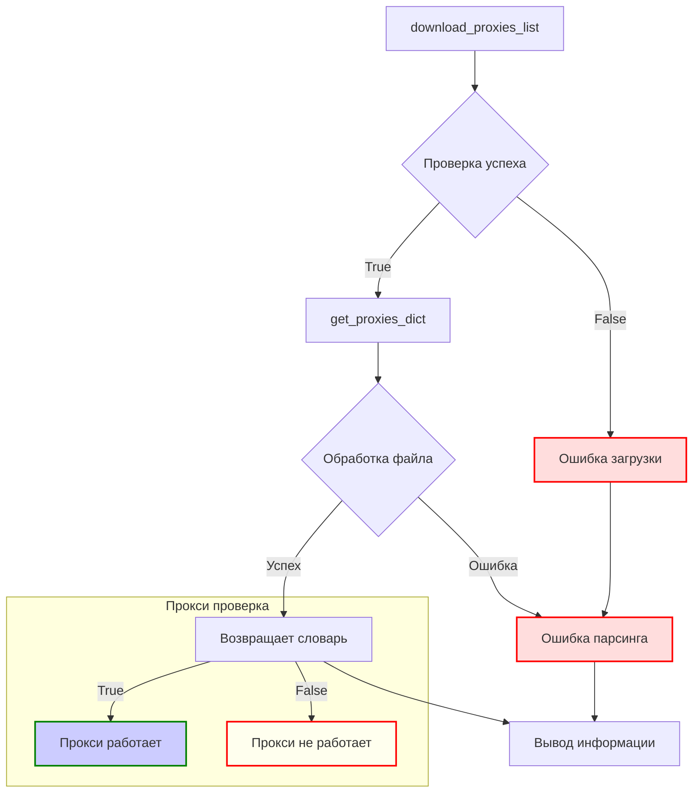

# <input code>

```python
## \file /src/webdriver/proxy.py
# -*- coding: utf-8 -*-\
#! venv/Scripts/python.exe
#! venv/bin/python/python3.12

"""
Модуль для работы с прокси
=========================================================================================

Этот модуль определяет функции для загрузки и парсинга списка прокси. 
Загружается текстовый файл с прокси-адресами и распределяется по категориям.

Пример использования
--------------------

.. code-block:: python

    download_proxies_list()
    proxies = parse_proxies()

"""

MODE = 'dev'

import re
import requests
from requests.exceptions import ProxyError, RequestException
from pathlib import Path
from typing import Any, Dict, List, Optional
import header
from src import gs
from src.utils.printer import pprint
from src.logger import logger

# URL источника списка прокси
url: str = 'https://raw.githubusercontent.com/proxifly/free-proxy-list/main/proxies/all/data.txt'

# Путь к файлу для сохранения списка прокси
proxies_list_path: Path = gs.path.src / 'webdriver' / 'proxies.txt'


def download_proxies_list(url: str = url, save_path: Path = proxies_list_path) -> bool:
    """
    Загружает файл по указанному URL и сохраняет его в заданный путь.

    :param url: URL файла для загрузки.
    :param save_path: Путь для сохранения загруженного файла.
    :return: Успешность выполнения операции.
    """
    try:
        # Отправка запроса на загрузку файла
        response = requests.get(url, stream=True)
        response.raise_for_status()  # Генерирует исключение для ошибок HTTP

        # Сохранение файла
        with open(save_path, 'wb') as file:
            for chunk in response.iter_content(chunk_size=8192):
                file.write(chunk)

        logger.info(f'Файл успешно загружен и сохранён в {save_path}')
        return True
    except Exception as ex:
        logger.error('Ошибка при загрузке файла: ', ex)
        ...
        return False


def get_proxies_dict(file_path: Path = proxies_list_path) -> Dict[str, List[Dict[str, Any]]]:
    """
    Парсит файл с прокси-адресами и распределяет их по категориям.

    :param file_path: Путь к файлу с прокси.
    :return: Словарь с распределёнными по типам прокси.
    """

    download_proxies_list()

    proxies: Dict[str, List[Dict[str, Any]]] = {
        'http': [],
        'socks4': [],
        'socks5': []
    }

    try:
        # Чтение файла
        with open(file_path, 'r', encoding='utf-8') as file:
            for line in file:
                match = re.match(r'^(http|socks4|socks5)://([\\d\\.]+):(\\d+)', line.strip())
                if match:
                    protocol, host, port = match.groups()
                    proxies[protocol].append({'protocol':protocol, 'host': host, 'port': port})
    except FileNotFoundError as ex:
        logger.error('Файл не найден: ', ex)
        ...
    except Exception as ex:
        logger.error('Ошибка при парсинге прокси: ', ex)
        ...

    return proxies


def check_proxy(proxy: dict) -> bool:
    """
    Проверяет работоспособность прокси-сервера.
    
    :param proxy: Словарь с данными прокси (host, port, protocol).
    :return: True, если прокси работает, иначе False.
    """
    try:
        # Попытка сделать запрос через прокси
        response = requests.get("https://httpbin.org/ip", proxies={proxy['protocol']: f"{proxy['protocol']}://{proxy['host']}:{proxy['port']}"}, timeout=5)
        # Проверка кода ответа
        if response.status_code == 200:
            logger.info(f"Прокси найден: {proxy['host']}:{proxy['port']}")
            return True
        else:
            logger.warning(f"Прокси не работает: {proxy['host']}:{proxy['port']} (Статус: {response.status_code})", None, False)
            return False
    except (ProxyError, RequestException) as ex:
        logger.warning(f"Ошибка подключения через прокси {proxy['host']}:{proxy['port']} :",ex)
        return False


if __name__ == '__main__':
    # Загрузка списка прокси и парсинг
    if download_proxies_list():
        parsed_proxies = parse_proxies()
        logger.info(f'Обработано {sum(len(v) for v in parsed_proxies.values())} прокси.')
```



```markdown
# <algorithm>

**Алгоритм работы модуля:**

1. **`download_proxies_list`**: Загружает файл с прокси-списком.
    * Берёт URL и путь к файлу в качестве параметров.
    * Использует `requests` для загрузки файла по URL.
    * Сохраняет загруженный файл в указанный путь.
    * Логирует успех или ошибку загрузки.
    * Возвращает True, если загрузка прошла успешно, иначе False.

2. **`get_proxies_dict`**: Парсит файл и группирует прокси по типу.
    * Вызывает `download_proxies_list()` для загрузки файла, если он не существует.
    * Создаёт словарь `proxies` с категориями `http`, `socks4`, `socks5`.
    * Читает файл построчно с помощью `open()`.
    * Для каждой строки применяет регулярное выражение для проверки формата строки прокси.
    * Если строка соответствует формату, то разделяет ее на протокол, хост и порт.
    * Добавляет прокси в соответствующую категорию в словаре.
    * Логирует ошибки (например, если файл не найден).
    * Возвращает словарь `proxies`.

3. **`check_proxy`**: Проверяет работоспособность прокси.
    * Принимает словарь с данными прокси.
    * Создаёт запрос `requests` с заданными прокси-сервером.
    * Проверяет статус ответа запроса.
    * Возвращает `True`, если запрос успешен, и `False` в противном случае. Логирует успешный результат и предупреждения.


# <explanation>

**Импорты:**

- `re`: Для работы с регулярными выражениями.
- `requests`: Для отправки HTTP-запросов.
- `ProxyError`, `RequestException`: Для обработки ошибок при работе с прокси.
- `Path`: Из `pathlib` для работы с путями к файлам.
- `typing`: Для определения типов переменных.
- `header`, `gs`, `pprint`, `logger`: Из пользовательских модулей проекта (`src`).
    -  `header`: Скорее всего, содержит конфигурационные параметры или настройки.
    - `gs`: Скорее всего, содержит глобальные настройки или вспомогательные функции для работы с файловой системой.
    - `pprint`: Используется для форматированного вывода данных.
    - `logger`: Используется для логирования событий и ошибок.

**Классы:**

В данном коде нет классов. Все функциональность реализована в функциях.

**Функции:**

- **`download_proxies_list`**: Загружает список прокси из внешнего источника и сохраняет его локально.  Ожидаются корректные URL и путь для сохранения файла.
- **`get_proxies_dict`**: Парсит загруженный список прокси, группируя прокси по типу (HTTP, SOCKS4, SOCKS5) в словарь.  Ожидается корректный формат файла.
- **`check_proxy`**: Проверяет работоспособность прокси-сервера путём отправки запроса через него. Возвращает `True` в случае успеха и `False` в случае ошибки.  Ожидается, что доступно интернет соединение, проверяемый прокси валидный, и целевой ресурс (`httpbin.org/ip`) доступен.

**Переменные:**

- `url`: Строка, содержащая URL для загрузки списка прокси.
- `proxies_list_path`: Объект `Path`, представляющий путь к файлу с прокси.
- `proxies`: Словарь, содержащий список прокси, сгруппированных по типу.
- `proxy`: Словарь, содержащий данные отдельного прокси.

**Возможные ошибки и улучшения:**

- **Обработка ошибок:** Хорошая обработка ошибок (try-except блоки), но можно добавить более детальную информацию об ошибках в логи.
- **Время ожидания:** Добавление таймаута (timeout) к запросу `requests` повысит устойчивость.
- **Обработка некорректных данных:** Регулярное выражение должно проверяться на случаи, когда данные могут быть повреждены или не соответствуют ожидаемому формату.
- **Проверка наличия файла:** В функции `get_proxies_dict` следует добавить проверку на существование файла и обработать случаи, когда файла нет, без перезагрузки скачивания.

**Взаимосвязь с другими частями проекта:**

- `gs`: Модуль `gs` вероятно содержит глобальные конфигурации проекта, такие как пути к папкам.
- `utils.printer`, `logger`: Модули для вывода информации и логирования, соответственно. Это части общей системы логирования и вывода информации.
- `webdriver`:  Возможно, это часть проекта, которая использует прокси для взаимодействия с веб-драйверами.