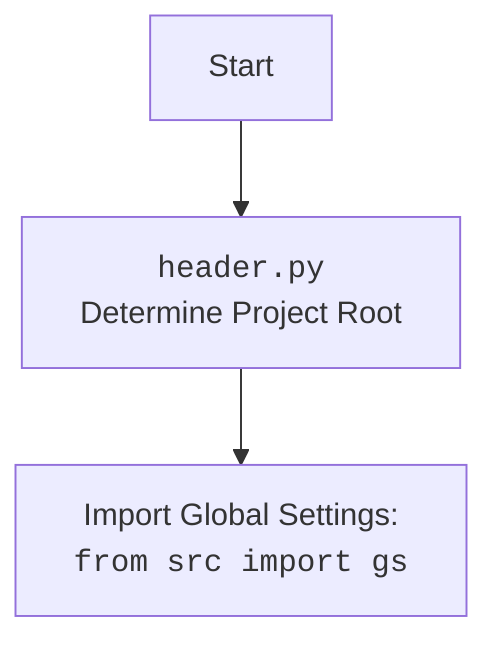

## <алгоритм>

1.  **`download_proxies_list(url, save_path)`**:
    *   Начало: Функция принимает URL источника прокси (`url`) и путь для сохранения файла (`save_path`).
    *   Пример: `download_proxies_list(url='https://example.com/proxies.txt', save_path='/tmp/proxies.txt')`
    *   Запрос: Отправляет HTTP GET-запрос к `url` используя `requests.get(url, stream=True)`.
        *   Пример: `response = requests.get('https://example.com/proxies.txt', stream=True)`
    *   Проверка статуса: Проверяет, что HTTP-статус ответа 200,  в случае ошибки выбрасывает исключение.
        *   Пример: `response.raise_for_status()`
    *   Сохранение: Сохраняет содержимое ответа в файл по пути `save_path` с помощью итерации по чанкам, размер чанка 8192 байта.
        *   Пример: Открытие файла на запись `with open('/tmp/proxies.txt', 'wb') as file:`.
    *   Успех: Логирует сообщение об успешной загрузке и возвращает `True`.
    *   Ошибка: Ловит исключение, логгирует ошибку и возвращает `False`.
2.  **`get_proxies_dict(file_path)`**:
    *   Начало: Функция принимает путь к файлу с прокси (`file_path`).
    *   Пример: `get_proxies_dict(file_path='/tmp/proxies.txt')`
    *   Вызов `download_proxies_list()`: Загружает файл со списком прокси (если его еще нет)
    *   Инициализация: Создает пустой словарь `proxies` для хранения прокси по типам (http, socks4, socks5).
    *   Чтение файла: Открывает файл на чтение.
    *   Парсинг каждой строки: Для каждой строки файла:
        *   Использует регулярное выражение `r'^(http|socks4|socks5)://([\d\.]+):(\d+)'` для извлечения типа, хоста и порта прокси.
        *   Пример: `match = re.match(r'^(http|socks4|socks5)://([\d\.]+):(\d+)', 'http://127.0.0.1:8080')`
        *   Если строка соответствует шаблону: добавляет извлеченную информацию в соответствующий список в `proxies`.
            *   Пример: `proxies['http'].append({'protocol': 'http', 'host': '127.0.0.1', 'port': '8080'})`
    *   Обработка ошибок: Ловит исключения `FileNotFoundError` и другие исключения,  логирует ошибки.
    *   Возврат: Возвращает словарь `proxies`.
3. **`check_proxy(proxy)`**:
    *   Начало: Функция принимает словарь с данными прокси (`proxy`).
    *   Пример: `check_proxy(proxy={'protocol': 'http', 'host': '127.0.0.1', 'port': '8080'})`
    *   Запрос: Пытается сделать GET-запрос к `https://httpbin.org/ip` через указанный прокси, устанавливает таймаут 5 секунд.
         *   Пример: `requests.get("https://httpbin.org/ip", proxies={'http': "http://127.0.0.1:8080"}, timeout=5)`
    *   Проверка статуса: Проверяет, что HTTP-статус ответа равен 200.
        *   Успех: Логирует сообщение об успехе и возвращает `True`.
        *   Неудача: Логирует сообщение о неудаче и возвращает `False`.
    *   Обработка ошибок: Ловит исключения `ProxyError` и `RequestException` и логгирует ошибку.
    *   Возврат: Возвращает `False` при ошибке.
4.  **`if __name__ == '__main__':`**:
    *   Начало: Запускает код, если скрипт запущен напрямую.
    *   Вызов `download_proxies_list()`: Загружает список прокси.
    *   Вызов `get_proxies_dict()`:  Парсит загруженный список.
    *   Логирование:  Выводит количество обработанных прокси.
        *   Пример:  `logger.info(f'Обработано {sum(len(v) for v in parsed_proxies.values())} прокси.')`

## <mermaid>

```mermaid
flowchart TD
    Start[Start] --> DownloadProxies[download_proxies_list(url, save_path)]
    DownloadProxies -- Success --> ParseProxies[get_proxies_dict(file_path)]
    DownloadProxies -- Failure --> End[End]
    ParseProxies --> LoopStart[Loop through Proxies]
    LoopStart --> CheckProxy[check_proxy(proxy)]
    CheckProxy -- Proxy works --> LoopContinue[Continue loop]
    CheckProxy -- Proxy does not work --> LoopContinue
    LoopContinue --> LoopEnd{End of Loop?}
    LoopEnd -- Yes --> End
    LoopEnd -- No --> LoopStart
    End[End]


    classDef function fill:#f9f,stroke:#333,stroke-width:2px
    class DownloadProxies,ParseProxies,CheckProxy function
```



## <объяснение>

### Импорты:

*   `re`:  Используется для работы с регулярными выражениями, применяется при парсинге строк с прокси-адресами, чтобы извлечь тип прокси, хост и порт.
*   `requests`: Библиотека для отправки HTTP-запросов. Используется для загрузки списка прокси из интернета и для проверки работоспособности прокси.
*   `requests.exceptions.ProxyError`, `requests.exceptions.RequestException`:  Исключения, специфичные для библиотеки `requests`. Позволяют обрабатывать ошибки, связанные с прокси и HTTP-запросами.
*   `pathlib.Path`:  Класс для работы с путями к файлам и директориям, позволяет создавать и обрабатывать пути к файлам кроссплатформенно.
*  `typing.Any`, `typing.Dict`, `typing.List`, `typing.Optional`: Используются для аннотации типов, улучшая читаемость и облегчая отладку кода.
*   `header`:  Импортируется модуль, который определяет корень проекта и инициализирует основные переменные. (см.  mermaid для header.py)
*   `src.gs`: Импортируются глобальные настройки проекта, такие как пути к файлам.
*   `src.utils.printer.pprint`: Функция для красивого вывода на экран.
*   `src.logger.logger.logger`:  Объект логгера для записи сообщений в лог-файл.

### Переменные:

*   `url`:  `str` -  URL, по которому находится список прокси.
*   `proxies_list_path`:  `Path` - Путь к файлу, куда будет сохранен список прокси.

### Функции:

*   **`download_proxies_list(url, save_path)`**:
    *   **Аргументы**:
        *   `url`:  `str` - URL для скачивания файла.
        *   `save_path`: `Path` -  Путь для сохранения файла.
    *   **Возвращает**: `bool` - `True` в случае успеха, `False` в случае ошибки.
    *   **Назначение**: Загружает список прокси из интернета и сохраняет его в локальный файл. Использует `requests.get` для отправки HTTP-запроса и `response.iter_content` для чтения файла по частям.
    *   **Пример**:
        ```python
        download_proxies_list(url='https://example.com/proxies.txt', save_path='/tmp/proxies.txt')
        ```
*   **`get_proxies_dict(file_path)`**:
    *   **Аргументы**:
        *   `file_path`:  `Path` - Путь к файлу со списком прокси.
    *   **Возвращает**: `Dict[str, List[Dict[str, Any]]]` - Словарь, где ключи - типы прокси (`http`, `socks4`, `socks5`), а значения - списки словарей с информацией о прокси (хост, порт, протокол).
    *   **Назначение**: Парсит файл со списком прокси, выделяя тип прокси, хост и порт, и распределяет их по соответствующим категориям. Использует регулярные выражения `re.match`.
    *   **Пример**:
        ```python
        proxies = get_proxies_dict(file_path='/tmp/proxies.txt')
        # proxies = {'http': [{'protocol': 'http', 'host': '127.0.0.1', 'port': '8080'}], 'socks4': [], 'socks5': []}
        ```
*   **`check_proxy(proxy)`**:
    *   **Аргументы**:
        *   `proxy`: `dict` - Словарь с данными о прокси (`protocol`, `host`, `port`).
    *   **Возвращает**: `bool` - `True`, если прокси работает, `False` в противном случае.
    *   **Назначение**: Проверяет работоспособность прокси, отправляя GET-запрос через прокси на `https://httpbin.org/ip`. Использует `requests.get` с параметром `proxies`.
    *   **Пример**:
        ```python
        proxy_data = {'protocol': 'http', 'host': '127.0.0.1', 'port': '8080'}
        if check_proxy(proxy_data):
            print("Прокси работает")
        else:
            print("Прокси не работает")
        ```

### Потенциальные ошибки и области для улучшения:

*   **Обработка ошибок**:  Код использует общую обработку исключений (`except Exception as ex`) в `download_proxies_list` и `get_proxies_dict`. Лучше использовать более специфичные блоки `except` для разных типов ошибок (например, `requests.exceptions.ConnectionError`, `IOError`).
*   **Проверка прокси**: `check_proxy` проверяет прокси, отправляя запрос на один и тот же URL (`https://httpbin.org/ip`). Можно добавить проверку на несколько URL, чтобы убедиться, что прокси работает корректно для разных ресурсов.
*   **Асинхронность**: Загрузка и проверка прокси выполняются последовательно. Можно использовать асинхронное программирование (например, `asyncio` или `concurrent.futures`) для ускорения этих операций.
*   **Формат файла**:  Код предполагает, что прокси в файле находятся в формате `protocol://host:port`. Было бы полезно добавить обработку других форматов или возможность настраивать регулярное выражение для парсинга.

### Взаимосвязь с другими частями проекта:

*   `header.py`: Инициализирует корень проекта, что необходимо для правильной работы `proxies_list_path`.
*   `src.gs`:  Используется для получения пути к директории `src` и дальнейшего определения пути к файлу со списком прокси.
*   `src.utils.printer`:  Используется для печати результатов, но не является критичной зависимостью.
*   `src.logger.logger`: Используется для логирования событий, что помогает отслеживать работу программы и находить ошибки.

**Цепочка взаимосвязей:**
`header.py` -> `src.gs` -> `src.webdriver.proxy.py` -> `src.logger.logger`
`src.webdriver.proxy.py` -> `src.utils.printer` (опционально)