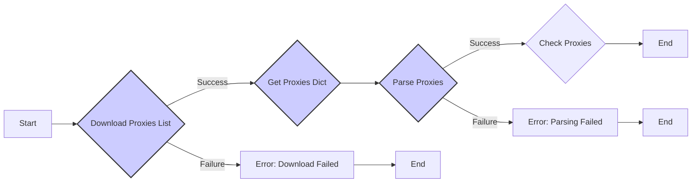
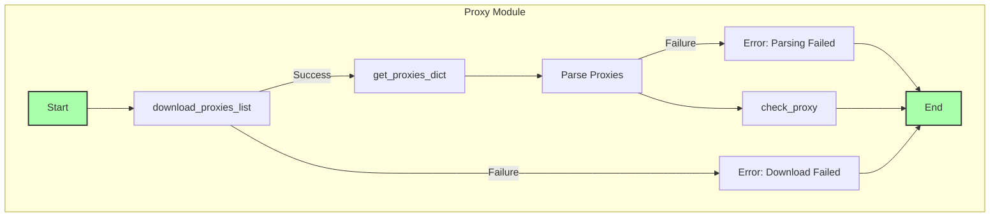

## Анализ кода `src/webdriver/proxy.py`

### 1. <алгоритм>

**Блок-схема:**



**Описание:**

1.  **`Start`**: Начало выполнения программы.
2.  **`Download Proxies List`**: Функция `download_proxies_list` загружает список прокси из URL (`https://raw.githubusercontent.com/proxifly/free-proxy-list/main/proxies/all/data.txt`) и сохраняет его в файл `proxies.txt`.
    *   *Пример:*
        *   Загрузка файла по URL: `https://raw.githubusercontent.com/proxifly/free-proxy-list/main/proxies/all/data.txt`
        *   Сохранение файла в: `gs.path.src / 'webdriver' / 'proxies.txt'`
        *   Успешное сохранение возвращает `True`.
3.  **`Error: Download Failed`**: Если загрузка файла не удалась, программа переходит к `End`.
4.  **`Get Proxies Dict`**: Функция `get_proxies_dict` читает файл `proxies.txt` и парсит строки в список словарей с ключами: `'protocol'`, `'host'` и `'port'`, далее распределяет их по категориям `http`, `socks4`, `socks5` в словарь `proxies`.
    *   *Пример*:
        *   Файл `proxies.txt` содержит строки:
            ```
            http://192.168.1.1:8080
            socks5://10.0.0.2:1080
            ```
        *   Результат:
            ```python
            {
                'http': [{'protocol': 'http', 'host': '192.168.1.1', 'port': '8080'}],
                'socks4': [],
                'socks5': [{'protocol': 'socks5', 'host': '10.0.0.2', 'port': '1080'}]
            }
            ```
5.  **`Parse Proxies`**: Результат парсинга из `get_proxies_dict`.
6.  **`Error: Parsing Failed`**: Если парсинг файла не удался, программа переходит к `End`.
7.  **`Check Proxies`**: Функция `check_proxy` для каждого прокси из словаря `proxies` отправляет запрос на `https://httpbin.org/ip` через прокси. Если прокси работает (статус код 200), то возвращает `True`, иначе `False`.
    *   *Пример:*
        *   Берется прокси: `{'protocol': 'http', 'host': '192.168.1.1', 'port': '8080'}`
        *   Отправляется запрос: `requests.get("https://httpbin.org/ip", proxies={'http': "http://192.168.1.1:8080"}, timeout=5)`
        *   Если `response.status_code == 200`, возвращает `True`.
8.  **`End`**: Конец выполнения программы.

### 2. <mermaid>



**Импортированные зависимости:**

*   **`re`**: Используется для работы с регулярными выражениями, в частности, для парсинга строк прокси из файла. Зависимость используется в `get_proxies_dict` для извлечения протокола, хоста и порта из каждой строки прокси.
*   **`requests`**: Используется для отправки HTTP-запросов, в данном случае для загрузки списка прокси и проверки их работоспособности. Используется в `download_proxies_list` для загрузки файла, и `check_proxy` для проверки прокси.
*   **`requests.exceptions.ProxyError` и `requests.exceptions.RequestException`**: Используются для обработки исключений при работе с прокси и общих ошибок запросов, соответственно. Используется в `check_proxy` для обработки ошибок при подключении к прокси.
*   **`pathlib.Path`**: Используется для работы с путями к файлам и директориям в файловой системе. Используется для определения пути к файлу прокси `proxies.txt`.
*   **`typing.Any`, `typing.Dict`, `typing.List`, `typing.Optional`**: Используются для аннотации типов, что помогает улучшить читаемость и поддерживать код. Используются для аннотации типов переменных и возвращаемых значений.
*   **`header`**: Импортируется для доступа к глобальным настройкам проекта, в частности, для определения базовой директории проекта.
    ```mermaid
    flowchart TD
        Start --> Header[<code>header.py</code><br> Determine Project Root]
    
        Header --> import[Import Global Settings: <br><code>from src import gs</code>] 
    ```
*   **`src.gs`**:  Глобальные настройки проекта, содержащие пути и конфигурации.
*    **`src.utils.printer.pprint`**: Используется для форматированного вывода информации в консоль.
*   **`src.logger.logger.logger`**: Используется для ведения логов.

### 3. <объяснение>

**Импорты:**

*   `re`: Модуль для работы с регулярными выражениями. Используется для парсинга строк прокси.
*   `requests`: Модуль для отправки HTTP-запросов. Используется для загрузки списка прокси и проверки их работоспособности.
*   `requests.exceptions`: Модуль для обработки исключений связанных с запросами.
*   `pathlib.Path`: Модуль для работы с путями.
*   `typing`: Модуль для аннотации типов.
*   `header`: Модуль для получения пути к корневой директории проекта.
*   `src.gs`: Глобальные настройки проекта.
*   `src.utils.printer`: Модуль для вывода форматированных данных.
*   `src.logger.logger`: Модуль для логирования событий.

**Переменные:**

*   `MODE`: Строка, обозначающая режим работы (в данном случае, `'dev'`).
*   `url`: Строка, содержащая URL списка прокси.
*   `proxies_list_path`: Объект `Path`, представляющий путь к файлу, где будет сохранён список прокси.

**Функции:**

*   **`download_proxies_list(url: str, save_path: Path) -> bool`**:
    *   **Аргументы**:
        *   `url` (str): URL для загрузки файла.
        *   `save_path` (Path): Путь к файлу для сохранения.
    *   **Возвращает**:
        *   `bool`: `True`, если загрузка прошла успешно, иначе `False`.
    *   **Назначение**: Загружает файл прокси по URL и сохраняет его в указанный путь. Использует `requests.get` для получения файла и обрабатывает возможные ошибки.
*   **`get_proxies_dict(file_path: Path) -> Dict[str, List[Dict[str, Any]]]`**:
    *   **Аргументы**:
        *   `file_path` (Path): Путь к файлу со списком прокси.
    *   **Возвращает**:
        *   `Dict[str, List[Dict[str, Any]]]`: Словарь, где ключи - типы прокси (`http`, `socks4`, `socks5`), а значения - списки словарей, каждый из которых содержит данные прокси.
    *   **Назначение**: Парсит файл со списком прокси, разделяет их на типы и возвращает в виде словаря. Использует регулярные выражения для парсинга строк.
*   **`check_proxy(proxy: dict) -> bool`**:
    *   **Аргументы**:
        *   `proxy` (dict): Словарь, содержащий данные о прокси (`protocol`, `host`, `port`).
    *   **Возвращает**:
        *   `bool`: `True`, если прокси работает, иначе `False`.
    *   **Назначение**: Проверяет работоспособность прокси, отправляя запрос через него на `https://httpbin.org/ip`. Возвращает `True`, если ответ `200`, иначе `False`.

**Классы:**

*   В данном коде классы не используются.

**Цепочка взаимосвязей с другими частями проекта:**

1.  **`src.webdriver.proxy`** зависит от:
    *   `src.gs`: Для получения пути к директории проекта и сохранения файла прокси.
    *   `src.utils.printer`: Для форматированного вывода сообщений в консоль (не используется, но импортирован).
    *   `src.logger.logger`: Для ведения логов о загрузке и парсинге прокси, а также о проверке работоспособности.
    *   `header`: Для определения корневой директории проекта.
2.  **`src.webdriver.proxy`** используется в других модулях проекта для получения и проверки списка прокси (нет в представленном фрагменте).

**Потенциальные ошибки и области для улучшения:**

1.  **Обработка ошибок**: В блоках `except`  добавлен `...`, что не является хорошей практикой. В этих блоках необходимо явно обрабатывать исключения, возможно, записывая их в лог и предпринимая какие-то дальнейшие действия.
2.  **Проверка прокси**: Функция `check_proxy` проверяет прокси только через `https://httpbin.org/ip`, что может быть недостаточно. Прокси может работать для одного ресурса, но не работать для другого.
3.  **Параллельная проверка**: Проверка прокси происходит последовательно, что может быть медленно для больших списков. Следует рассмотреть возможность параллельной проверки прокси.
4.  **Неявное использование `download_proxies_list` в `get_proxies_dict`**: Функция `get_proxies_dict` вызывает `download_proxies_list` внутри себя, что является неявной зависимостью. Желательно явно указать зависимость, либо передавать путь к файлу как аргумент в `get_proxies_dict`.
5.  **Отсутствие явного возврата ошибок**: В некоторых случаях функции неявно возвращают `None`, что может затруднить отладку. Желательно явно возвращать `None` или исключения в случае ошибок.
6.  **Глобальные переменные**: Использование глобальных переменных `url` и `proxies_list_path` может затруднить переиспользование кода. Желательно передавать эти значения как аргументы.
7. **`parse_proxies`**: Функция `parse_proxies` не определена в коде, но используется в `if __name__ == '__main__':`. Предполагается, что она должна вызывать `get_proxies_dict`. Необходимо явно определить данную функцию.

В целом, код выполняет заявленную функциональность, но требует доработки в плане обработки ошибок, оптимизации производительности и улучшения читаемости.