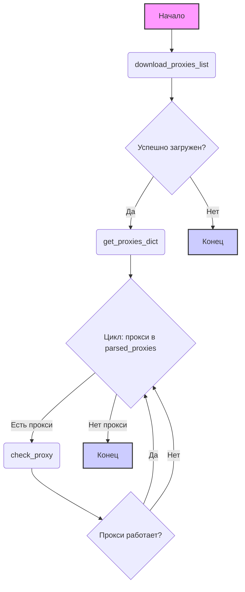

## Анализ кода `src/webdriver/proxy.py`

### 1. `<алгоритм>`:

**Блок-схема:**

1.  **`download_proxies_list(url, save_path)`**:
    *   **Вход:** `url` (URL для скачивания файла со списком прокси), `save_path` (путь для сохранения скачанного файла).
    *   **Действие:**
        *   Отправляет GET-запрос к `url`.
        *   Проверяет статус ответа (200 OK). Если нет, возвращает `False`.
        *   Записывает содержимое ответа в файл по пути `save_path` по частям (чанки по 8192 байт).
        *   Логирует успех и возвращает `True`, в случае ошибки лог и `False`.
    *   **Выход:** `True` при успешной загрузке, `False` при ошибке.

2.  **`get_proxies_dict(file_path)`**:
    *   **Вход:** `file_path` (путь к файлу со списком прокси). Если не указан использует `proxies_list_path`.
    *   **Действие:**
        *   Вызывает `download_proxies_list()`, для обеспечения актуальности файла.
        *   Инициализирует пустой словарь `proxies` с ключами `'http'`, `'socks4'`, `'socks5'` (каждый ключ хранит список прокси).
        *   Читает файл `file_path` построчно.
        *   Для каждой строки проверяет соответствие шаблону `(http|socks4|socks5)://(\d+\.\d+\.\d+\.\d+):(\d+)` с помощью `re.match()`.
        *   Если строка соответствует шаблону:
            *   Извлекает протокол, хост и порт.
            *   Добавляет информацию о прокси в соответствующий список в словаре `proxies`.
        *   Логирует ошибки при открытии или парсинге файла.
    *   **Выход:** Словарь `proxies` с прокси, рассортированными по протоколам.

3.  **`check_proxy(proxy)`**:
    *   **Вход:** `proxy` (словарь с информацией о прокси: `protocol`, `host`, `port`).
    *   **Действие:**
        *   Создает прокси строку `f"{proxy['protocol']}://{proxy['host']}:{proxy['port']}"`.
        *   Пытается сделать GET-запрос к `https://httpbin.org/ip` через указанный прокси.
        *   Проверяет HTTP статус ответа (200 OK). Если 200 то лог и `True`.
        *   Если ответ не 200, лог и возвращает `False`.
        *   Ловит ошибки `ProxyError` или `RequestException`, лог и возвращает `False`.
    *   **Выход:** `True`, если прокси работает, `False` в противном случае.

**Пример потока данных:**

```
    [Начало] --> download_proxies_list() -->  get_proxies_dict()
                                                                  |
                                                                  v
                                                         [parsed_proxies] --> loop over each proxy in parsed_proxies
                                                                               |
                                                                               v
                                                                     check_proxy(proxy)
                                                                                |
                                                                                v
                                                                       [Конец]
```

### 2. `<mermaid>`:



**Объяснение зависимостей:**

*   **`graph TD`**:  Объявляет диаграмму направленного графа, идущего сверху вниз.
*   **`A[Начало]`**:  Начальная точка процесса, обозначенная как `Начало`. `fill` и `stroke` задают стиль.
*   **`B(download_proxies_list)`**: Функция загрузки списка прокси. Круглые скобки обозначают функцию.
*   **`C{Успешно загружен?}`**: Условие проверки, успешно ли загружен файл прокси. Фигурные скобки обозначают условие.
*   **`D(get_proxies_dict)`**: Функция парсинга списка прокси.
*   **`E[Конец]`**: Конечная точка процесса, если загрузка не удалась. Квадратные скобки обозначают конец процесса.
*   **`F{Цикл: прокси в parsed_proxies}`**:  Цикл по списку прокси.
*   **`G(check_proxy)`**: Функция проверки работоспособности прокси.
*   **`H[Конец]`**: Конечная точка процесса.
*   **`I{Прокси работает?}`**: Условие проверки, работает ли прокси.
*   Стрелки (`-->`) показывают последовательность выполнения.
*   `style` определяет визуальный вид блоков.

### 3. `<объяснение>`:

**Импорты:**

*   `re`: Используется для работы с регулярными выражениями (парсинг строк прокси).
*   `requests`: Используется для HTTP запросов (скачивание списка прокси и проверка их работоспособности).
*   `requests.exceptions.ProxyError, RequestException`: Используется для обработки ошибок при работе с прокси.
*   `pathlib.Path`: Используется для работы с путями к файлам.
*   `typing.Any, Dict, List, Optional`: Используется для аннотации типов.
*   `header`: Используется для хранения header (не используется в этом файле).
*   `src.gs`: Используется для доступа к глобальным настройкам, в частности к `path`
*   `src.utils.printer.pprint`: Используется для красивого вывода, (не используется в этом файле)
*   `src.logger.logger`: Используется для логирования событий.

**Переменные:**

*   `MODE: str`: Режим работы, в данном случае `dev`.
*   `url: str`: URL для скачивания списка прокси.
*   `proxies_list_path: Path`: Путь к файлу, где сохраняется список прокси.

**Функции:**

*   **`download_proxies_list(url: str = url, save_path: Path = proxies_list_path) -> bool`**:
    *   **Аргументы:**
        *   `url`: URL для скачивания файла. По умолчанию используется глобальная переменная `url`.
        *   `save_path`: Путь для сохранения файла. По умолчанию используется глобальная переменная `proxies_list_path`.
    *   **Возвращает:** `True`, если файл успешно скачан и сохранен, `False` в противном случае.
    *   **Назначение:** Скачивает файл по заданному URL и сохраняет его локально. Используется `requests` для загрузки и `open` для записи в файл.
    *   **Пример:**
        ```python
        download_proxies_list(url="https://example.com/proxies.txt", save_path=Path("./my_proxies.txt"))
        ```
*   **`get_proxies_dict(file_path: Path = proxies_list_path) -> Dict[str, List[Dict[str, Any]]]`**:
    *   **Аргументы:**
        *   `file_path`: Путь к файлу со списком прокси. По умолчанию используется `proxies_list_path`.
    *   **Возвращает:** Словарь, где ключи – типы прокси (`'http'`, `'socks4'`, `'socks5'`), а значения – списки словарей с данными прокси (`{'protocol': str, 'host': str, 'port': str}`).
    *   **Назначение:** Парсит файл со списком прокси и распределяет их по типам. Использует регулярные выражения для извлечения данных из строк.
    *   **Пример:**
        ```python
        proxies = get_proxies_dict(Path("./my_proxies.txt"))
        print(proxies)  # {'http': [{'protocol': 'http', 'host': '127.0.0.1', 'port': '8080'}], 'socks4': [], 'socks5': []}
        ```
*   **`check_proxy(proxy: dict) -> bool`**:
    *   **Аргументы:**
        *   `proxy`: Словарь с информацией о прокси (`protocol`, `host`, `port`).
    *   **Возвращает:** `True`, если прокси работает, `False` в противном случае.
    *   **Назначение:** Проверяет работоспособность прокси, отправляя запрос к `https://httpbin.org/ip` через заданный прокси. Использует `requests`.
    *   **Пример:**
        ```python
        proxy = {'protocol': 'http', 'host': '127.0.0.1', 'port': '8080'}
        if check_proxy(proxy):
            print("Прокси работает")
        else:
            print("Прокси не работает")
        ```

**Классы:**

*   В данном коде классы не используются.

**Потенциальные ошибки и области для улучшения:**

*   **Обработка ошибок:** В функции `download_proxies_list` при ошибке просто пропускается `...`, лучше сделать более детальную обработку исключений. В `get_proxies_dict` аналогично.
*   **Проверка формата прокси:** Регулярное выражение может быть более точным для обработки разных форматов прокси.
*   **Параллелизм:**  `check_proxy` можно было бы выполнять параллельно, для более быстрой проверки.
*  **Улучшить логирование**: В методе check_proxy() можно было бы выводить прокси  в случае успеха, для удобства использования.
* **Использовать более надежные источники прокси**: Текущий `url` может быть не всегда доступен или не содержать актуальные данные.
* **Кеширование**: Результаты скачивания файла прокси могли бы быть закешированы.
*  **Обработка отсутствия прокси:** В методе `get_proxies_dict` добавить обработку случая, когда в файле не найдется ни одного прокси.

**Взаимосвязи с другими частями проекта:**

*   Использует `src.gs` для доступа к глобальным настройкам, определяя путь к файлу.
*   Использует `src.logger.logger` для логирования действий и ошибок.
*   Зависит от библиотеки `requests` для HTTP-запросов.
*   Зависит от библиотеки `re` для работы с регулярными выражениями.
*  Использует `pathlib` для работы с путями.
*   Может использоваться другими частями проекта для получения списка прокси.

**Цепочка взаимосвязей:**

```
    [webdriver/proxy.py] --> [src/gs]
    [webdriver/proxy.py] --> [src/logger/logger.py]
    [webdriver/proxy.py] --> [requests]
    [webdriver/proxy.py] --> [re]
    [webdriver/proxy.py] --> [pathlib]