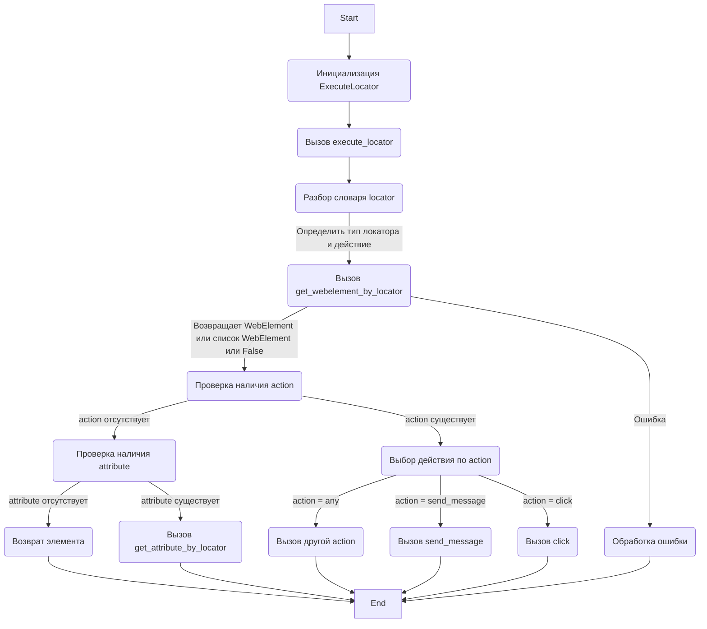
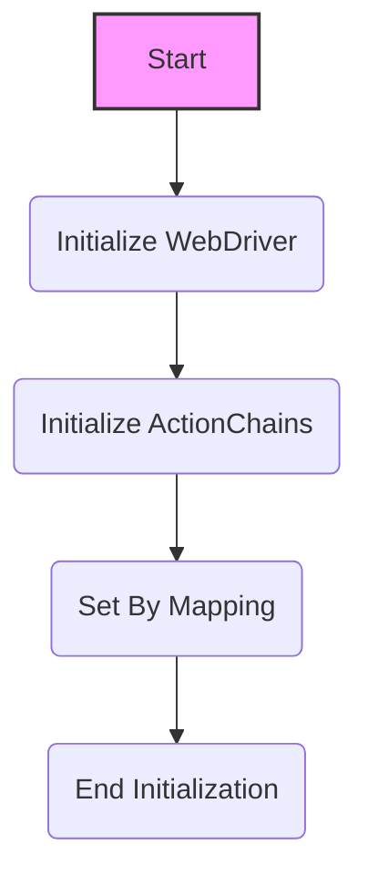
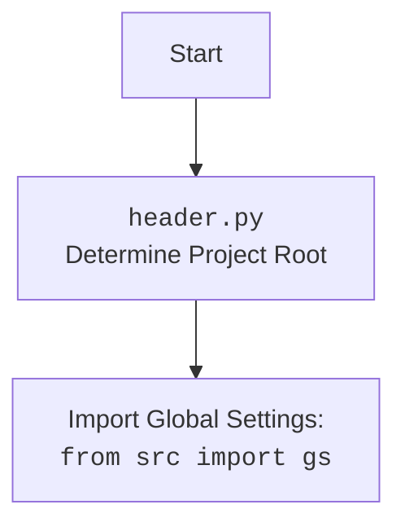

## <алгоритм>

**Общий процесс выполнения действий с веб-элементами:**

1.  **Инициализация `ExecuteLocator`:**
    *   Создается экземпляр класса `ExecuteLocator`, принимая на вход объект `webdriver` и дополнительные аргументы.
    *   В конструкторе инициализируется `ActionChains` для выполнения сложных действий.
    *   _Пример:_
        ```python
        driver = webdriver.Chrome()
        executor = ExecuteLocator(driver)
        ```
2.  **Вызов метода `execute_locator`:**
    *   Метод `execute_locator` принимает словарь `locator` с информацией о том, как найти элемент и какие действия с ним выполнить.
    *   Также принимает параметры: `message` (сообщение для отправки в поле ввода), `typing_speed` (скорость набора сообщения), `continue_on_error` (продолжать ли выполнение при ошибке).
    *   _Пример:_
        ```python
        locator = {
          "by": "xpath",
          "selector": "//input[@id='search']",
          "action": "send_message",
          "message": "test"
         }
        executor.execute_locator(locator, message="test", typing_speed=0.1)
        ```
3.  **Разбор словаря `locator`:**
    *   Внутри `execute_locator` происходит разбор переданного словаря `locator`.
    *   Определяется тип локатора (например, `xpath`, `css`, `id`) и действие, которое нужно выполнить (например, `send_message`, `click`, `get_attribute`).
    *  Если ключа `action` нет - будет возвращен WebElement.
4.  **Получение веб-элемента:**
    *   Вызывается метод `get_webelement_by_locator`, который, используя `locator['by']` и `locator['selector']`, пытается найти элемент на странице.
    *   Метод ожидает появления элемента на странице, используя `WebDriverWait`.
    *   Возвращает либо найденный `WebElement`, либо список элементов, либо `False`, если элемент не найден.
    *   _Пример:_
        ```python
        element = executor.get_webelement_by_locator({"by": "id", "selector": "my_element"})
        if element:
            print("Element found!")
        ```
5.  **Выполнение действия:**
    *   В зависимости от указанного в `locator['action']` действия вызывается соответствующий метод.
    *   Например, для `action="send_message"` вызывается `send_message`, для `action="click"` вызывается `click` и т.д.
    *   Если `action` отсутствует, но есть `attribute`, то вызывается `get_attribute_by_locator`.
    *   _Пример:_
        ```python
        if locator.get('action') == 'send_message':
          executor.send_message(locator, message="example text", typing_speed=0.01)
        elif locator.get('action') == 'click':
          executor.click(locator)
        elif locator.get('attribute'):
           attribute_value = executor.get_attribute_by_locator(locator)
        else:
          element = executor.get_webelement_by_locator(locator)
        ```
6.  **Обработка ошибок:**
    *   Все действия выполняются в блоках `try-except` для отлова ошибок, таких как `NoSuchElementException` (элемент не найден) и `TimeoutException` (таймаут ожидания).
    *   Ошибки логируются, и в зависимости от `continue_on_error`, выполнение может быть продолжено или остановлено.
    *   _Пример:_
        ```python
        try:
           element = executor.get_webelement_by_locator(locator)
           if locator.get('action') == 'send_message':
             executor.send_message(locator, message="example text", typing_speed=0.01)
        except NoSuchElementException as e:
          logger.error(f"Element not found:{e} ")
        ```
7.  **Возвращение результата:**
    *   Метод `execute_locator` возвращает результат выполнения действия.
    *   Это может быть текст, считанный из атрибута, `WebElement`, `True`, `False` или `None` в зависимости от операции и ее результата.
    *   _Пример:_
         ```python
        result = executor.execute_locator(locator)
        print(f"Result: {result}")
        ```
        
8.  **Метод `get_attribute_by_locator`:**
   - Получает атрибут элемента, используя метод `get_webelement_by_locator`
   -  Использует метод `_get_element_attribute` для извлечения нужного атрибута.
   - Возвращает значение атрибута (или `None` если не найдено).

9. **Метод `send_message`:**
  - Получает веб элемент с помощью метода `get_webelement_by_locator`.
  -  Имитирует ввод текста в элемент с заданной скоростью (`typing_speed`).
  -  Использует `ActionChains` для взаимодействия с мышью при необходимости.

10. **Метод `evaluate_locator`:**
   - Выполняет подстановку значений в плейсхолдеры `%EXTERNAL_MESSAGE%`.
   - Возвращает строку с подставленными значениями.

## <mermaid>



## <объяснение>

### Импорты

*   `selenium`:
    *   `webdriver`: Используется для управления браузером.
    *   `webdriver.common.keys`: Используется для эмуляции нажатий клавиш.
    *   `webdriver.common.by`: Используется для определения способов поиска элементов (например, By.XPATH, By.CSS\_SELECTOR).
    *   `webdriver.remote.webelement`: Используется для представления веб-элементов.
    *   `webdriver.support.ui`: Используется для ожидания появления элементов.
    *   `webdriver.support`: Содержит вспомогательные функции, такие как `expected_conditions`.
    *    `webdriver.common.action_chains`: Используется для выполнения сложных действий с элементами (например, перетаскивания, множественные клики).
    *   `selenium.common.exceptions`: Содержит исключения, такие как `NoSuchElementException` и `TimeoutException`.
*   `src`:
    *   `gs`: Глобальные настройки проекта, используемые для доступа к конфигурации.
    *   `src.utils.printer`: Содержит функции для вывода данных, работы с JSON и сохранения изображений.
    *    `src.logger.logger`: Модуль для логирования событий и ошибок.
    *    `src.logger.exceptions`: Кастомные исключения для данного проекта.

### Класс `ExecuteLocator`

*   **Назначение:** Класс `ExecuteLocator` предназначен для выполнения действий над веб-элементами, основываясь на переданных данных (локаторах), используя WebDriver.
*   **Атрибуты:**
    *   `driver`: Экземпляр WebDriver, через который осуществляется взаимодействие с браузером.
    *   `actions`: Экземпляр `ActionChains` для выполнения сложных действий, таких как перетаскивание или множественные клики.
    *   `by_mapping`: Словарь, содержащий соответствия между строковыми представлениями локаторов и объектами `By` из Selenium.
*   **Методы:**
    *   `__init__(self, driver, *args, **kwargs)`: Конструктор класса, инициализирует `driver` и `ActionChains`.
    *   `execute_locator(self, locator: dict, message: str = None, typing_speed: float = 0, continue_on_error: bool = True)`: Основной метод, выполняющий действия с веб-элементами на основе переданного словаря `locator`.
       *   `locator`: Словарь, содержащий информацию о локаторе и действии.
       *   `message`: Сообщение для отправки в элемент (при `action='send_message'`).
       *   `typing_speed`: Скорость печати сообщения (для имитации ввода с клавиатуры).
       *   `continue_on_error`: Флаг, указывающий, продолжать ли выполнение при ошибке.
        * Возвращает результат выполнения действия.
    *   `get_webelement_by_locator(self, locator: dict | SimpleNamespace, message: str = None) -> WebElement | List[WebElement] | bool`: Метод для поиска веб-элементов по локатору.
        *  `locator`: Словарь с данными локатора.
        *  `message`: Сообщение для логирования.
        * Возвращает найденный элемент, список элементов или `False`.
    *   `get_attribute_by_locator(self, locator: dict | SimpleNamespace, message: str = None) -> str | list | dict | bool`: Метод для получения атрибута веб-элемента.
        *  `locator`: Словарь с данными локатора.
        *  `message`: Сообщение для логирования.
         *  Возвращает значение атрибута, список значений или `False`.
    *    `_get_element_attribute(self, element: WebElement, attribute: str) -> str | None`: Получает значение атрибута элемента.
        *   `element`: Веб-элемент, из которого извлекается атрибут.
        *   `attribute`: Имя атрибута.
        * Возвращает значение атрибута или `None`, если не найден.
    *    `send_message(self, locator: dict | SimpleNamespace, message: str, typing_speed: float, continue_on_error:bool) -> bool`: Метод для отправки сообщения в веб-элемент.
        *   `locator`: Словарь с данными локатора.
        *  `message`: Сообщение для отправки.
        *  `typing_speed`: Скорость печати сообщения.
        * `continue_on_error`: Флаг, указывающий, продолжать ли выполнение при ошибке.
       * Возвращает `True` в случае успеха, `False` в случае ошибки.
    *    `evaluate_locator(self, attribute: str | list | dict) -> str`: Метод для оценки и подстановки значений в атрибут локатора, используя шаблон `%EXTERNAL_MESSAGE%`.
       *    `attribute`: Атрибут локатора для оценки.
       * Возвращает строку с подставленными значениями.
    *   `_evaluate(self, attribute: str) -> str | None`: Метод для оценки и подстановки значений в отдельный атрибут.
         *  `attribute`: Атрибут локатора для оценки.
        * Возвращает строку с подставленными значениями.
    *   `get_locator_keys() -> list`: Статический метод, возвращающий список ключей локаторов.

### Функции

*   В основном, функциональность сосредоточена в методах класса `ExecuteLocator`.

### Переменные

*   `locator`: Словарь, определяющий, как найти веб-элемент и какие действия с ним выполнить.
    *   Пример:
        ```json
         {
          "product_links": {
            "attribute": "href",
            "by": "xpath",
            "selector": "//div[contains(@id,'node-galery')]//li[contains(@class,'item')]//a",
            "selector 2": "//span[@data-component-type='s-product-image']//a",
            "if_list":"first",
            "use_mouse": false,
            "mandatory": true,
            "timeout":0,
            "timeout_for_event":"presence_of_element_located",
            "event": null
          }
        }
        ```
    *   `attribute`: Атрибут, который нужно получить из элемента.
    *   `by`: Тип локатора (`xpath`, `css`, `id` и т.д.).
    *   `selector`: Строка, определяющая местоположение элемента.
    *   `selector 2`: Альтернативный селектор.
    *   `if_list`: Если список элементов, то какой вернуть (`first`, `last` или `all`).
     *   `use_mouse`: Использовать ли мышь для взаимодействия.
    *   `mandatory`: Является ли локатор обязательным.
    *   `timeout`: Время ожидания элемента.
    *  `timeout_for_event`: Условие ожидания элемента (`presence_of_element_located`, `element_to_be_clickable`).
    *   `event`: Событие для элемента (например, `click()`).
*   `message`: Строка, которую нужно отправить в веб-элемент.
*   `typing_speed`: Скорость ввода текста (число с плавающей точкой, представляющее задержку между вводом символов).
*   `continue_on_error`: Булево значение, указывающее, продолжать ли выполнение при ошибке.

### Потенциальные ошибки и области для улучшения

*   **Обработка ошибок**: Используются общие блоки try-except. Можно добавить более специфичную обработку ошибок.
*   **Гибкость локаторов**: Локаторы можно сделать более гибкими, добавив поддержку различных условий поиска.
*   **Производительность**: В некоторых местах можно оптимизировать поиск элементов, чтобы снизить время выполнения.
*   **Документация**: Добавить больше комментариев в код для лучшей читаемости и понимания.
*   **Расширяемость**: Можно расширить список доступных действий, добавив новые методы в `ExecuteLocator`.

### Взаимосвязи с другими частями проекта

*   Модуль `webdriver` зависит от `src.gs` для получения глобальных настроек.
*   Использует `src.utils.printer` для вывода сообщений и сохранения изображений.
*   Использует `src.logger.logger` для логирования событий и ошибок.
*   Использует `src.logger.exceptions` для создания кастомных исключений.

**Цепочка взаимосвязей:**

`Driver` (использующий `ExecuteLocator`) --> `ExecuteLocator` --> `Selenium WebDriver` -->  `gs`(Глобальные настройки)--> `printer`(Вывод)--> `logger` (Логирование)