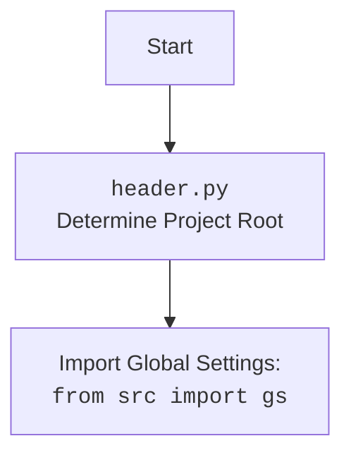

## АНАЛИЗ КОДА: `src/webdriver/readme.md`

### 1. <алгоритм>

#### Общий процесс:

1. **Инициализация `Driver`:**
   - Создается экземпляр класса `Driver`, передавая в него класс `Chrome`.
   - Настраивается WebDriver, устанавливаются пользовательские опции.
   
   _Пример:_
   ```python
    chrome_driver = Driver(Chrome) 
   ```

2. **Переход по URL:**
   - Метод `get_url` загружает указанный URL в браузере.
   
   _Пример:_
    ```python
    if chrome_driver.get_url("https://www.example.com"):
      print("Successfully navigated to the URL")
    ```

3. **Извлечение домена:**
    - Метод `extract_domain` извлекает доменное имя из переданного URL.
    
    _Пример:_
    ```python
    domain = chrome_driver.extract_domain("https://www.example.com/path/to/page")
    print(f"Extracted domain: {domain}")
    ```

4. **Сохранение cookies:**
   - Метод `_save_cookies_localy` сохраняет текущие cookies браузера в локальный файл.
   
   _Пример:_
   ```python
   success = chrome_driver._save_cookies_localy()
   if success:
        print("Cookies were saved successfully")
    ```

5. **Обновление страницы:**
   - Метод `page_refresh` обновляет текущую страницу.
   
   _Пример:_
   ```python
   if chrome_driver.page_refresh():
       print("Page was refreshed successfully")
   ```

6. **Прокрутка страницы:**
   - Метод `scroll` прокручивает страницу в указанном направлении на заданное количество раз с заданной скоростью.
   
    _Пример:_
   ```python
    if chrome_driver.scroll(scrolls=3, direction='forward', frame_size=1000, delay=1):
        print("Successfully scrolled the page down")
   ```

7. **Получение языка страницы:**
   - Метод `locale` определяет язык текущей страницы.
   
   _Пример:_
   ```python
    page_language = chrome_driver.locale
    print(f"Page language: {page_language}")
   ```

8. **Установка кастомного User-Agent:**
    - Создается новый экземпляр `Driver` с кастомным User-Agent.
    - Загружается страница с кастомным User-Agent.
   
   _Пример:_
   ```python
    user_agent = {
        'user-agent': 'Mozilla/5.0 (Windows NT 10.0; Win64; x64) AppleWebKit/537.36 (KHTML, like Gecko) Chrome/100.0.4896.127 Safari/537.36'
    }
    custom_chrome_driver = Driver(Chrome, user_agent=user_agent)
    if custom_chrome_driver.get_url("https://www.example.com"):
        print("Successfully navigated to the URL with custom user agent")
   ```

9. **Поиск элемента:**
   - Метод `find_element` находит элемент на странице по заданному селектору.
   
   _Пример:_
   ```python
   element = chrome_driver.find_element(By.CSS_SELECTOR, 'h1')
   if element:
        print(f"Found element with text: {element.text}")
   ```

10. **Получение текущего URL:**
   - Метод `current_url` возвращает текущий URL открытой страницы.
   
    _Пример:_
   ```python
    current_url = chrome_driver.current_url
    print(f"Current URL: {current_url}")
    ```

11. **Фокусировка окна:**
    - Метод `window_focus` фокусирует текущее окно браузера.
    
    _Пример:_
    ```python
    chrome_driver.window_focus()
    print("Focused the window")
    ```

### 2. <mermaid>
```mermaid
flowchart TD
    subgraph DriverModule [Driver module]
    Start --> CreateDriver[Create Driver Instance: <br><code>Driver(Chrome)</code>]
    CreateDriver --> NavigateURL[Navigate to URL: <br><code>get_url(url)</code>]
    NavigateURL --> ExtractDomain[Extract Domain: <br><code>extract_domain(url)</code>]
    ExtractDomain --> SaveCookies[Save Cookies Locally: <br><code>_save_cookies_localy()</code>]
    SaveCookies --> RefreshPage[Refresh Page: <br><code>page_refresh()</code>]
    RefreshPage --> ScrollPage[Scroll Page: <br><code>scroll(scrolls, direction, frame_size, delay)</code>]
    ScrollPage --> GetPageLanguage[Get Page Language: <br><code>locale</code>]
    GetPageLanguage --> CreateCustomDriver[Create Driver with Custom User Agent: <br><code>Driver(Chrome, user_agent)</code>]
    CreateCustomDriver --> NavigateCustomURL[Navigate to URL with Custom User Agent: <br><code>get_url(url)</code>]
    NavigateCustomURL --> FindElement[Find Element: <br><code>find_element(By.CSS_SELECTOR, selector)</code>]
    FindElement --> GetCurrentURL[Get Current URL: <br><code>current_url</code>]
    GetCurrentURL --> FocusWindow[Focus Window: <br><code>window_focus()</code>]
    FocusWindow --> End[End]
    end

    style DriverModule fill:#f9f,stroke:#333,stroke-width:2px
```

### Зависимости:
 - **`from src.webdriver.driver import Driver, Chrome`**: Импортируются классы `Driver` и `Chrome` из модуля `src.webdriver.driver`. `Driver` предоставляет абстракцию для управления браузером, а `Chrome` является конкретной реализацией WebDriver для Google Chrome.
 - **`from selenium.webdriver.common.by import By`**: Импортируется класс `By` из Selenium, который используется для указания способа поиска элементов на веб-странице (например, по CSS-селектору).

### Дополнительно:

#### Диаграмма для `header.py`:



### 3. <объяснение>

#### Импорты:
   - **`from src.webdriver.driver import Driver, Chrome`**:
     - `Driver`: Абстрактный класс для управления веб-драйвером, предоставляющий общие методы.
     - `Chrome`: Конкретная реализация веб-драйвера для браузера Chrome. Оба класса располагаются в пакете `src.webdriver.driver`, что указывает на их принадлежность к функциональности веб-автоматизации внутри проекта `src`.
   - **`from selenium.webdriver.common.by import By`**:
     - `By`: Класс из библиотеки Selenium, используемый для определения стратегии поиска элементов (например, по ID, CSS-селектору, XPATH). Позволяет четко указать, как нужно находить нужные элементы на странице.

#### Классы:
   - **`Driver`**:
     - **Роль**: Абстрактный класс для управления веб-драйвером, служит базой для конкретных драйверов (например, Chrome). Он предоставляет методы для навигации, управления куки, прокрутки, и т.д.
     - **Атрибуты**: Содержит атрибуты для управления текущей страницей (например, `previous_url`, `referrer`, `page_lang`), а также может содержать атрибуты, связанные с взаимодействием с элементами на странице.
     - **Методы**:
       - `get_url(url)`: загружает страницу по указанному URL.
       - `extract_domain(url)`: извлекает домен из URL.
       - `_save_cookies_localy()`: сохраняет текущие cookies.
       - `page_refresh()`: обновляет текущую страницу.
       - `scroll(scrolls, direction, frame_size, delay)`: прокручивает страницу.
       - `locale`: определяет язык текущей страницы.
       - `find_element(by, selector)`: находит элемент по заданному селектору.
       - `current_url`: возвращает текущий URL страницы.
       - `window_focus()`: фокусирует окно браузера.
   - **`Chrome`**:
     - **Роль**: Конкретная реализация веб-драйвера для браузера Chrome, наследуется от класса `selenium.webdriver.chrome.webdriver.WebDriver` и расширяет его возможности.
     - **Атрибуты**: может содержать специфичные для Chrome атрибуты.
     - **Методы**: переопределяет или расширяет методы базового класса WebDriver и может иметь свои собственные.

#### Функции:
   - **`main()`**:
     - **Аргументы**: нет
     - **Возвращаемое значение**: нет
     - **Назначение**: Основная функция, которая демонстрирует примеры использования классов `Driver` и `Chrome`. Она создает экземпляры драйвера, выполняет различные действия (переход по URL, извлечение домена, сохранение куки, и т.д.), и выводит результаты в консоль.
   
#### Переменные:
 - `chrome_driver`: экземпляр класса `Driver` с драйвером `Chrome`. Используется для выполнения операций на веб-страницах.
 - `domain`: строка, содержащая доменное имя, извлеченное из URL.
 - `success`: логическое значение, указывающее на успех сохранения cookies.
 - `page_language`: строка, содержащая язык текущей страницы.
 - `user_agent`: словарь, содержащий пользовательский User-Agent.
 - `custom_chrome_driver`: экземпляр класса `Driver`, созданный с кастомным User-Agent.
 - `element`:  объект `WebElement`, представляющий найденный элемент на странице.
 - `current_url`: строка, содержащая текущий URL страницы.

#### Потенциальные ошибки и улучшения:
  - **Обработка ошибок**: в примере не все методы `Driver` обернуты в `try-except` блоки. Нужно предусмотреть обработку исключений (например, `NoSuchElementException`, `TimeoutException`), чтобы скрипт не завершался аварийно.
  - **Логирование**: для отладки и мониторинга хорошо было бы добавить более детальное логирование действий драйвера.
  - **Конфигурация**: можно вынести параметры, такие как URL, селекторы и user-agent, в конфигурационный файл, чтобы их можно было легко изменять.
  - **Абстракция**: можно использовать паттерн проектирования "страница", чтобы сделать код более модульным и поддерживаемым.

#### Взаимосвязи:
- **`Driver` и `Chrome`**: `Chrome` является конкретной реализацией `Driver`, что позволяет легко переключаться между разными драйверами браузеров.
- **`Driver` и `selenium`**: `Driver` использует методы из `selenium.webdriver` для взаимодействия с браузером.
- **`gs` (Global Settings)**:  Внутри кода есть упоминание о `gs`, что намекает на наличие глобальных настроек проекта, которые могут влиять на поведение драйвера (например, пути к ресурсам).
- **`printer` and `logger`**: Предположительно, существуют кастомные модули для печати (printer) и логирования (logger) событий, которые могут использоваться в методах класса `Driver`, но они не представлены в предоставленном коде,

Таким образом, данный код представляет собой пример использования веб-драйвера для автоматизации действий в браузере, демонстрируя основные возможности и интерфейсы классов `Driver` и `Chrome`. Код также предоставляет набор примеров, иллюстрирующих различные взаимодействия с веб-страницами, такие как переходы по URL, поиск элементов, сохранение куки, прокрутка, и т.д.