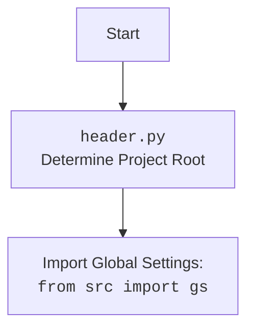

## <алгоритм>

**Описание работы модуля `ExecuteLocator`:**

1.  **Инициализация `ExecuteLocator`:**
    *   Создается экземпляр класса `ExecuteLocator`.
    *   Принимает объект `webdriver` в качестве параметра.
    *   Инициализирует атрибут `driver` переданным объектом `webdriver`.
    *   Инициализирует атрибут `actions` для выполнения цепочки действий.
    
    *Пример:*
    ```python
    from selenium import webdriver
    from src.webdriver.executor import ExecuteLocator
    
    driver = webdriver.Chrome()
    executor = ExecuteLocator(driver)
    ```

2.  **Метод `execute_locator`:**
    *   Принимает словарь `locator`, строку `message` (опционально), скорость набора `typing_speed` (опционально) и флаг `continue_on_error` (опционально).
    *   Определяет тип действия на основе данных в словаре `locator`.
    *   В зависимости от типа выполняет одно из действий:
        *   **Получение атрибута:** вызывает `get_attribute_by_locator` для извлечения атрибута элемента.
        *   **Отправка сообщения:** вызывает `send_message` для ввода текста в элемент.
        *   **Клик:** вызывает `click` для выполнения клика по элементу.
        *   **Получение элемента:** вызывает `get_webelement_by_locator` для получения элемента.
    *   Возвращает результат действия или `False` в случае ошибки.
    
    *Пример:*
    ```python
    locator = {
       "attribute": "href",
       "by": "xpath",
       "selector": "//a[@class='product-link']"
    }
    
    link_href = executor.execute_locator(locator)
    print(link_href)
    
    locator = {
       "by": "id",
       "selector": "input-search"
    }
    
    executor.execute_locator(locator, message="Test input", typing_speed=0.1)
    ```
3.  **Метод `get_webelement_by_locator`:**
    *   Принимает словарь `locator` (или `SimpleNamespace`) и строку `message` (опционально).
    *   Получает тип локатора (`by`) и селектор (`selector`) из словаря `locator`.
    *   Использует `WebDriverWait` для ожидания появления элемента на странице.
    *   Находит элемент (или список элементов) используя `driver.find_element` или `driver.find_elements`.
    *   Возвращает `WebElement`, список `WebElement` или `False` в случае ошибки.
    
    *Пример:*
    ```python
    locator = {
       "by": "id",
       "selector": "my-element"
    }
    
    element = executor.get_webelement_by_locator(locator)
    if element:
        print(element.text)
    ```

4.  **Метод `get_attribute_by_locator`:**
    *   Принимает словарь `locator` (или `SimpleNamespace`) и строку `message` (опционально).
    *   Использует `get_webelement_by_locator` для получения элементов.
    *   Получает атрибут элемента с использованием `_get_element_attribute`.
    *   Возвращает значение атрибута, список значений или `False`.
    
    *Пример:*
    ```python
    locator = {
        "attribute": "href",
        "by": "css",
        "selector": "a.my-link"
    }
    
    href = executor.get_attribute_by_locator(locator)
    print(href)
    ```

5.  **Метод `_get_element_attribute`:**
    *   Принимает `WebElement` и название атрибута.
    *   Извлекает значение атрибута из элемента.
    *   Возвращает значение атрибута или `None`, если атрибут не найден.
    
    *Пример:*
    ```python
    element = driver.find_element(By.ID, "my-element")
    attribute_value = executor._get_element_attribute(element, "class")
    print(attribute_value)
    ```

6.  **Метод `send_message`:**
    *   Принимает словарь `locator` (или `SimpleNamespace`), текст `message`, скорость набора `typing_speed` и флаг `continue_on_error`.
    *   Получает элемент с помощью `get_webelement_by_locator`.
    *   Отправляет текст в элемент с заданной скоростью (если задано).
    *   Возвращает `True` при успешной отправке, `False` в случае ошибки.
    
    *Пример:*
    ```python
    locator = {
       "by": "id",
       "selector": "my-input"
    }
    
    executor.send_message(locator, message="Hello World", typing_speed=0.2)
    ```

7.  **Метод `evaluate_locator`:**
    *   Принимает атрибут (`str`, `list` или `dict`).
    *   Вызывает `_evaluate` для каждого элемента, если атрибут список или словарь.
    *   Возвращает строку, если атрибут строка или результат `_evaluate`.
        
    *Пример:*
    ```python
    message = executor.evaluate_locator("%EXTERNAL_MESSAGE%")
    print(message)
    ```

8.  **Метод `_evaluate`:**
    *   Принимает строку `attribute`.
    *   Выполняет специальные проверки (например, для `%EXTERNAL_MESSAGE%`).
    *   Возвращает строку или `None`.
   
    *Пример:*
    ```python
    value = executor._evaluate("%EXTERNAL_MESSAGE%")
    print(value)
    ```

9.  **Метод `get_locator_keys`:**
    *   Статический метод, возвращает список доступных ключей локатора.
    
    *Пример:*
     ```python
     keys = ExecuteLocator.get_locator_keys()
     print(keys)
    ```

## <mermaid>

```mermaid
flowchart TD
    classDef default fill:#f9f,stroke:#333,stroke-width:2px
    classDef internal fill:#ccf,stroke:#333,stroke-width:2px
    classDef input fill:#cfc,stroke:#333,stroke-width:2px
    classDef output fill:#ffc,stroke:#333,stroke-width:2px
    
    Start(Start) --> InitializeExecutor[Initialize <br> <code>ExecuteLocator</code> Class <br> with WebDriver]:::default
    
    InitializeExecutor --> ExecuteLocatorMethod[Call <code>execute_locator</code> <br> with locator, message, <br> typing_speed, continue_on_error]:::default

    ExecuteLocatorMethod --> ProcessLocatorType{Determine <br> Action Type <br> from Locator}:::default

    ProcessLocatorType -- "attribute" --> GetAttribute[Call <code>get_attribute_by_locator</code> <br> with locator, message]:::default
    ProcessLocatorType -- "message" --> SendMessage[Call <code>send_message</code> <br> with locator, message,<br> typing_speed, continue_on_error]:::default
    ProcessLocatorType -- "click" --> Click[Call <code>click</code> <br> with locator]:::default
    ProcessLocatorType -- "get element" --> GetElement[Call <code>get_webelement_by_locator</code> <br> with locator]:::default
    ProcessLocatorType -- "evaluate" --> EvaluateLocator[Call <code>evaluate_locator</code> <br> with attribute]:::default
    
    GetAttribute --> GetElementForAttribute[Call <code>get_webelement_by_locator</code> <br> to get element(s) ]:::internal
    GetElementForAttribute --> ExtractAttribute[Call <code>_get_element_attribute</code>  <br> to get attribute(s) from element(s)]:::internal
    ExtractAttribute --> ReturnAttributeValue(Return Attribute <br> Value(s) or False):::output

    SendMessage --> GetElementForMessage[Call <code>get_webelement_by_locator</code> <br> to get element ]:::internal
    GetElementForMessage --> SendKeys[Send keys to the element ]:::internal
    SendKeys --> ReturnSendMessageResult(Return True/False):::output

    Click --> GetElementForClick[Call <code>get_webelement_by_locator</code> <br> to get element ]:::internal
    GetElementForClick --> PerformClick[Click on the element]:::internal
    PerformClick --> ReturnClickResult(Return True/False):::output
    
    GetElement --> ReturnWebElement(Return WebElement(s) or False):::output
    EvaluateLocator --> EvalAttribute[Call <code>_evaluate</code> <br> to evaluate attribute]:::internal
    EvalAttribute --> ReturnEvalResult(Return evaluated value):::output
    
     ReturnAttributeValue --> End(End)
     ReturnSendMessageResult --> End
     ReturnClickResult --> End
     ReturnWebElement --> End
     ReturnEvalResult --> End
     
    
    
    class InitializeExecutor,ExecuteLocatorMethod,ProcessLocatorType,GetAttribute, SendMessage, Click,GetElement, EvaluateLocator default;
    class GetElementForAttribute, ExtractAttribute, GetElementForMessage, SendKeys, GetElementForClick, PerformClick, EvalAttribute internal;
    class ReturnAttributeValue,ReturnSendMessageResult, ReturnClickResult, ReturnWebElement, ReturnEvalResult output;
```

**Зависимости `mermaid`:**

*   `Start` - начало выполнения кода
*   `InitializeExecutor` - инициализация класса `ExecuteLocator` с использованием драйвера
*   `ExecuteLocatorMethod` - вызов метода `execute_locator` с переданными параметрами
*   `ProcessLocatorType` - блок, определяющий тип действия, основываясь на данных в `locator`
*   `GetAttribute` - вызов метода `get_attribute_by_locator` для получения атрибута элемента
*   `SendMessage` - вызов метода `send_message` для отправки сообщения в элемент
*   `Click` - вызов метода `click` для выполнения клика по элементу
*    `GetElement` - вызов метода `get_webelement_by_locator` для получения элемента
*    `EvaluateLocator` - вызов метода `evaluate_locator` для оценки атрибута локатора
*   `GetElementForAttribute` - вызов `get_webelement_by_locator` для получения элемента с целью получения его атрибута
*   `ExtractAttribute` - вызов `_get_element_attribute` для получения значения атрибута
*   `GetElementForMessage` - вызов `get_webelement_by_locator` для получения элемента, в который нужно отправить сообщение
*   `SendKeys` - отправка сообщения в элемент
*   `GetElementForClick` - вызов `get_webelement_by_locator` для получения элемента, по которому нужно кликнуть
*    `PerformClick` - действие клика на элементе
*    `EvalAttribute` - вызов `_evaluate` для оценки значения атрибута
*   `ReturnAttributeValue` - возвращает полученное значение атрибута
*   `ReturnSendMessageResult` - возвращает результат выполнения отправки сообщения
*   `ReturnClickResult` - возвращает результат выполнения клика
*    `ReturnWebElement` - возвращает найденный элемент
*    `ReturnEvalResult` - возвращает оцененное значение
*   `End` - завершение работы кода



## <объяснение>

**Импорты:**

*   `from selenium import webdriver`: Импортирует модуль `webdriver` из библиотеки `selenium`, необходимый для управления браузером.
*   `from selenium.webdriver.common.keys import Keys`: Импортирует класс `Keys` из `selenium`, используемый для отправки специальных клавиш (например, Enter, Shift) в элементы.
*   `from selenium.webdriver.common.by import By`: Импортирует класс `By`, используемый для определения типа локатора (например, XPATH, ID, CSS селектор).
*   `from selenium.webdriver.remote.webelement import WebElement`: Импортирует тип данных `WebElement` представляющий элемент на веб-странице.
*   `from selenium.webdriver.support.ui import WebDriverWait`: Импортирует класс `WebDriverWait`, который позволяет ожидать появления элемента на странице.
*   `from selenium.webdriver.support import expected_conditions as EC`: Импортирует `expected_conditions`, используемый для задания условий ожидания элемента.
*   `from selenium.webdriver.common.action_chains import ActionChains`: Импортирует класс `ActionChains` для выполнения сложных действий с мышью и клавиатурой.
*   `from selenium.common.exceptions import NoSuchElementException, TimeoutException`: Импортирует исключения, которые могут возникнуть во время работы с элементами на странице.
*   `from src import gs`: Импортирует глобальные настройки (`gs`) из пакета `src`. Это обеспечивает доступ к общим настройкам проекта.
*   `from src.utils.printer import pprint, j_loads, j_loads_ns, j_dumps, save_png`: Импортирует функции для печати, загрузки и сохранения JSON и PNG из модуля `printer`.
*    `from src.logger.logger import logger`: Импортирует объект `logger` из модуля `logger` для логирования действий.
*   `from src.logger.exceptions import DefaultSettingsException, WebDriverException, ExecuteLocatorException`: Импортирует пользовательские исключения из модуля `exceptions` для обработки специфичных ошибок.

**Класс `ExecuteLocator`:**

*   **Роль:** Предоставляет методы для взаимодействия с элементами веб-страницы на основе переданных локаторов.
*   **Атрибуты:**
    *   `driver`: Экземпляр WebDriver, используемый для управления браузером.
    *   `actions`: Экземпляр ActionChains для выполнения сложных действий, таких как перетаскивание элементов.
    *    `by_mapping`: Словарь, маппирующий строковые представления типов локаторов на константы By из selenium
*   **Методы:**
    *   `__init__(self, driver, *args, **kwargs)`: Конструктор класса, инициализирует драйвер и action chains.
    *   `execute_locator(self, locator: dict, message: str = None, typing_speed: float = 0, continue_on_error: bool = True)`: Основной метод, выполняет действие на основе данных в словаре `locator`.
    *   `get_webelement_by_locator(self, locator: dict | SimpleNamespace, message: str = None) -> WebElement | List[WebElement] | bool`: Метод получает элемент (или список элементов) на веб странице по заданному локатору.
    *   `get_attribute_by_locator(self, locator: dict | SimpleNamespace, message: str = None) -> str | list | dict | bool`: Метод получает значение атрибута элемента по заданному локатору.
    *    `_get_element_attribute(self, element: WebElement, attribute: str) -> str | None`: Вспомогательный метод для получения значения атрибута элемента.
    *   `send_message(self, locator: dict | SimpleNamespace, message: str, typing_speed: float, continue_on_error:bool) -> bool`: Метод отправляет сообщение в элемент.
    *   `evaluate_locator(self, attribute: str | list | dict) -> str`: Метод оценивает атрибут локатора.
    *    `_evaluate(self, attribute: str) -> str | None`: Вспомогательный метод для оценки значения атрибута.
    *   `get_locator_keys() -> list`: Статический метод для получения списка ключей локаторов.

**Функции:**

*   `_get_element_attribute(self, element: WebElement, attribute: str) -> str | None`: Принимает веб-элемент и название атрибута, возвращает значение атрибута или `None`.
*   `_evaluate(self, attribute: str) -> str | None`: Принимает строку атрибута и выполняет её оценку, возвращает результат или `None`.
* `get_locator_keys() -> list`: Возвращает список ключей локатора.

**Переменные:**

*   `driver` - объект веб-драйвера, используется для управления браузером.
*   `actions` - объект `ActionChains`, позволяющий выполнять сложные действия с элементами.
*   `by_mapping` - словарь для соответствия строковых значений типов локаторов константам By из selenium
*    `locator` - словарь, содержащий информацию о том, как найти элемент и какое действие с ним выполнить.
*   `message` - строка, которую нужно отправить в элемент (опционально).
*   `typing_speed` - скорость печати текста в элемент (опционально).
*   `continue_on_error` - флаг, определяющий, нужно ли продолжать выполнение при ошибке (по умолчанию `True`).
*   `element` - `WebElement`, представляющий найденный на веб-странице элемент.
*   `attribute` - строка, представляющая атрибут элемента, значение которого требуется получить.

**Потенциальные ошибки и области для улучшения:**

*   **Отсутствие явной обработки исключений:** Метод `_get_element_attribute` не обрабатывает ошибки при извлечении атрибута.
*   **Сложная логика:** Метод `execute_locator` имеет сложную логику, которая может быть разнесена на несколько функций.
*   **Расширяемость:** Может быть полезна возможность добавления новых типов действий.
*   **Обработка ошибок:** Логика обработки ошибок может быть улучшена для предоставления более информативных сообщений об ошибках.

**Взаимосвязи с другими частями проекта:**

*   Модуль `executor.py` зависит от `driver.py` для создания экземпляра WebDriver.
*   Модуль использует `gs` (глобальные настройки) для доступа к общим настройкам проекта.
*   Модуль использует `src.utils.printer` для форматирования и вывода данных.
*   Модуль использует `src.logger.logger` и `src.logger.exceptions` для логирования и обработки ошибок.
*   Модуль `executor.py` используется в других частях проекта для выполнения автоматизированных действий на веб-страницах.

**Примеры использования:**

1.  Инициализация:
    ```python
    from selenium import webdriver
    from src.webdriver.executor import ExecuteLocator

    driver = webdriver.Chrome()
    executor = ExecuteLocator(driver)
    ```
2.  Выполнение действия на основе локатора:
    ```python
    locator = {
       "by": "id",
       "selector": "search-input",
       "event":"send_keys()",
       "message":"test string"
    }
    executor.execute_locator(locator)
    ```

**Цепочка взаимосвязей:**

1.  Пользовательский код вызывает `ExecuteLocator` с экземпляром `webdriver`
2.  `ExecuteLocator` использует методы `selenium` для взаимодействия с веб-страницей
3.  `ExecuteLocator` использует настройки из `gs`
4.  `ExecuteLocator` использует `printer` для вывода данных
5.  `ExecuteLocator` логирует ошибки через `logger`
6.  `ExecuteLocator` обрабатывает исключения, используя `exceptions`
7.  Результат работы `ExecuteLocator` используется в основном коде для дальнейшей обработки данных или взаимодействия с веб-страницей.