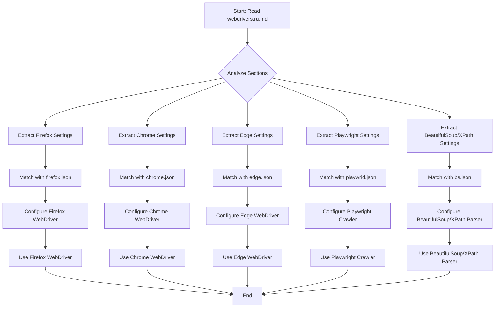

## Анализ кода `webdrivers.ru.md`

### 1. <алгоритм>

Этот документ не содержит исполняемого кода, а представляет собой текстовое описание различных вебдрайверов и их конфигурационных параметров в формате Markdown. Тем не менее, можно представить алгоритм обработки этих данных в виде блок-схемы, если бы мы захотели автоматизировать настройку вебдрайверов:

1.  **Чтение файла `webdrivers.ru.md`**: Начинается процесс с чтения файла, содержащего информацию о вебдрайверах.
2.  **Анализ разделов**: Разбор файла на разделы, определяющие разные вебдрайверы (Firefox, Chrome, Edge, Playwright, BeautifulSoup/XPath).
3.  **Извлечение данных**: Для каждого вебдрайвера извлекаются его настройки:
    *   Названия настроек, такие как `profile_name`, `user_agent`, `proxy_file_path`, `options`.
    *   Примеры конфигурации в формате JSON.
4.  **Сопоставление с JSON**: Конфигурации каждого вебдрайвера сопоставляются с соответствующим файлом `*.json`, если необходимо (например, `firefox.json`, `chrome.json`).
5.  **Настройка вебдрайвера**: На основе извлеченных и JSON-данных производится настройка конкретного вебдрайвера (пример: для Firefox - установка профиля, user-agent, прокси и т.д.).
6.  **Использование вебдрайвера**: Вебдрайвер используется для автоматизации браузера или сбора данных.
7.  **Повторение процесса**: Для каждого вебдрайвера с 3-го по 6-й шаги процесс повторяется.

**Примеры для каждого логического блока:**

*   **Чтение файла**: Читается файл `webdrivers.ru.md`.
*   **Анализ разделов**: Текст анализируется, чтобы найти заголовки вида "## 1. Firefox WebDriver", "## 2. Chrome WebDriver" и т.д.
*   **Извлечение данных**: Извлекаются параметры "profile_name", "user_agent", "proxy_file_path" для Firefox.
*   **Сопоставление с JSON**: Для Firefox из раздела берется образец конфигурации и сопоставляется с файлом `firefox.json`
*   **Настройка вебдрайвера**: На основе данных из `firefox.json` устанавливается профиль Firefox, пользовательский агент, и другие параметры.
*   **Использование вебдрайвера**: Запускается Firefox с настроенными параметрами для автоматизированного тестирования.

### 2. <mermaid>

**Описание диаграммы:**

*   `A[Start: Read webdrivers.ru.md]` - Начало процесса, чтение файла `webdrivers.ru.md`.
*   `B{Analyze Sections}` - Анализ текста для определения разделов каждого вебдрайвера.
*   `C1[Extract Firefox Settings]`, `C2[Extract Chrome Settings]`, `C3[Extract Edge Settings]`, `C4[Extract Playwright Settings]`, `C5[Extract BeautifulSoup/XPath Settings]` - Извлечение настроек для каждого вебдрайвера из текста.
*   `D1[Match with firefox.json]`, `D2[Match with chrome.json]`, `D3[Match with edge.json]`, `D4[Match with playwrid.json]`, `D5[Match with bs.json]` - Сопоставление настроек с соответствующими JSON-файлами.
*   `E1[Configure Firefox WebDriver]`, `E2[Configure Chrome WebDriver]`, `E3[Configure Edge WebDriver]`, `E4[Configure Playwright Crawler]`, `E5[Configure BeautifulSoup/XPath Parser]` - Конфигурирование каждого вебдрайвера на основе полученных данных.
*   `F1[Use Firefox WebDriver]`, `F2[Use Chrome WebDriver]`, `F3[Use Edge WebDriver]`, `F4[Use Playwright Crawler]`, `F5[Use BeautifulSoup/XPath Parser]` - Использование настроенных вебдрайверов для автоматизации и сбора данных.
*   `G[End]` - Конец процесса.

**Зависимости:**

Диаграмма показывает последовательность действий при обработке настроек вебдрайверов, начиная с чтения текстового файла `webdrivers.ru.md` и заканчивая их настройкой и использованием. Каждому вебдрайверу соответствует свой блок извлечения настроек, сопоставления с JSON и конфигурации.

### 3. <объяснение>

**Импорты:**

В данном документе нет импортов, так как это не исполняемый код, а текстовое описание.

**Классы:**

В этом документе нет определения классов, так как это текстовое описание вебдрайверов.

**Функции:**

В этом документе нет определения функций, так как это текстовое описание вебдрайверов.

**Переменные:**

В этом документе описываются параметры конфигурации вебдрайверов, такие как:

*   `profile_name` - Имя пользовательского профиля. Тип: `str`.
*   `geckodriver_version`, `chromedriver_version`, `edgedriver_version` - Версии драйверов. Тип: `str`.
*   `firefox_version`, `chrome_version`, `edge_version` - Версии браузеров. Тип: `str`.
*   `user_agent` - Пользовательский агент браузера. Тип: `str`.
*   `proxy_file_path` - Путь к файлу прокси. Тип: `str`.
*   `options` - Список опций браузера. Тип: `list` of `str`.
*   `executable_path` - Путь к исполняемым файлам браузера и драйвера. Тип: `dict`.
*   `headers` - Заголовки HTTP. Тип: `dict`.
*   `proxy_enabled` - Включение/выключение прокси. Тип: `bool`.
*   `max_requests` - Максимальное количество запросов Playwright. Тип: `int`.
*   `headless` - Режим безголового запуска браузера. Тип: `bool`.
*   `browser_type` - Тип браузера для Playwright. Тип: `str`.
*   `proxy` - Настройки прокси сервера для Playwright/bs. Тип: `dict`.
*   `viewport` - Размер окна браузера. Тип: `dict`.
*   `timeout` - Тайм-аут для запросов. Тип: `int`.
*   `ignore_https_errors` - Игнорирование ошибок HTTPS. Тип: `bool`.
*   `default_url` - URL по умолчанию для загрузки HTML. Тип: `str`.
*   `default_file_path` - Путь к файлу по умолчанию. Тип: `str`.
*   `default_locator` - Локатор по умолчанию для извлечения элементов. Тип: `dict`.
*   `logging` - Настройки логирования. Тип: `dict`.
*   `encoding` - Кодировка для чтения файлов или запросов. Тип: `str`.

**Объяснение:**

Этот документ описывает конфигурацию различных вебдрайверов, предоставляя информацию о том, как настроить каждый драйвер для автоматизации браузера или сбора данных. Каждая секция посвящена конкретному вебдрайверу и описывает его настройки, включая пользовательские профили, версии драйверов и браузеров, user-agent, прокси, опции запуска и примеры JSON-конфигурации.

*   **Firefox WebDriver**: Позволяет настраивать профили, версии Firefox и Geckodriver, пользовательский агент, прокси и опции запуска.
*   **Chrome WebDriver**: Аналогично Firefox, но для Chrome и Chromedriver.
*   **Edge WebDriver**: Аналогично Chrome, но для Microsoft Edge и Edgedriver.
*   **Playwright Crawler**: Предоставляет настройки для автоматизации браузера с использованием Playwright, включая выбор типа браузера, прокси, user-agent и параметры viewport.
*   **BeautifulSoup и XPath Parser**: Описывает настройки для парсинга HTML-контента, включая URL по умолчанию, локаторы XPath, прокси, тайм-аут и логирование.

**Потенциальные ошибки и области для улучшения:**

*   **Отсутствие проверки конфигурации**: Документ не включает проверки корректности данных в JSON файлах (например, соответствует ли версия `geckodriver` версии `firefox`). Это может привести к ошибкам при запуске вебдрайверов.
*   **Отсутствие унифицированного формата**: Разные секции имеют незначительные различия в названиях ключей (например, `profiles` у Edge вместо `profile_directory`, как у Chrome и Firefox). Это усложняет автоматизацию.
*   **Жесткие пути**: В примерах конфигураций указаны жесткие пути к исполняемым файлам, что затрудняет переносимость между разными системами.
*   **Неполная документация**: Для некоторых настроек отсутствуют подробные описания их влияния на работу вебдрайверов.

**Взаимосвязь с другими частями проекта:**

Этот документ является частью конфигурационной базы проекта. JSON-файлы, описанные в документе, используются модулями вебдрайверов для их корректной настройки перед запуском автоматизированных задач или сбора данных.