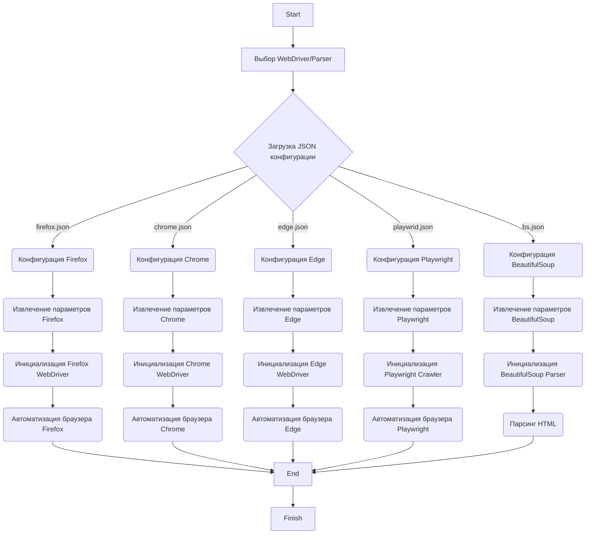

## Анализ кода

### 1. <алгоритм>

Этот документ описывает конфигурации различных вебдрайверов и парсеров, используемых в проекте. Вот блок-схема, описывающая, как эти конфигурации могут быть использованы:

1.  **Выбор WebDriver:**
    *   Пользователь определяет, какой вебдрайвер (Firefox, Chrome, Edge, Playwright) или парсер (BeautifulSoup/XPath) ему нужен. Например, если нужно автоматизировать браузер Chrome, выбирается "Chrome WebDriver".

2.  **Чтение конфигурации:**
    *   После выбора вебдрайвера или парсера, соответствующий JSON файл конфигурации (например, `firefox.json`, `chrome.json`, `edge.json`, `playwrid.json`, `bs.json`) загружается.
        *   **Пример:** Если выбран Chrome WebDriver, загружается `chrome.json`.

3.  **Настройка параметров:**
    *   Из загруженного JSON файла извлекаются необходимые параметры. Это могут быть:
        *   Пути к исполняемым файлам (например, `chrome_binary`, `chromedriver`).
        *   Опции запуска браузера (например, `--headless`, `--disable-gpu`).
        *   Профили пользователей.
        *   User-Agent.
        *   Настройки прокси.
        *   Тайм-ауты и другие параметры.
            *   **Пример:** Из `chrome.json` извлекаются пути к `chrome.exe` и `chromedriver.exe`, а также список опций, например, `["--headless", "--disable-gpu"]`.

4.  **Инициализация WebDriver/Parser:**
    *   Используя извлечённые параметры, инициализируется выбранный вебдрайвер или парсер.
        *   **Пример:** Для Chrome WebDriver, Chrome Browser и ChromeDriver запускаются с указанными параметрами.

5.  **Работа с браузером/парсинг:**
    *   После инициализации вебдрайвер или парсер используется для автоматизации браузера (например, навигация по страницам, ввод данных, сбор информации) или для парсинга HTML-контента.
        *   **Пример:** Chrome WebDriver используется для открытия веб-страницы, выполнения поиска, сбора данных.

6.  **Завершение работы:**
    *   По окончании работы вебдрайвер/парсер корректно завершает свою работу, освобождая ресурсы.

### 2. <mermaid>

**Объяснение:**

1.  **Start:** Начало процесса.
2.  **ChooseDriver:** Пользователь выбирает, какой вебдрайвер или парсер использовать (например, Chrome, Firefox, Edge, Playwright или BeautifulSoup).
3.  **LoadConfig:**  В зависимости от выбранного драйвера/парсера, загружается соответствующий JSON файл конфигурации.
4.  **FirefoxConfig, ChromeConfig, EdgeConfig, PlaywrightConfig, BsConfig:**  Представляют загруженные конфигурации каждого из инструментов.
5.  **ParseFirefoxConfig, ParseChromeConfig, ParseEdgeConfig, ParsePlaywrightConfig, ParseBsConfig:** Извлечение параметров из соответствующих JSON-файлов.
6.  **InitFirefoxDriver, InitChromeDriver, InitEdgeDriver, InitPlaywrightCrawler, InitBsParser:** Инициализация выбранного вебдрайвера или парсера с извлеченными настройками.
7.  **BrowserAutomation, BrowserAutomation2, BrowserAutomation3, PlaywrightAutomation:** Автоматизация браузеров с помощью соответствующих вебдрайверов.
8.  **HTMLParsing:** Парсинг HTML-контента с использованием BeautifulSoup и XPath.
9. **End:** Завершение работы с инструментом.
10. **Finish:** Конец процесса.

### 3. <объяснение>

**Общее описание:**

Этот документ предназначен для описания и настройки различных инструментов для автоматизации браузеров и парсинга веб-страниц, используемых в проекте. Описываются вебдрайверы (Firefox, Chrome, Edge) и краулер Playwright, а также парсер BeautifulSoup.  Настройки для каждого инструмента хранятся в отдельных JSON файлах.

**Детальное объяснение по разделам:**

**1. Firefox WebDriver:**

*   **Описание:** Предоставляет интерфейс для управления браузером Firefox.
*   **Настройки:**
    *   `profile_name`: Имя профиля пользователя Firefox.
    *   `geckodriver_version`: Версия geckodriver, драйвера для Firefox.
    *   `firefox_version`: Версия браузера Firefox.
    *   `user_agent`: Строка User-Agent.
    *   `proxy_file_path`: Путь к файлу с настройками прокси.
    *   `options`: Список опций командной строки Firefox (например, `--kiosk`, `--headless`).
*   **Пример конфигурации (`firefox.json`):**
    *   `options`: `--kiosk`, `--headless`
    *  `profile_directory`:  Пути к каталогам профиля (для ОС и для внутреннего использования).
    *   `executable_path`: Пути к исполняемым файлам Firefox и geckodriver.
    *   `headers`: Заголовки, которые отправляются с запросами.
    *   `proxy_enabled`: Включение/выключение прокси.

**2. Chrome WebDriver:**

*   **Описание:** Предоставляет интерфейс для управления браузером Google Chrome.
*   **Настройки:** Аналогично Firefox WebDriver, но для браузера Chrome.
    *   `profile_name`: Имя профиля пользователя Chrome.
    *   `chromedriver_version`: Версия chromedriver, драйвера для Chrome.
    *   `chrome_version`: Версия браузера Chrome.
    *   `user_agent`: Строка User-Agent.
    *   `proxy_file_path`: Путь к файлу с настройками прокси.
    *   `options`: Список опций командной строки Chrome (например, `--headless`, `--disable-gpu`).
*   **Пример конфигурации (`chrome.json`):**
    *   `options`: `--headless`, `--disable-gpu`.
     *  `profile_directory`:  Пути к каталогам профиля (для ОС и для внутреннего использования).
    *   `executable_path`: Пути к исполняемым файлам Chrome и chromedriver.
    *   `headers`: Заголовки, которые отправляются с запросами.
    *   `proxy_enabled`: Включение/выключение прокси.

**3. Edge WebDriver:**

*   **Описание:** Предоставляет интерфейс для управления браузером Microsoft Edge.
*   **Настройки:** Аналогично Firefox и Chrome WebDriver, но для браузера Edge.
    *   `profile_name`: Имя профиля пользователя Edge.
    *   `edgedriver_version`: Версия edgedriver, драйвера для Edge.
    *   `edge_version`: Версия браузера Edge.
    *   `user_agent`: Строка User-Agent.
    *   `proxy_file_path`: Путь к файлу с настройками прокси.
    *   `options`: Список опций командной строки Edge (например, `--headless`, `--disable-gpu`).
*   **Пример конфигурации (`edge.json`):**
    *   `options`: `--headless`, `--disable-gpu`.
     *  `profiles`:  Пути к каталогам профиля (для ОС и для внутреннего использования).
    *   `executable_path`: Пути к исполняемым файлам Edge и edgedriver.
    *   `headers`: Заголовки, которые отправляются с запросами.
    *   `proxy_enabled`: Включение/выключение прокси.

**4. Playwright Crawler:**

*   **Описание:** Использует библиотеку Playwright для автоматизации браузеров.
*   **Настройки:**
    *   `max_requests`: Максимальное количество запросов.
    *   `headless`: Режим безголового запуска браузера (true/false).
    *   `browser_type`: Тип браузера (`chromium`, `firefox`, `webkit`).
    *   `user_agent`: Строка User-Agent.
    *   `proxy`: Настройки прокси-сервера (сервер, логин, пароль).
    *   `viewport`: Размеры окна браузера (ширина и высота).
    *   `timeout`: Тайм-аут для запросов.
    *   `ignore_https_errors`: Игнорирование ошибок HTTPS (true/false).
 *  `options`: Список дополнительных опций для запуска браузера.
*   **Пример конфигурации (`playwrid.json`):**
    *   `max_requests`: 10.
    *   `headless`: `true`.
    *   `browser_type`: `chromium`.
    *  `options`:  `["--disable-dev-shm-usage", "--no-sandbox"]`
    *   `user_agent`: User-Agent.
    *   `proxy`: Включение/выключение прокси и его настройки.
    *   `viewport`:  `{width: 1280, height: 720}`.
    *   `timeout`: `30000`.
    *   `ignore_https_errors`: `false`.

**5. BeautifulSoup и XPath Parser:**

*   **Описание:**  Модуль для парсинга HTML с использованием BeautifulSoup и XPath.
*   **Настройки:**
    *   `default_url`: URL по умолчанию для загрузки HTML.
    *   `default_file_path`: Путь к файлу по умолчанию.
    *   `default_locator`: Локатор по умолчанию для извлечения элементов.
    *   `logging`: Настройки логирования (уровень, файл лога).
    *   `proxy`: Настройки прокси-сервера.
    *   `timeout`: Тайм-аут для запросов.
    *   `encoding`: Кодировка для чтения файлов.
*   **Пример конфигурации (`bs.json`):**
    *   `default_url`: `https://example.com`.
    *   `default_file_path`: `file://path/to/your/file.html`.
    *   `default_locator`: Поиск по ID, с аттрибутом `element_id`, и  XPath селектором.
    *   `logging`: Настройки логирования (уровень, файл).
    *   `proxy`:  Настройки прокси.
    *   `timeout`: `10`.
    *   `encoding`: `utf-8`.

**Взаимосвязи с другими частями проекта:**

*   **JSON файлы конфигурации**: Используются для хранения настроек вебдрайверов и парсеров.
*   **src**: Предположительно, эти настройки будут использованы в модулях, находящихся в каталоге `src`, где располагаются различные классы и функции, управляющие вебдрайверами и парсерами.
*  **Логирование:**  Модули логирования, вероятно, будут использоваться для записи действий и ошибок, которые могут возникнуть во время работы вебдрайверов и парсеров.

**Потенциальные ошибки или области для улучшения:**

*   **Жестко закодированные пути:** В примерах конфигураций пути к исполняемым файлам жестко закодированы. Это может создать проблемы при переносе проекта или использовании разных версий драйверов. Можно использовать переменные окружения или относительные пути.
*   **Управление версиями:** Конфигурации содержат версии драйверов и браузеров.  Следовало бы предусмотреть автоматическое обновление драйверов или оповещение об устаревших версиях.
*   **Безопасность прокси:**  Логины и пароли для прокси-серверов не должны храниться в открытом виде. Можно использовать методы для безопасного хранения секретов, например, переменные окружения или защищенные файлы конфигурации.
*   **Обработка ошибок:** Необходимо убедиться, что каждый вебдрайвер и парсер имеет адекватную обработку ошибок.  Особое внимание следует уделить обработке тайм-аутов, ошибок сетевых соединений и некорректных HTML.

**Цепочка взаимосвязей:**

1.  **JSON файлы конфигураций** (например, `firefox.json`, `chrome.json`, `edge.json`, `playwrid.json`, `bs.json`)
2.  **Модули, считывающие конфигурации** (`src/config_reader.py` или аналогичный)
3.  **Классы вебдрайверов/парсеров** (`src/webdriver/firefox.py`, `src/webdriver/chrome.py`,  `src/webdriver/edge.py`, `src/crawler/playwright.py`, `src/parser/bs.py` или аналогичные).
4.  **Модули, использующие вебдрайверы/парсеры** (`src/tasks.py` или аналогичные)
5.  **Модули логирования** (`src/logger.py` или аналогичный)

В целом, документ представляет собой подробное руководство по настройке и использованию вебдрайверов и парсеров в проекте. Соблюдение рекомендаций по улучшению позволит сделать систему более гибкой и надежной.