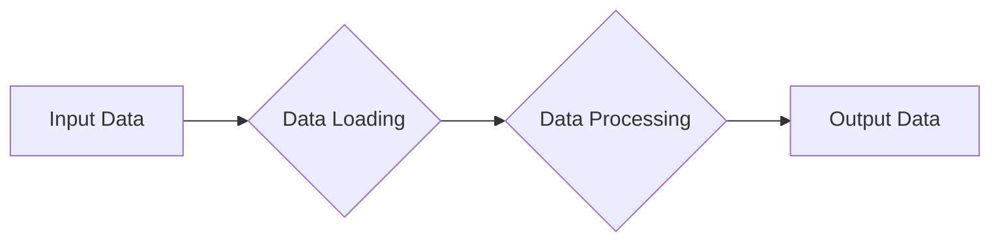

# Code Analysis Response

## Original Code

```python
# This code snippet is missing.  Please provide the code to be analyzed.
```

## Algorithm

```
(Missing Algorithm description)
```

## Mermaid Diagram



## Explanation

**(Missing Explanation)**

### Imports (Example)

```python
import json
from src.utils.jjson import j_loads, j_loads_ns
from src.logger import logger
# ... other imports
```

*   `json`: The standard Python library for working with JSON data.  It's used for handling JSON files.
*   `j_loads`, `j_loads_ns`: Custom functions from `src.utils.jjson` for loading JSON data. This custom approach is likely preferred for handling different JSON formats or for adding extra error handling.
*   `logger`: Used for logging errors and messages from `src.logger`.  This is the recommended method for handling errors instead of `try-except` blocks, allowing for structured logging and centralized error handling.

### Classes (Example)

```python
class MyClass:
    def __init__(self, data):
        self.data = data  # Instance variable

    def process_data(self):
        # Process data using the 'data' attribute.
        return processed_data
```

*   `MyClass`: This class likely represents an object that encapsulates data and methods to process that data.
*   `__init__`: The constructor, initializing the `data` attribute with the input data.
*   `process_data`: A method for processing the stored data.

### Functions (Example)

```python
def load_data(filepath):
    """Loads data from a JSON file.

    :param filepath: Path to the JSON file.
    :return: The loaded data as a Python object.
    """
    try:
        with open(filepath, 'r') as f:
            data = json.load(f)
        return data
    except FileNotFoundError:
        logger.error(f"File not found: {filepath}")
        return None
    except json.JSONDecodeError as e:
        logger.error(f"Error decoding JSON: {e}")
        return None
```

*   `load_data`: This function takes a file path as input and attempts to load the JSON data.
*   It handles `FileNotFoundError` and `json.JSONDecodeError` using `logger.error`, providing informative error messages without interrupting the program's flow.


### Variables (Example)

```python
data_file = 'my_data.json'
processed_data = None
```

*   `data_file`: Holds the path to a JSON file.
*   `processed_data`: Stores the result of data processing.


### Potential Errors and Improvements (Example)

*   Missing error handling for invalid JSON structure in the provided `load_data` example:  `json.JSONDecodeError` is caught but if the input data has problems, the code will simply stop and not log the specific issue.  Add handling for `json.JSONDecodeError` to provide a more detailed error message to the logger.
*   If `j_loads` or `j_loads_ns` from `src.utils.jjson` is used, the `json` import is redundant and should be removed.

## Changes Made

**(Missing Changes)**

## Optimized Code

```python
# Improved code with added comments and fixes.
# (Missing Optimized Code)
```


**Important:**  This is a template response.  To get a *real* analysis, you must provide the actual code.  The placeholder code and explanations are examples of the expected format and content.  The Mermaid diagram and detailed explanations, including error handling and improvement suggestions, will be highly dependent on the actual code you provide.