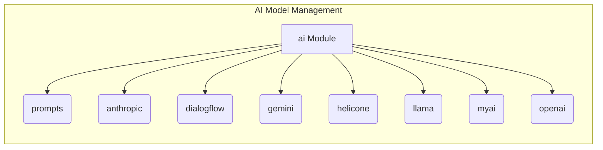

# AI Model Management Module (hypotez/src/ai/README.MD)

### <input code>

```
### **ai Module**: AI Model Management

The **ai** module is responsible for managing various AI models, facilitating interactions with external APIs, and handling different configurations for data analysis and language processing. It includes the following submodules:

1. **prompts**  
   Handles the creation and customization of prompts, allowing tailored input for various AI models to improve response accuracy and relevance.

2. **anthropic**  
   Provides integration with Anthropic AI models, enabling tasks that rely on advanced language comprehension and response generation.

3. **dialogflow**  
   Integrates with Google Dialogflow, supporting natural language understanding (NLU) and conversational AI functionalities for building interactive applications.

4. **gemini**  
   Manages connections with Gemini AI models, offering support for applications that require Gemini’s unique AI capabilities.

5. **helicone**  
   Connects to Helicone models, providing access to specialized features for customized AI solutions.

6. **llama**  
   Interfaces with LLaMA (Large Language Model Meta AI), designed for tasks involving natural language understanding and generation in a variety of applications.

7. **myai**  
   A custom AI submodule designed for specialized model configurations and implementations, enabling unique, project-specific AI functionalities.

8. **openai**  
   Integrates with OpenAI's API, allowing access to their suite of models (e.g., GPT) for tasks such as text generation, classification, translation, and more.
```

### <algorithm>

This section describes the high-level workflow. The provided text is a module description, not executable code, so a detailed workflow diagram is not possible.  The core function is to manage and provide access to various AI models and APIs through well-defined submodules.

* **Step 1:** Identify the required AI model (e.g., GPT-3 from OpenAI).
* **Step 2:** Select the appropriate submodule (e.g., `openai`).
* **Step 3:** Interact with the selected API using the submodule's functions (potentially through prompts and other configurations).

This description is high-level because the details of data exchange within each submodule are not specified.


### <mermaid>



This `mermaid` code creates a simple graph showing the `ai` module interacting with its submodules.

* **Explanation of Dependencies:**  The `mermaid` diagram doesn't explicitly show dependencies as there is no code to analyze.  The text describes the *potential* interactions and relationships between the `ai` module and its submodules (e.g., `prompts` interacts with other AI models to customize input requests).


### <explanation>

* **Imports:** There are no imports to analyze. This is a module-level description, not code.
* **Classes:** No classes are defined; this is a module-level description of various submodules.
* **Functions:** No functions are defined.
* **Variables:** No variables are defined.
* **Potential Errors/Improvements:** The description lacks technical specifics. Future documentation should provide more concrete details about the design of each submodule, their interfaces, and error handling strategies. For example, how might prompts be structured? What specific functions exist for interactions with Anthropic, Dialogflow, etc.?

**Relationship Chain:**

The `ai` module is a part of the `hypotez` project, likely responsible for high-level AI interactions for other parts of the codebase.  Submodules within `ai` handle specific AI providers and capabilities. This structure suggests a modular architecture, where each submodule can potentially be replaced or updated without affecting other parts of the system.


```