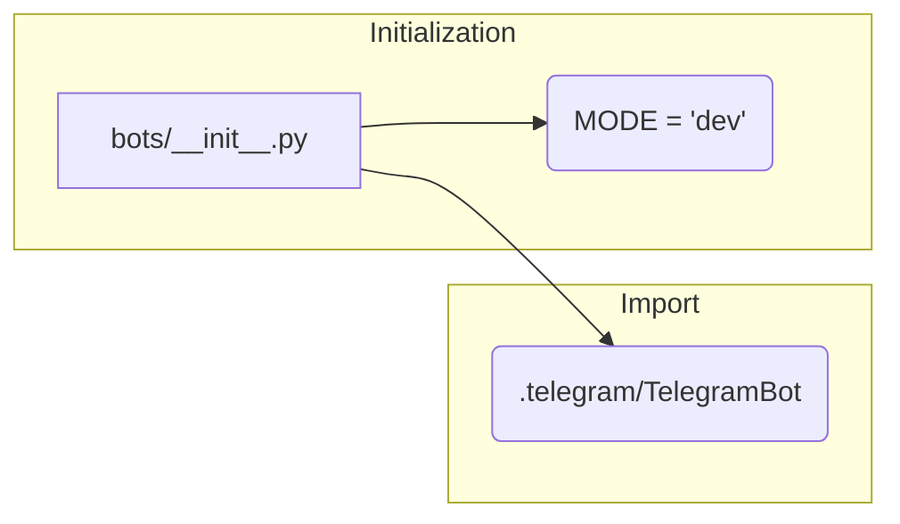

# Code Explanation for hypotez/src/bots/__init__.py

## <input code>

```python
## \file hypotez/src/bots/__init__.py
# -*- coding: utf-8 -*-\
#! venv/Scripts/python.exe
#! venv/bin/python/python3.12

"""
.. module: src.bots 
	:platform: Windows, Unix
	:synopsis:

"""
MODE = 'dev'


from .telegram import TelegramBot
```

## <algorithm>

This file appears to be an initialization file for a module named `bots`.  It likely sets up a module structure for different bot implementations in the `hypotez` project. The current state of the file is extremely basic.

**Step-by-step Workflow (Conceptual):**

1. **Initialization:**  The `__init__.py` file is executed when the `hypotez/src/bots` module is imported. It defines constants and imports necessary components.  In this case, it sets a variable called `MODE` to a string value ('dev').
2. **Import:** The file imports `TelegramBot` class from the `telegram.py` module within the `bots` folder (indicated by `.telegram`).
3. **Module Preparation:** This sets up the `bots` module, making its components accessible to other parts of the project.  There's no significant logic processing or function call.

## <mermaid>



**Dependencies:**

The only dependency shown is the import of `TelegramBot` from `.telegram`.  This assumes that `telegram.py` is located within the same directory `bots`. The diagram depicts the module initialization and the import process.


## <explanation>

* **Imports:**
    * `from .telegram import TelegramBot`: This line imports the `TelegramBot` class from a file named `telegram.py` located in the `bots` subdirectory. The `.` signifies a relative import within the `bots` module's current directory.  This is a common Python module organization pattern.

* **Classes:**
    * `TelegramBot`: This class (likely defined in `telegram.py`) represents a Telegram bot.  Its details (attributes and methods) aren't present in `__init__.py`, requiring inspection of the `telegram.py` file.

* **Functions:**
    *  There are no functions defined directly within `__init__.py`.

* **Variables:**
    * `MODE = 'dev'`:  This global variable likely controls different operation modes (e.g., development, production). It's a simple string variable.

* **Potential Errors/Improvements:**

    * **Lack of functionality:** The file is currently very rudimentary; it lacks any significant logic.  The `MODE` constant isn't used and there are no functions that would actually interact with the `TelegramBot` for its operation. Further functionality would need to be included for the bot's operation.

* **Relationship Chain:** The `TelegramBot` class and its interactions (with `telepot` or similar libraries, for example) are not directly visible from this file.  To create a full project dependency analysis, other modules/files containing the code for the `TelegramBot` (and associated Telegram API connections) would need to be inspected.

In summary, the `__init__.py` file sets up a module for interacting with a TelegramBot, but without further code, it doesn't do much beyond importing the necessary component from another file.