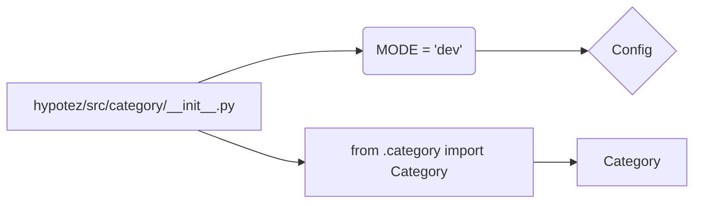

# Code Explanation for hypotez/src/category/__init__.py

## <input code>

```python
## \file hypotez/src/category/__init__.py
# -*- coding: utf-8 -*-
#! venv/Scripts/python.exe
#! venv/bin/python/python3.12

"""
.. module: src.category 
	:platform: Windows, Unix
	:synopsis:

"""
MODE = 'dev'

from .category import Category
```

## <algorithm>

This file is an initialization module for the `category` package.  It primarily acts as a point of entry and exports a defined constant and imports a class from another file within the package. There's no complex algorithm or processing.

**Step 1:** Define a constant.
   - Example: `MODE = 'dev'`
   - Data flow: Sets the value of `MODE` which is likely a configuration value for the module.


**Step 2:** Import a class.
   - Example: `from .category import Category`
   - Data flow: Imports the `Category` class from a file named `category.py` within the `src.category` package, making it available for use in other parts of the project.

No complex interactions, just setting a variable and importing a class for potential usage.

## <mermaid>



**Dependency Analysis:**

The `hypotez/src/category/__init__.py` imports the `Category` class. This means there must be a `category.py` file (or similar) located within the `hypotez/src/category` directory that defines the `Category` class. The diagram reflects this dependency. The `Category` class represents a central component of the `category` package (likely having data and methods related to categories).

## <explanation>

### Imports:

- `from .category import Category`: This line imports the `Category` class from the `category.py` file within the same directory (`hypotez/src/category`). The `.` indicates that the import is from a sibling module within the current package. This is a crucial part of Python's module system. Without it, you would need to specify the full path (like `from hypotez.src.category import Category`) making the code less maintainable, especially if the `category` package structure was altered in the future.

### Classes:

- `Category`: This class is imported; its definition is located elsewhere (in `category.py`).  Its functionality is not detailed in the provided `__init__.py` file.  The nature of the class (attributes and methods) is unknown at this stage.

### Functions:

- No functions are defined in this file.

### Variables:

- `MODE = 'dev'`: This is a global constant variable.  It's used to store a string likely representing a mode, perhaps 'development' or similar.  It sets the operational context for other parts of the application where it might be referenced.


### Potential Errors/Improvements:

- **No Docstrings for `MODE`:**  While the module docstring is present, the `MODE` constant lacks a docstring explaining its purpose and possible values.  Adding a docstring would improve clarity for anyone reading or maintaining this code.


**Relationship with Other Parts of the Project:**

This `__init__.py` file acts as an entry point for the `category` package. Other parts of the project will import the `Category` class from this package to interact with and manage categories. This implicitly creates a dependency where any changes within the `src.category` package may affect other parts relying on its functionality, making it part of a larger software system where changes must consider the broader context. This demonstrates an important structural concept, the modular design of software projects in Python.