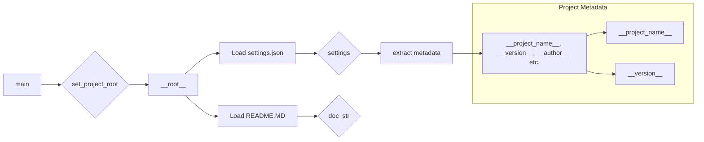

```MD
# Code Explanation for hypotez/src/category/header.py

## <input code>

```python
## \file hypotez/src/category/header.py
# -*- coding: utf-8 -*-\n#! venv/Scripts/python.exe
#! venv/bin/python/python3.12
"""
module: src.category 
	:platform: Windows, Unix
	:synopsis: Модуль определяющий корневой путь к проекту. Все импорты строятся относительно этого пути.
    :TODO: В дальнейшем перенести в системную переменную"""
MODE = 'dev'

import sys
import json
from packaging.version import Version

from pathlib import Path
def set_project_root(marker_files=('pyproject.toml', 'requirements.txt', '.git')) -> Path:
    """
    Finds the root directory of the project starting from the current file's directory,
    searching upwards and stopping at the first directory containing any of the marker files.

    Args:
        marker_files (tuple): Filenames or directory names to identify the project root.
    
    Returns:
        Path: Path to the root directory if found, otherwise the directory where the script is located.
    """
    __root__:Path
    current_path:Path = Path(__file__).resolve().parent
    __root__ = current_path
    for parent in [current_path] + list(current_path.parents):
        if any((parent / marker).exists() for marker in marker_files):
            __root__ = parent
            break
    if __root__ not in sys.path:
        sys.path.insert(0, str(__root__))
    return __root__


# Get the root directory of the project
__root__ = set_project_root()
"""__root__ (Path): Path to the root directory of the project"""

from src import gs

settings:dict = None
try:
    with open(gs.path.root / 'src' / 'settings.json', 'r') as settings_file:
        settings = json.load(settings_file)
except (FileNotFoundError, json.JSONDecodeError):
    ...

doc_str:str = None
try:
    with open(gs.path.root / 'src' / 'README.MD', 'r') as settings_file:
        doc_str = settings_file.read()
except (FileNotFoundError, json.JSONDecodeError):
    ...


__project_name__ = settings.get("project_name", 'hypotez') if settings  else 'hypotez'
__version__: str = settings.get("version", '')  if settings  else ''
__doc__: str = doc_str if doc_str else ''
__details__: str = ''
__author__: str = settings.get("author", '')  if settings else ''
__copyright__: str = settings.get("copyrihgnt", '')  if settings else ''
__cofee__: str = settings.get("cofee", "Treat the developer to a cup of coffee for boosting enthusiasm in development: https://boosty.to/hypo69")  if settings else "Treat the developer to a cup of coffee for boosting enthusiasm in development: https://boosty.to/hypo69"
```

## <algorithm>

**Workflow Diagram:**

1. **`set_project_root()`:**
    * Takes a tuple of marker files as input.
    * Starts from the current file's directory.
    * Iterates through parent directories until a directory containing at least one marker file is found.
    * If the found root directory isn't already in `sys.path`, it's added.
    * Returns the `Path` object representing the root directory.

    **Example:**
    ```
    Input: marker_files = ('pyproject.toml', '.git')
    Current File: /path/to/project/src/category/header.py
    Parent directories checked:
        /path/to/project/src/category
        /path/to/project/src
        /path/to/project
    Result: /path/to/project
    ```

2. **`__root__` assignment:**
    * Calls `set_project_root()` to determine the project's root.
    * Stores the result in `__root__`.

3. **`settings` loading:**
    * Constructs a path to `settings.json` using the project root (`gs.path.root`) and the `src` directory.
    * Attempts to load JSON data from `settings.json` into the `settings` variable.
    * Handles `FileNotFoundError` and `json.JSONDecodeError` to gracefully manage cases where the file is missing or the JSON is invalid.

4. **`doc_str` loading:**
    * Constructs a path to `README.MD` using the project root (`gs.path.root`) and the `src` directory.
    * Attempts to read the content of `README.MD` into the `doc_str` variable.
    * Handles `FileNotFoundError` and `json.JSONDecodeError` to gracefully manage missing or invalid files.

5. **Project Metadata Extraction:**
    * Extracts project name, version, author, etc. from the `settings` dictionary, providing default values if keys are missing or `settings` is None.


## <mermaid>



**Dependencies Analysis:**

* **`sys`:** Used for interacting with the Python interpreter, particularly for manipulating the `sys.path` variable.
* **`json`:** Used for serializing and deserializing JSON data (loading and saving settings).
* **`packaging.version`:** Used for handling and managing version strings.
* **`pathlib`:** Used for working with file paths in a more object-oriented way.  Crucial for handling paths correctly and portably.
* **`src.gs`:** Likely a custom module for getting the project root path.  Import is crucial for knowing the project's structure.  This establishes a dependency on the `gs` module.


## <explanation>

**Imports:**

* **`sys`:** Provides access to system-specific parameters and functions, in this case, for modifying the module search path.
* **`json`:** Used for handling JSON data.
* **`packaging.version`:** Used for handling and validating version strings.
* **`pathlib`:**  Provides a way to work with paths that is more modern and more object-oriented, enhancing code clarity and portability.
* **`src.gs`:**  Likely part of the project's structure, providing a way to access the project root path (`gs.path.root`). This import establishes a dependency on `src.gs` that should be documented elsewhere in the project.


**Classes:**

*  There are no classes in this file.


**Functions:**

* **`set_project_root(marker_files)`:**
    * Takes a tuple of strings (files or directories) as input to identify the root of the project.
    * Traverses up the directory tree from the current file's location until a directory containing any of the marker files is found.
    * Ensures the root directory is added to `sys.path`.  This is crucial for the import mechanism of the project.
    * Returns the path to the root directory.

**Variables:**

* **`MODE`:**  A string variable likely used for project configurations or settings.  It is set to 'dev' in this case, but is not used internally.
* **`__root__`:**  The resolved root directory of the project, after execution of `set_project_root()`. Critical to setting the import path of the project.
* **`settings`:** A dictionary containing project settings loaded from `settings.json`.
* **`doc_str`:** The content of the `README.MD` file, if it exists.
* **`__project_name__`, `__version__`, `__doc__`, `__details__`, `__author__`, `__copyright__`, `__cofee__`:**  Metadata variables derived from the `settings` dictionary; these variables are used for project information.  The defaults in case `settings` isn't loaded (or a key isn't found) are essential for preventing runtime errors.

**Potential Errors/Improvements:**

* **Error Handling:** The `try...except` blocks for loading `settings.json` and `README.MD` are good practices for robustness.  Consider adding logging to provide more information about why loading might fail in case of a `FileNotFoundError`.
* **`gs.path.root`:**  The exact nature of `gs.path.root` should be documented.  Consider adding more descriptive comments or a separate file that defines the helper functions for obtaining the root path and its members like `src`.

**Relationships:**

This file depends on `src.gs` for accessing the project root directory (`gs.path.root`).  It initializes and sets up the project environment by ensuring the root directory is added to `sys.path`.  The `src` package must contain `gs` and `settings.json`.

```
header.py
     +-----------------+
     |                 |
     v                 |
    src.gs             | Defines Path functions, potentially
     +-----------------+      project root access, etc.
     |                 |
     +-----------------+
     |                 |  (other src files)
     | settings.json   |
     |                 |
     +-----------------+
```