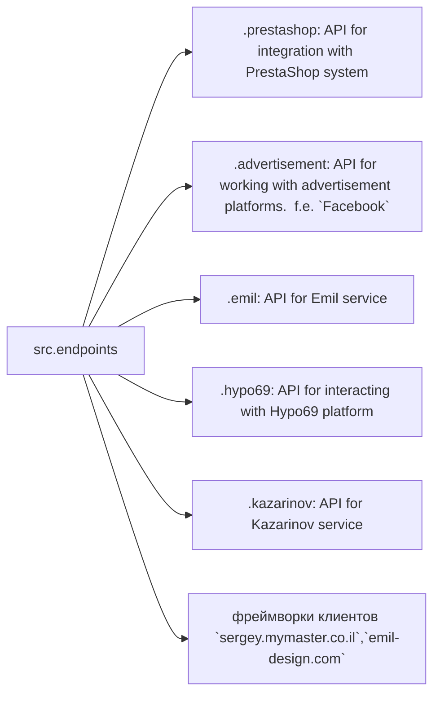

# Code Explanation: `src.endpoints` Module

## <input code>

```
[English](https://github.com/hypo69/hypo/endpoints/blob/master/readme.md)
Модуль конечных точек взаимодействия с потребителями данных
=========================================================================================

Модуль `endpoints` предоставляет реализацию API для взаимодействия с потребителями данных.
Каждая поддиректория представляет собой отдельный модуль, реализующий API для определённого сервиса.
Модуль `endpoints` включает подмодули для интеграции с различными системами потребителей,
обеспечивая взаимодействие с внешними сервисами.


## Структура модуля


### Final Consumer Endpoints


# 1. **PrestaShop**
Интеграция с API PrestaShop. Использует стандартные api.

# 2. **bots**
Подмодуль для управления интеграцией с ботами Telegram и Discord.


# 3. **emil**
Подмодуль для интеграции с клиентом  https://emil-design.com (prestashop + facebook)


# 4. **kazarinov**
Подмодуль для интеграции с поставщиком данных Kazarinov. (pricelist creator, facebook promotion)

## Описание модулей

### 1. `prestashop`
Модуль предназначен для интеграции с системой электронной коммерции PrestaShop. Реализует функционал взаимодействия с заказами, товарами и клиентами.

- **Основные функции**:
  - Создание, редактирование и удаление товаров.
  - Управление заказами и пользователями.

### 2. `advertisement`
Модуль предоставляет API для управления рекламными платформами, включая создание кампаний и аналитические отчеты.

- **Основные функции**:
  - Управление рекламными кампаниями.
  - Сбор и обработка данных аналитики.

### 3. `emil`
Интерфейс для работы с сервисом Emil, предоставляющим API для обмена данными.

- **Основные функции**:
  - Обработка и отправка запросов в сервис.
  - Сбор данных из API Emil.

### 4. `hypo69`
API для взаимодействия с платформой Hypo69, предоставляющей специфические бизнес-решения.

- **Основные функции**:
  - Получение данных о клиентах.
  - Работа с пользовательскими отчетами.

### 5. `kazarinov`
Модуль для интеграции с сервисом Kazarinov. Поддерживает функционал аналитики и обмена данными.

- **Основные функции**:
  - Интеграция данных между системами.
  - Создание отчетов и аналитика.

## Установка и использование

### Установка
Для начала работы убедитесь, что установлены все зависимости проекта. Используйте команду:

```bash
pip install -r requirements.txt
```

### Использование
Импортируйте нужный модуль в своем коде:

```python
from src.endpoints.prestashop import PrestashopAPI
from src.endpoints.advertisement import AdvertisementAPI
```

Далее настройте и используйте методы в зависимости от вашего кейса.

## Вклад в разработку

Если вы хотите внести изменения в модуль, соблюдайте следующие правила:

1. Используйте [PEP 8](https://peps.python.org/pep-0008/) для стиля кода.
2. Добавляйте тесты для нового функционала.
3. Оставляйте подробные комментарии к изменениям.

Для вопросов и предложений обращайтесь к владельцу репозитория или оставляйте комментарии в [Issues](#).
```

## <algorithm>

The `endpoints` module acts as an API layer for interacting with various consumer data systems (PrestaShop, advertisement platforms, Emil, Hypo69, Kazarinov). Each subdirectory (`prestashop`, `advertisement`, etc.) represents a separate module responsible for a specific service integration.  This structure promotes modularity and maintainability.

**Workflow steps:**

1. **Import the necessary `endpoints` module** into a consumer application.
2. **Instantiate a specific API object** from a respective module.
3. **Call methods** on the instantiated object to perform operations on the service.


## <mermaid>

```mermaid
graph LR
    subgraph src.endpoints
        src.endpoints --> prestashop
        src.endpoints --> advertisement
        src.endpoints --> emil
        src.endpoints --> hypo69
        src.endpoints --> kazarinov
    end
    prestashop --> "PrestaShop API"
    advertisement --> "Advertisement API"
    emil --> "Emil API"
    hypo69 --> "Hypo69 API"
    kazarinov --> "Kazarinov API"
    subgraph consumer app
      consumerapp --> src.endpoints
    end
```

This diagram illustrates the relationship where `src.endpoints` is a central module acting as an intermediary between various consumer applications (represented by `consumerapp`) and external APIs (`PrestaShop API`, etc.).


## <explanation>

**Imports:**

The provided text describes the intended structure of `src.endpoints`.  Crucially, it shows that the module is part of the larger `src` package, which likely contains other related packages/modules.   Import statements like `from src.endpoints.prestashop import PrestashopAPI` indicate that the `endpoints` module contains sub-modules like `prestashop` that implement specific APIs.

**Classes:**

Classes like `PrestashopAPI`, `AdvertisementAPI`, etc. are likely defined within the `.prestashop`, `.advertisement`, etc.  modules. These classes encapsulate the logic for interacting with each respective external API.  The documentation specifies the functions that would be included within these classes (creating/updating products, managing advertisements, etc.).


**Functions:**

Methods within the classes are designed to handle actions like creating/updating products, managing campaigns, making requests to APIs, etc.  The documentation describes the primary functionalities provided by each API in the `endpoints` module, giving examples for each (e.g., adding, modifying, or removing products from PrestaShop).


**Variables:**

Variables are likely used within the methods of the classes to store data retrieved from the APIs (product IDs, campaign details), or to configure API connections (API keys, URLs).


**Potential Errors/Improvements:**

* **Detailed Implementation Missing:** The documentation lacks specifics about the implementation of the API calls and data handling.  For example, how errors are handled, what data structures are used, and how authentication is managed.
* **Testing:**  Testing is critical for ensuring the reliability and accuracy of the API calls. The documentation mentions adding tests, which is an excellent practice, but specific details about how to test these modules aren't provided.
* **Error Handling:** The documentation should outline the error handling strategies used in the classes.
* **Security:**  API keys or other sensitive data should be handled securely and not hardcoded directly within the code.
* **Dependencies:**  The documentation should include which external libraries or APIs are used for each service.

**Chain of Relationships:**

The `endpoints` module acts as an intermediary layer between the core application logic (`src`) and external consumer APIs.  Consumer applications utilize the methods of classes in the `endpoints` module to interact with these external APIs.