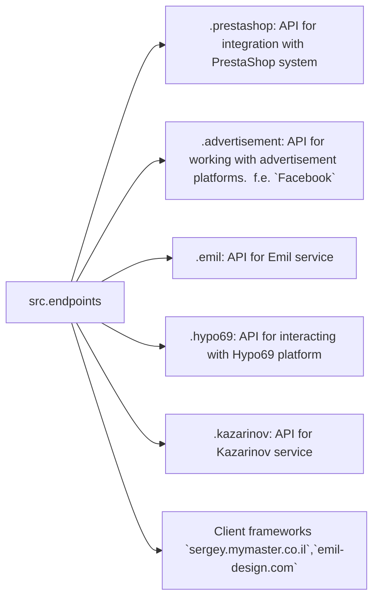

```MD
# Code Explanation: `hypotez/src/endpoints/README.MD`

## <input code>

```
[Русский](https://github.com/hypo69/hypo/endpoints/blob/master/README.RU.MD)
### Data Consumer Endpoints Module
=========================================================================================

The `endpoints` module provides an implementation of APIs for interacting with data consumers.
Each subdirectory represents a separate module that implements the API for a specific service.
The `endpoints` module includes submodules for integration with various consumer systems,
ensuring seamless interaction with external services.

## Module Structure


### Final Consumer Endpoints

#### 1. **PrestaShop**
Integration with the PrestaShop API, utilizing standard API features.

#### 2. **bots**
Submodule for managing integration with Telegram and Discord bots.

#### 3. **emil**
`https://emil-design.com`
Submodule for integrating with the client at https://emil-design.com (PrestaShop + Facebook).

#### 4. **kazarinov**
`https://sergey.mymaster.co.il`,`@hypo69_kazarinov_bot`
Submodule for integrating with the Kazarinov data provider (pricelist creator, Facebook promotion).

## Module Descriptions

### 1. `prestashop`
This module is designed for integration with the PrestaShop e-commerce system. It implements functionality for managing orders, products, and customers.

- **Key Features**:
  - Create, edit, and delete products.
  - Manage orders and users.

### 2. `advertisement`
The module provides an API for managing advertising platforms, including campaign creation and analytical reports.

- **Key Features**:
  - Manage advertising campaigns.
  - Collect and process analytics data.

### 3. `emil`
Interface for working with the Emil service, providing an API for data exchange.

- **Key Features**:
  - Process and send requests to the service.
  - Retrieve data from the Emil API.

### 4. `hypo69`
API for interacting with the Hypo69 platform, which offers specific business solutions.

- **Key Features**:
  - Retrieve client data.
  - Work with custom reports.

### 5. `kazarinov`
Module for integrating with the Kazarinov service. It supports analytics and data exchange functionality.

- **Key Features**:
  - Data integration between systems.
  - Generate reports and perform analytics.

## Installation and Usage

### Installation
Ensure all project dependencies are installed before starting. Use the following command:

```bash
pip install -r requirements.txt
```

### Usage
Import the required module into your code:

```python
from src.endpoints.prestashop import PrestashopAPI
from src.endpoints.advertisement import AdvertisementAPI
```

Then configure and use the methods depending on your use case.

## Contribution

If you want to contribute to the module, please follow these guidelines:

1. Follow [PEP 8](https://peps.python.org/pep-0008/) for code style.
2. Add tests for new features.
3. Leave detailed comments for any changes.

For questions and suggestions, contact the repository owner or leave comments in [Issues](#).
```

## <algorithm>

This document describes the `endpoints` module, which provides APIs for interacting with various data consumer systems.  It doesn't describe *how* the APIs are implemented.  The provided text is a high-level overview of the module's structure and purpose, outlining various consumer endpoints (e.g., PrestaShop, advertisement platforms, Emil service, etc.).

No specific step-by-step workflow can be derived without the actual code.

## <mermaid>

```mermaid
graph LR
    subgraph src.endpoints
        src.endpoints --> prestashop
        src.endpoints --> advertisement
        src.endpoints --> emil
        src.endpoints --> hypo69
        src.endpoints --> kazarinov
        src.endpoints --> websites
    end
```

**Explanation:**

This mermaid diagram depicts a simple relationship. `src.endpoints` is the parent module, and `prestashop`, `advertisement`, `emil`, `hypo69`, `kazarinov`, and `websites` are submodules or individual API endpoints within the `endpoints` module.  The arrow indicates a dependency—the `endpoints` module likely contains imports or references to the other modules.

**Dependencies:**

The diagram visually represents a hierarchical structure, showing how the `endpoints` module manages different APIs. The specific Python code imports (like `from src.endpoints.prestashop import PrestashopAPI`) are necessary to use the various APIs. The exact relationships depend on the Python code structure.

## <explanation>

**Imports:**

The provided README describes how to import specific modules from the `src.endpoints` package, allowing use of the various APIs it implements. The imports are fundamental for utilizing the APIs. Example imports `from src.endpoints.prestashop import PrestashopAPI` bring the `PrestashopAPI` class to the current namespace.  Missing import statements and proper module structure make it difficult to analyze functionality beyond the module's structure.

**Classes:**

The README mentions classes like `PrestashopAPI`, `AdvertisementAPI`, etc.  These would be implemented in Python files within the individual subdirectories (e.g., `.prestashop`, `.advertisement`, etc.).  Without the Python code, we can't analyze their attributes (data members) or methods (functions within the class), but we know they represent APIs for interacting with specific external services.

**Functions:**

The README describes general functions within each API module, like `create_product()`, `manage_orders()`, etc., which would likely interact with the specific consumer system APIs.

**Variables:**

Without the code, we cannot analyze variables used.

**Potential Errors/Improvements:**

The README is a good start for documentation; however, to make it even better:

* **Detailed API documentation:** Each API (e.g., `prestashop`) should have specific documentation outlining endpoints, parameters, return types, etc., within the corresponding module's documentation.
* **Error handling:** Mention how the module handles errors when interacting with external services (e.g., network issues, invalid responses).
* **Example Usage:** Providing actual code examples using the functions and classes would help users understand how to interact with the APIs.
* **Clearer structure:** If the endpoints are not well-organized into modules, the diagram may not accurately represent the code structure.

**Relationships with other project parts:**

The `endpoints` module depends on other modules/packages for their functionalities, for instance, authentication, database connections, and any internal modules related to data manipulation. The `requirements.txt` file specifies the dependencies needed to run the `endpoints` module.  This module likely interacts with other parts of the project, but more information is required to determine the full context of the relationships.