# Code Analysis of hypotez/src/endpoints/__init__.py

## <input code>

```python
## \file hypotez/src/endpoints/__init__.py
# -*- coding: utf-8 -*-\
#! venv/Scripts/python.exe
#! venv/bin/python/python3.12

"""
.. module: src.endpoints 
	:platform: Windows, Unix
	:synopsis:

"""
MODE = 'dev'


from .prestashop import PrestaShop, PrestaCategory, PrestaCustomer, PrestaLanguage, PrestaProduct, PrestaShopShop, PrestaSupplier, PrestaWarehouse, PriceListRequester 
from .kazarinov import KazarinovTelegramBot
```

## <algorithm>

This file serves as an initialization module for the `endpoints` package.  It primarily imports classes and modules from subdirectories within the `src.endpoints` package.  There's no significant algorithm or data processing happening within this file itself.  It's a simple import statement block.

**Block Diagram:**

```
+-----------------+
| __init__.py     |
+-----------------+
|                 |
|   import        | --> .prestashop  
|   statements    |   
|                 | --> .kazarinov 
|                 |
+-----------------+
```

**Example:**

The import statements effectively bring in classes like `PrestaShop`, `PrestaCategory`, etc.  This would allow other parts of the application to use these classes without needing to explicitly reference the submodules within `src.endpoints`.

```mermaid
graph TD
    A[hypotez/src/endpoints/__init__.py] --> B(PrestaShop);
    A --> C(PrestaCategory);
    A --> D(PrestaCustomer);
    A --> E(PrestaLanguage);
    A --> F(PrestaProduct);
    A --> G(PrestaShopShop);
    A --> H(PrestaSupplier);
    A --> I(PrestaWarehouse);
    A --> J(PriceListRequester);
    A --> K(KazarinovTelegramBot);

    subgraph PrestaShop Module
        B -- imports --> PrestaShop.py;
        B -- imports --> PrestaCategory.py;
        B -- imports --> PrestaCustomer.py;
        B -- imports --> PrestaLanguage.py;
        B -- imports --> PrestaProduct.py;
        B -- imports --> PrestaShopShop.py;
        B -- imports --> PrestaSupplier.py;
        B -- imports --> PrestaWarehouse.py;
        B -- imports --> PriceListRequester.py;
    end
    subgraph Kazarinov Module
       K -- imports --> KazarinovTelegramBot.py;
    end
```


## <mermaid>



**Dependencies:**

The `mermaid` code illustrates that `__init__.py` imports components from the `prestashop` and `kazarinov` modules within the `src.endpoints` directory. These dependencies indicate that `prestashop` and `kazarinov` modules, in turn, likely contain their own class definitions (e.g., `PrestaShop`, `PrestaCategory`, etc.) as well as functions and other resources necessary for their operations.  There are no external dependencies.


## <explanation>

* **Imports**: The `from .prestashop import ...` and `from .kazarinov import ...` statements import classes from their respective modules within the `src.endpoints` package.  This is a common Python practice to structure code and avoid naming collisions. The `. ` indicates that the modules being imported are located within the same package as the `__init__.py` file.  The specific classes imported represent different entities from PrestaShop and Kazarinov systems.
* **Classes**:  The imported classes (e.g., `PrestaShop`, `PrestaCategory`, `KazarinovTelegramBot`) likely represent different data structures and/or functionalities for interacting with those systems. Each class probably contains attributes to store data relevant to the system (e.g., shop details, product details) and methods to perform operations on those systems (e.g., retrieving product information, sending messages to the bot).
* **Functions**: There are no functions defined directly in this file. All the functionality will reside in the imported modules/classes.
* **Variables**: The `MODE` variable is defined.  In the example shown, it is set to `'dev'`. This variable likely determines the mode of operation (e.g., development, production) and can be used to control configuration or behavior in the application.
* **Potential Errors/Improvements**:
    * **Missing documentation**:  While the docstrings at the top indicate the module's purpose, adding docstrings to the imported classes and functions within the submodules would provide more context for other developers working with the code.
    * **Error handling**:  There's no error handling; importing modules might fail if they are not present.  Consider adding `try...except` blocks for robust code.


**Chain of Relationships:**

This `__init__.py` file acts as a crucial connection point. Code in other parts of the project can import these classes and use the functionality that is provided by these PrestaShop or Kazarinov modules.


```
Project Root
    ├── src
    │   └── endpoints
    │       └── __init__.py  <-- This file
    │       └── prestashop
    │           └── ...
    │       └── kazarinov
    │           └── ...
    └── ... (other modules/packages)
```

The `__init__.py` file acts as a central point to access these components within the `endpoints` package.  Other parts of the application will likely use these components in their code, creating the required chain of relationships.