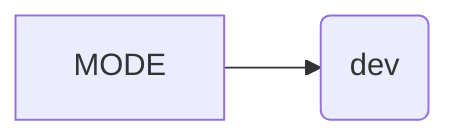

# <input code>

```python
## \file hypotez/src/fast_api/__init__.py
# -*- coding: utf-8 -*-\
#! venv/Scripts/python.exe
#! venv/bin/python/python3.12

"""
.. module: src.fast_api 
	:platform: Windows, Unix
	:synopsis:

"""
MODE = 'dev'
```

# <algorithm>

This file appears to be an initialization file for a package named `fast_api` within a larger project structure.  It's likely part of a larger application using Python's package structure.  The code's function is setting a constant variable.


No data flow or function calls are present.  The code is simply defining a single variable named `MODE` with the value 'dev'.


# <mermaid>



This mermaid code represents a simple assignment.  The variable `MODE` is assigned the string value `'dev'`.  There are no dependencies or imports to represent, as this code just sets a variable within a module.


# <explanation>

- **Imports:** There are no imports in this file.  The file is solely for initialization, setting a variable that can be used elsewhere in the `fast_api` package (or imported from other packages.)

- **Classes:** No classes are defined.

- **Functions:** No functions are defined.

- **Variables:**
    - `MODE`: A string variable. It appears to be a configuration setting, likely for deployment modes (development, testing, production) as evidenced by the docstring comment.  Its value is set to `'dev'` in this module.  This type of variable is used to direct the application logic or behavior based on the context (e.g., whether it's running in development or production).  The possible values for this variable (`dev`, `test`, `prod`) would influence how the rest of the application functions.

- **Potential Errors/Improvements:**

    - **Docstrings:** The docstrings are present but incomplete.  They describe the module but lack specifics about the variable `MODE`.  Adding more context about the purpose of the variable would improve readability and maintainability.
    - **Naming:** While `MODE` is understandable, more descriptive names (like `APPLICATION_MODE`) might be better if this is used extensively across the application, but 'dev' is usually recognizable.


- **Relationships with other parts of the project:**  This file likely serves as a configuration module for the `fast_api` package, which in turn is presumably part of a larger system using Python's package structure.  The value of `MODE` might be used by other functions or classes within `fast_api` to determine different behaviors.  For instance, logging might behave differently in 'dev' mode vs 'prod' mode. The initialization of this variable precedes any use of it by other parts of the project.