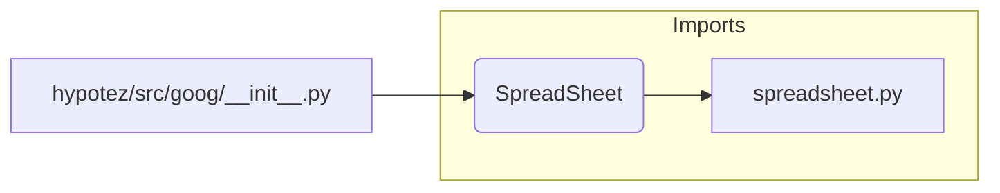

# Code Explanation for hypotez/src/goog/__init__.py

## <input code>

```python
## \file hypotez/src/goog/__init__.py
# -*- coding: utf-8 -*-
#! venv/Scripts/python.exe
#! venv/bin/python/python3.12

"""
.. module: src.goog 
	:platform: Windows, Unix
	:synopsis:

"""
MODE = 'dev'

from .spreadsheet import SpreadSheet
```

## <algorithm>

This file is an initialization script for the `goog` module.  Its primary function is to import and make available the `Spreadsheet` class defined within the `spreadsheet.py` module (likely located in the `hypotez/src/goog/` directory).

There's no complex algorithm involved; it's a straightforward import statement.

**Example Data Flow:**

1. The file is loaded by Python.
2. The `from .spreadsheet import SpreadSheet` line finds and imports the `Spreadsheet` class from the `spreadsheet.py` module.
3. The `MODE = 'dev'` assignment sets a global variable that likely controls the module's behavior (e.g., development or production mode).

**Block Diagram (Conceptual):**

```
+-----------------+
|  __init__.py   |
+-----------------+
     |
     V
+-----------------+
|  spreadsheet.py |  <--- Import
+-----------------+
     ^
+-----+
| MODE |  <-- Variable Assignment (Global Scope)
+-----+
```


## <mermaid>



**Dependencies Analysis:**

The mermaid code shows a direct dependency on `spreadsheet.py` within the `goog` package.  This is implied by the import statement `from .spreadsheet import SpreadSheet`.  The `.spreadsheet` prefix indicates the import is from a module within the same package (the `goog` package).

## <explanation>

* **Imports:** The `from .spreadsheet import SpreadSheet` line imports the `SpreadSheet` class from the `spreadsheet.py` module within the `goog` subpackage.  This is crucial for using the functionality defined in `spreadsheet.py` within other parts of the project. The `.` prefix is a relative import, indicating the target module is located in the same directory structure.

* **Classes:** The `SpreadSheet` class (defined in `spreadsheet.py`) is not directly defined or explained in this file, but it's made available for use via the import statement.  Its detailed functionality is encapsulated within `spreadsheet.py`.

* **Functions:** There are no functions directly defined in this file.

* **Variables:** The `MODE = 'dev'` line defines a global variable `MODE` and assigns it the string value 'dev'. This variable is likely used for conditional logic elsewhere in the project. Its significance will depend on how the value is used elsewhere in the `hypotez` project.


* **Potential Errors or Improvements:**
    * **Docstrings:** While the docstrings are present, they are minimal. More detailed explanations of the module's purpose, usage, and how the `MODE` variable affects behavior would be beneficial.
    * **Type Hinting:** For better code clarity and maintainability, especially in larger projects, adding type hints would be recommended, such as `MODE: str = 'dev'`.

* **Relationship with Other Parts:**  The `hypotez/src/goog` package likely interacts with other parts of the `hypotez` project through the `SpreadSheet` class.  For instance, other modules might use the `SpreadSheet` class to interact with Google Sheets. This would require more context about the overall structure and usage of the `hypotez` project to fully understand these relationships.