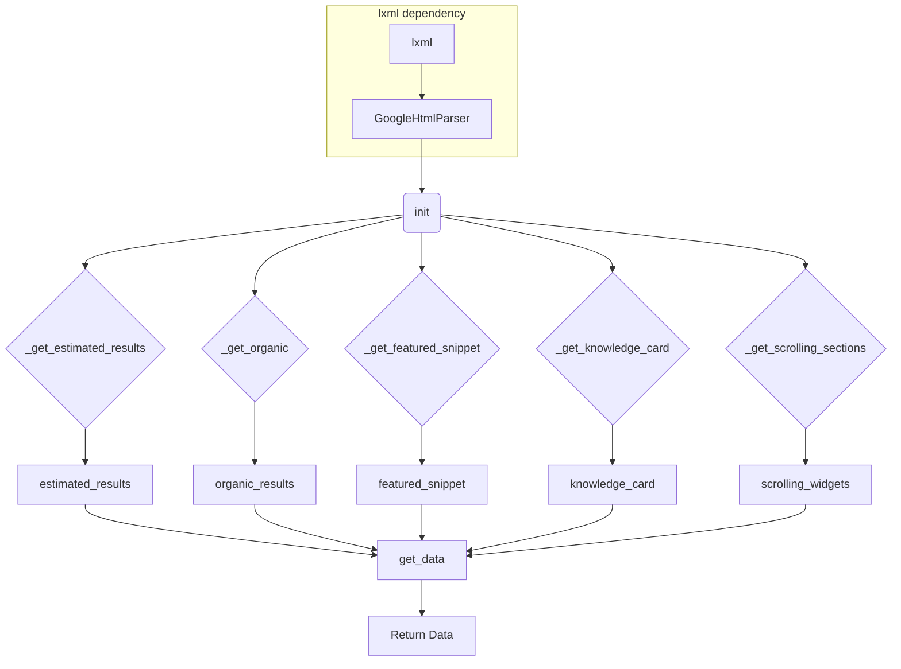

# Code Explanation: `hypotez/src/goog/google_search.py`

## <input code>

```python
## \file hypotez/src/goog/google_search.py
# -*- coding: utf-8 -*-\
#! venv/Scripts/python.exe
#! venv/bin/python/python3.12

"""
.. module: src.goog 
	:platform: Windows, Unix
	:synopsis:

"""
MODE = 'dev'


from lxml import html


class GoogleHtmlParser:
    """Класс для парсинга HTML с Google Search.

    Парсит HTML страницы поисковой выдачи Google и преобразует её в словарь.
    Работает как с мобильной, так и с десктопной версией HTML.

    Атрибуты:
        tree (html.Element): Дерево документа, полученное через html.fromstring().
        user_agent (str): User agent, использованный для получения HTML Google Search.
    """

    def __init__(self, html_str: str, user_agent: str = 'desktop') -> None:
        """Инициализация парсера.

        Создает дерево документа из строки HTML.

        Args:
            html_str (str): HTML Google Search в виде строки.
            user_agent (str): User agent для получения HTML. Может быть 'mobile' или 'desktop'.

        Returns:
            None
        """
        self.tree = html.fromstring(html_str)
        if user_agent in ['mobile', 'desktop']:
            self.user_agent = user_agent
        else:
            self.user_agent = 'desktop'

    # ... (other methods)
```

## <algorithm>

The code parses Google Search results from an HTML string.

1. **Initialization (`__init__`):**
   - Takes the HTML string (`html_str`) and an optional `user_agent` (defaults to 'desktop') as input.
   - Parses the HTML string using `lxml.html.fromstring()` to create a document tree (`self.tree`).
   - Sets the `user_agent` attribute, handling potential incorrect values by defaulting to 'desktop'.
   - Example: `parser = GoogleHtmlParser('<html><body>...</body></html>', 'mobile')`

2. **Data Extraction (`_get_estimated_results`, `_get_organic`, `_get_featured_snippet`, `_get_knowledge_card`, `_get_scrolling_sections`):**
   - These methods extract specific data elements from the parsed HTML tree using `xpath`.
   - `_get_estimated_results`: Parses the number of search results. Example: extracts "1,234,567" from the HTML.
   - `_get_organic`: Extracts title, snippet, URL, and other data from organic search results. Example: extracts titles, snippets, and links from a page.
   - `_get_featured_snippet`, `_get_knowledge_card`, `_get_scrolling_sections`: Extract specific data types (featured snippets, knowledge cards, and scrolling sections) as dictionaries. Examples vary depending on the specific section.

3. **Data Cleaning and Normalization (`_clean`, `_normalize_dict_key`):**
   - `_clean`: Removes extra whitespace from strings. Example: converts "  Title  " to "Title".
   - `_normalize_dict_key`: Prepares strings for use as dictionary keys. Example: converts "Result Title:" to "result_title".


4. **Data Aggregation (`get_data`):**
   - Constructs a final dictionary (`data`) based on data extracted by previous functions.
   - Selects data based on `user_agent` value, only fetching desktop data in this version. Example: populates `data` dictionary for 'desktop' user agent.

## <mermaid>



**Dependencies Analysis:**

- `lxml`: The code imports `lxml.html`, which is a powerful library for parsing HTML and XML. It is likely used here to parse the Google search result page's HTML content efficiently, providing features to navigate the tree structure.  This library is external to the project.


## <explanation>

**Imports:**

- `from lxml import html`: Imports the necessary functions from the `lxml` library for parsing HTML. `lxml` is a C-based library, known for its speed and reliability in HTML/XML processing. It's an important external dependency.


**Classes:**

- `GoogleHtmlParser`: This class encapsulates the logic for parsing Google Search results.
    - `__init__`: Initializes the parser, takes HTML string and optional user agent, and creates the document tree (`self.tree`).
    - `_clean`, `_normalize_dict_key`: Helper functions for cleaning and normalizing strings.
    - `_get_estimated_results`, `_get_organic`, `_get_featured_snippet`, `_get_knowledge_card`, `_get_scrolling_sections`: Methods to extract data from various parts of the Google search results page using XPath expressions.
    - `get_data`: The main method that aggregates the data from other methods and returns it in a structured format as a dictionary.


**Functions:**

- `__init__`: Initializes the `GoogleHtmlParser` instance.
- `_clean`: Removes extra whitespace from strings.
- `_normalize_dict_key`: Normalizes keys for dictionaries, creating cleaner keys.
- `_get_estimated_results`: Extracts the number of search results from the HTML.
- `_get_organic`: Extracts organic search results, handling different structures and rich snippets.
- `_get_featured_snippet`: Extracts featured snippet information.
- `_get_knowledge_card`: Extracts knowledge card data.
- `_get_scrolling_sections`: Extracts data from scrolling widgets (potentially news, tweets).
- `get_data`: Aggregates data from other methods into a final dictionary representation.

**Variables:**

- `MODE`: A constant string set to 'dev'. This variable could be part of a larger configuration setup.
- `self.tree`, `self.user_agent`: Instance attributes of the `GoogleHtmlParser` class, storing the parsed HTML tree and user agent.

**Potential Errors and Improvements:**

- **Error Handling:** The code lacks robust error handling. For example, if `xpath` calls don't find the expected elements, it might result in errors or unexpected behavior. Adding `try-except` blocks around `xpath` calls would be beneficial.
- **Input Validation:** While the `user_agent` check is a start, more extensive input validation for `html_str` and other parameters could prevent unexpected issues and improve code robustness.
- **Flexibility:**  The code might be too tightly coupled with a specific Google Search result structure. Making the code more adaptable to changes in the HTML layout would require more careful consideration of the dynamic nature of website design.
- **Efficiency:** For very large HTML strings, parsing with `lxml` might not be the optimal solution for large websites. Optimizing the parsing and the subsequent data retrieval to limit memory usage is a good idea.

**Chain of Relationships:**

This code interacts with the `lxml` library (external dependency) for parsing HTML. It likely forms part of a larger project for scraping or processing search results, potentially interacting with other modules for data processing, storage, or display.