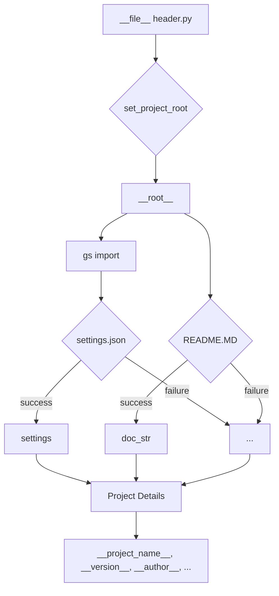

# Code Explanation for hypotez/src/goog/header.py

## <input code>

```python
## \file hypotez/src/goog/header.py
# -*- coding: utf-8 -*-\n
#! venv/Scripts/python.exe
#! venv/bin/python/python3.12
"""
.. module: src.goog 
	:platform: Windows, Unix
	:synopsis:

"""
MODE = 'dev'

import sys
import json
from packaging.version import Version

from pathlib import Path
def set_project_root(marker_files=('pyproject.toml', 'requirements.txt', '.git')) -> Path:
    """
    Finds the root directory of the project starting from the current file's directory,
    searching upwards and stopping at the first directory containing any of the marker files.

    Args:
        marker_files (tuple): Filenames or directory names to identify the project root.
    
    Returns:
        Path: Path to the root directory if found, otherwise the directory where the script is located.
    """
    __root__:Path
    current_path:Path = Path(__file__).resolve().parent
    __root__ = current_path
    for parent in [current_path] + list(current_path.parents):
        if any((parent / marker).exists() for marker in marker_files):
            __root__ = parent
            break
    if __root__ not in sys.path:
        sys.path.insert(0, str(__root__))
    return __root__


# Get the root directory of the project
__root__ = set_project_root()
"""__root__ (Path): Path to the root directory of the project"""

from src import gs

settings:dict = None
try:
    with open(gs.path.root / 'src' / 'settings.json', 'r') as settings_file:
        settings = json.load(settings_file)
except (FileNotFoundError, json.JSONDecodeError):
    ...

doc_str:str = None
try:
    with open(gs.path.root / 'src' / 'README.MD', 'r') as settings_file:
        doc_str = settings_file.read()
except (FileNotFoundError, json.JSONDecodeError):
    ...


__project_name__ = settings.get("project_name", 'hypotez') if settings  else 'hypotez'
__version__: str = settings.get("version", '')  if settings  else ''
__doc__: str = doc_str if doc_str else ''
__details__: str = ''
__author__: str = settings.get("author", '')  if settings else ''
__copyright__: str = settings.get("copyrihgnt", '')  if settings else ''
__cofee__: str = settings.get("cofee", "Treat the developer to a cup of coffee for boosting enthusiasm in development: https://boosty.to/hypo69")  if settings else "Treat the developer to a cup of coffee for boosting enthusiasm in development: https://boosty.to/hypo69"
```

## <algorithm>

**Step 1:** Define `set_project_root` function.
    - Takes `marker_files` as a tuple of strings (defaults to common project markers).
    - Gets the current file's path.
    - Iterates through current path and its parent directories.
    - Checks if any marker file exists in the current directory.
    - Sets `__root__` to the parent directory if a marker is found.
    - If `__root__` is not already in `sys.path`, inserts it.
    - Returns `__root__`.

**Step 2:** Call `set_project_root()` to get the project root.

**Step 3:** Import `gs` from `src`.

**Step 4:** Attempt to load `settings.json` from the project root.
    - Reads the file and parses it as JSON.
    - Catches `FileNotFoundError` and `json.JSONDecodeError` for robustness.


**Step 5:** Attempt to load `README.MD` from the project root.
    - Reads the file into `doc_str`.
    - Catches `FileNotFoundError` and `json.JSONDecodeError` for robustness.


**Step 6:** Extract project details from `settings` if found, otherwise use default values. 
    - Fetches values for `project_name`, `version`, `author`, `copyright`, `cofee` from settings or default values.

**Example Data Flow:**

```
[current file] -> set_project_root -> __root__
__root__ -> settings.json -> settings -> project details
__root__ -> README.MD -> doc_str -> project details
```


## <mermaid>




**Dependencies Analysis:**

- `sys`: Provides access to system-specific parameters and functions.
- `json`: Used for working with JSON data.
- `packaging.version`: Used for handling software version numbers. This is likely a dependency for package management functionality.
- `pathlib`: Offers an object-oriented way of working with filesystem paths.
- `src`: likely a package import that defines classes and functions that manage the source code directory structure. `gs` within `src` is critical to finding the project root.


## <explanation>

**Imports:**

- `sys`: Used for accessing system-related things, like the Python path.
- `json`: Used to handle JSON data (loading project settings).
- `packaging.version`: Used for handling software versioning.
- `pathlib`: Provides object-oriented way of working with paths.  This is more robust than using `os.path`.
- `src.gs`: Crucial; This import likely provides utilities for interacting with the project structure or resources, specifically for locating the project root.

**Classes:**

- No classes are defined in this file.


**Functions:**

- `set_project_root(marker_files=...)`:  This function is crucial for finding the project root directory. It iterates through parent directories starting from the current file until it finds one containing any of the marker files.  It's designed to be robust by handling cases where the project root isn't immediately found.


**Variables:**

- `MODE`: A string defining the project mode ('dev').
- `__root__`: A `Path` object, stores the path to the project root directory.
- `settings`: A dictionary, storing data loaded from `settings.json`.
- `doc_str`: A string, storing the content of `README.MD`.
- `__project_name__`, `__version__`, `__author__`, etc.:  Strings, holding project details, fetched from `settings` or using defaults.

**Potential Errors and Improvements:**

- **Error Handling**: While the `try...except` blocks are present, the `...` part is a placeholder. Consider providing more informative error messages or alternative actions in case of file not found or invalid JSON.
- **Readability**:  The many `if settings` checks could be improved by using the ternary operator to check if a value is present.

**Relationship with Other Project Components:**

- Heavily relies on the `gs` module (within `src`) for finding the project root directory.
- The `settings.json` file (and possibly `README.MD`) in the `src` directory is crucial for providing project-level information.
- The structure suggests a project using a `src` directory to manage the primary codebase.


```