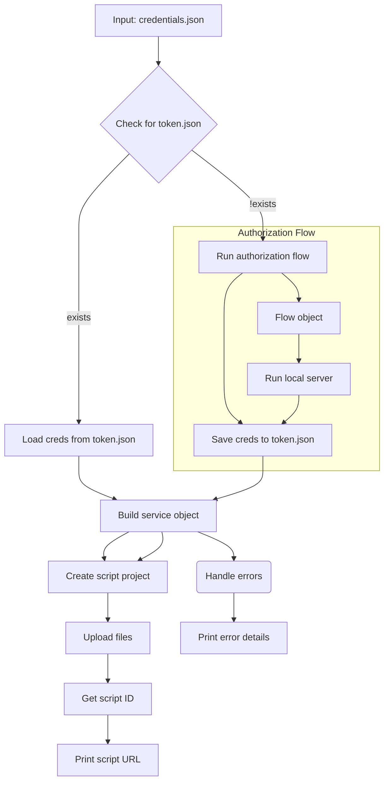

# Code Explanation for hypotez/src/goog/quickstart.py

## <input code>

```python
## \file hypotez/src/goog/quickstart.py
# -*- coding: utf-8 -*-\
#! venv/Scripts/python.exe
#! venv/bin/python/python3.12

"""
.. module: src.goog 
	:platform: Windows, Unix
	:synopsis:

"""
MODE = 'dev'


"""
Shows basic usage of the Apps Script API.
Call the Apps Script API to create a new script project, upload a file to the
project, and log the script's URL to the user.

https://developers.google.com/apps-script/api/quickstart/python
"""


from pathlib import Path

from google.auth.transport.requests import Request
from google.oauth2.credentials import Credentials
from google_auth_oauthlib.flow import InstalledAppFlow
from googleapiclient import errors
from googleapiclient.discovery import build

import header
from src import gs

# If modifying these scopes, delete the file token.json.
SCOPES = ['https://www.googleapis.com/auth/script.projects']

SAMPLE_CODE = """
function helloWorld() {
  console.log("Hello, world!");
}
""".strip()

SAMPLE_MANIFEST = """
{
  "timeZone": "America/New_York",
  "exceptionLogging": "CLOUD"
}
""".strip()


def main():
    """Calls the Apps Script API."""
    creds = None
    # The file token.json stores the user's access and refresh tokens, and is
    # created automatically when the authorization flow completes for the first
    # time.
    token_path = gs.path.tmp / 'e-cat-346312-137284f4419e.json'
    if token_path.exists():
        creds = Credentials.from_authorized_user_file(token_path, SCOPES)
    # If there are no (valid) credentials available, let the user log in.
    if not creds or not creds.valid:
        if creds and creds.expired and creds.refresh_token:
            creds.refresh(Request())
        else:
            flow = InstalledAppFlow.from_client_secrets_file(
                'credentials.json', SCOPES)
            creds = flow.run_local_server(port=0)
        # Save the credentials for the next run
        with Path('token.json').open('w') as token:
            token.write(creds.to_json())

    try:
        service = build('script', 'v1', credentials=creds)

        # Call the Apps Script API
        # Create a new project
        request = {'title': 'My Script'}
        response = service.projects().create(body=request).execute()

        # Upload two files to the project
        request = {
            'files': [
                {'name': 'hello', 'type': 'SERVER_JS', 'source': SAMPLE_CODE},
                {'name': 'appsscript', 'type': 'JSON', 'source': SAMPLE_MANIFEST}
            ]
        }
        response = service.projects().updateContent(
            body=request, scriptId=response['scriptId']).execute()
        print('https://script.google.com/d/' + response['scriptId'] + '/edit')
    except errors.HttpError as error:
        # The API encountered a problem.
        print(error.content)


if __name__ == '__main__':
    main()
```

## <algorithm>




## <mermaid>

```mermaid
graph LR
    subgraph Imports
        "pathlib" --> "Path"
        "google.auth" --> "Request"
        "google.oauth2" --> "Credentials"
        "google_auth_oauthlib" --> "InstalledAppFlow"
        "googleapiclient" --> "errors"
        "googleapiclient" --> "build"
        "header" -- imports --> main
        "src.gs" -- imports --> main

    end
    main --> "SCOPES"
    main --> "SAMPLE_CODE"
    main --> "SAMPLE_MANIFEST"
    main --> "main"
    main --> "creds"
    main --> "service"
    main --> "request"
    main --> "response"
    main --> "token_path"
    main --> "flow"
    main --> "token"
    
    "main" --> "build"
    "build" --> "service"
    "service" --> "projects.create"
    "service" --> "projects.updateContent"
    "projects.create" --> "response"
    "projects.updateContent" --> "response"

    "response" --> "print"

```

**Explanation of Dependencies:**


The `mermaid` diagram shows the imports and their relationships.  `pathlib` is used for file system operations (like `Path`).  Google's authentication and API client libraries are used to interact with the Google Apps Script API.


## <explanation>

**Imports:**

-   `pathlib`: Provides object-oriented way of working with files and paths.
-   `google.auth.transport.requests`: Necessary for handling requests related to Google authentication.
-   `google.oauth2.credentials`: Deals with OAuth2 credentials.
-   `google_auth_oauthlib.flow`: Manages the OAuth2 authorization flow.
-   `googleapiclient`:  Provides tools for interacting with Google APIs.  Importantly, `errors` for handling potential API errors, and `build` for constructing the API client.
-   `header`: This likely imports functions or constants from a header file in the project, but the context is not clear from just this file.
-   `src.gs`: Implies a module (`gs`) within the `src` package; this likely handles file system operations or other Google services.

**Classes:**

-   `Credentials`:  Represents the authorization credentials.  The code retrieves and uses these to authenticate with the Google Apps Script API.
-   `InstalledAppFlow`:  Handles the local server authorization flow.
-   Potentially others from the imported libraries.


**Functions:**

-   `main()`: This is the entry point of the script. It handles credential retrieval, Google Apps Script API calls, error handling, and printing the script URL.
    -   It fetches credentials from a `token.json` file or initiates the OAuth2 flow if no valid credentials are present.
    -   It uses the `build()` function to construct the necessary API client service object.
    -   It executes the Apps Script API calls to create a new project and upload files (sample code and manifest).
    -   It prints the URL of the created script project to the console, offering easy access and use.
    -   It includes a `try...except` block to gracefully catch and handle potential `HttpError` exceptions, giving user feedback on possible problems.


**Variables:**

-   `MODE`: A string constant, likely used for configuring different modes of operation (e.g., development, production).
-   `SCOPES`: A list of Google API scopes defining the authorized access required for accessing Google Apps Script resources.
-   `SAMPLE_CODE` and `SAMPLE_MANIFEST`:  String constants containing sample code and manifest required for a Google Apps Script project.
-   `creds`: Stores the `Credentials` object for authentication.
-   `token_path`: Stores the file path to `token.json`.


**Potential Errors and Improvements:**

-   **Error Handling:** The `try...except` block is good for handling potential `HttpError`. Consider more specific error handling (e.g., checking for specific HTTP status codes) to provide more informative error messages.
-   **Configuration:** The use of `credentials.json` for client secrets is a good practice.  However, consider storing sensitive configuration (credentials) in a more secure way, especially in production code, rather than hardcoding in a project.  Consider an environment variable or more structured configuration files for better management.
-   **File Paths:** The use of `gs.path.tmp` hints at a potential file system or path management module within the `src` package. The specific file path for `token.json` might be better constructed to avoid hardcoding file locations (e.g., using environment variables or configuration files).
-   **Clarity:** Adding comments explaining the purpose of each section or crucial logic steps within the `main` function would improve readability.


**Relationship with other parts of the project:**

-   The `gs` module (from `src`) is likely responsible for managing file paths and potentially other Google services related to file storage.
-   The `header` module's purpose is unclear from this code alone. More context is needed for its role in the broader project.

This comprehensive analysis provides a deep understanding of the code's functionality and its interaction with other project components.