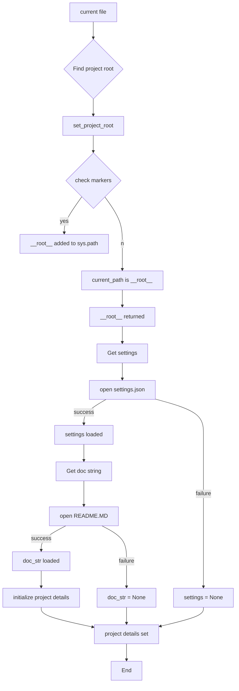
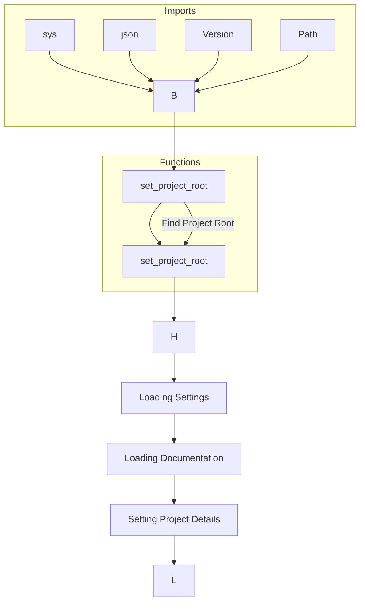

# Code Explanation for hypotez/src/logger/header.py

## <input code>

```python
## \file hypotez/src/logger/header.py
# -*- coding: utf-8 -*-\
#! venv/Scripts/python.exe
#! venv/bin/python/python3.12

"""
.. module: src.logger 
	:platform: Windows, Unix
	:synopsis:

"""
MODE = 'dev'

"""
	:platform: Windows, Unix
	:synopsis: Модуль определяющий корневой путь к проекту. Все импорты строятся относительно этого пути.
    :TODO: В дальнейшем перенести в системную переменную"""

import sys
import json
from packaging.version import Version

from pathlib import Path
def set_project_root(marker_files=('pyproject.toml', 'requirements.txt', '.git')) -> Path:
    """
    Finds the root directory of the project starting from the current file's directory,
    searching upwards and stopping at the first directory containing any of the marker files.

    Args:
        marker_files (tuple): Filenames or directory names to identify the project root.
    
    Returns:
        Path: Path to the root directory if found, otherwise the directory where the script is located.
    """
    __root__:Path
    current_path:Path = Path(__file__).resolve().parent
    __root__ = current_path
    for parent in [current_path] + list(current_path.parents):
        if any((parent / marker).exists() for marker in marker_files):
            __root__ = parent
            break
    if __root__ not in sys.path:
        sys.path.insert(0, str(__root__))
    return __root__


# Get the root directory of the project
__root__ = set_project_root()
"""__root__ (Path): Path to the root directory of the project"""

from src import gs

settings:dict = None
try:
    with open(gs.path.root / 'src' /  'settings.json', 'r') as settings_file:
        settings = json.load(settings_file)
except (FileNotFoundError, json.JSONDecodeError):
    ...

doc_str:str = None
try:
    with open(gs.path.root / 'src' /  'README.MD', 'r') as settings_file:
        doc_str = settings_file.read()
except (FileNotFoundError, json.JSONDecodeError):
    ...


__project_name__ = settings.get("project_name", 'hypotez') if settings  else 'hypotez'
__version__: str = settings.get("version", '')  if settings  else ''
__doc__: str = doc_str if doc_str else ''
__details__: str = ''
__author__: str = settings.get("author", '')  if settings  else ''
__copyright__: str = settings.get("copyrihgnt", '')  if settings  else ''
__cofee__: str = settings.get("cofee", "Treat the developer to a cup of coffee for boosting enthusiasm in development: https://boosty.to/hypo69")  if settings  else "Treat the developer to a cup of coffee for boosting enthusiasm in development: https://boosty.to/hypo69"
```

## <algorithm>



This algorithm finds the project root directory, loads settings from a JSON file, and a README file, then initializes project details using the loaded data.  Error handling is included for file not found and JSON parsing errors.

## <mermaid>



**Dependencies Analysis:**

The diagram shows the dependencies for this code. `sys`, `json`, `Version`, and `Path` are directly imported from Python's standard library, and `gs` is being imported from a different module called `src.gs`. This suggests `gs` is part of the same project. The diagram shows that the `set_project_root` function is crucial in finding the project root directory by checking for the marker files and then adding the path to the `sys.path`


## <explanation>

**Imports:**

- `sys`: Provides access to system-specific parameters and functions, particularly for manipulating the `sys.path` which is crucial for importing modules from a specific location.
- `json`: Used for loading the project settings from the `settings.json` file.
- `packaging.version`: Used to handle versions. This is probably used to check for the compatibility of the project with different versions.
- `pathlib`: Provides an object-oriented way of working with paths.  This allows cleaner and more robust handling of file system interactions.


**Classes:**

- No classes are defined in this file.

**Functions:**

- `set_project_root(marker_files=(...)):` This function is critical for locating the project's root directory. It starts from the current file's directory and recursively checks parent directories for the marker files. These markers help to identify the true root folder in the file system.
   - *Args:* `marker_files`: A tuple of files or directories used to locate the project's root. Defaults to `('pyproject.toml', 'requirements.txt', '.git')` which are common project root markers.
   - *Returns:* A `Path` object representing the path to the root directory. Also adds the root directory to `sys.path` if it is not already present, enabling modules within the project to be imported.
   - *Example:* If the code is located in `/home/user/project/src/logger/header.py`, the function would search upwards, checking `/home/user/project/src/logger` and so on until finding a directory with `pyproject.toml`, `requirements.txt`, or `.git`.

**Variables:**

- `MODE`:  A string variable likely used to configure the execution mode (e.g., 'dev', 'prod').
- `__root__`: A `Path` object representing the project's root directory. It's calculated by the `set_project_root()` function.
- `settings`: A dictionary to store project settings loaded from `settings.json`. `None` if the file cannot be found or is invalid.
- `doc_str`: A string variable to store the project's documentation from the `README.md` file.
- `__project_name__`, `__version__`, `__doc__`, `__details__`, `__author__`, `__copyright__`, `__cofee__`: These variables store project metadata, retrieved from the `settings.json` file if it exists.  Defaults to specified values if the key is not found or the file is missing.


**Potential Errors and Improvements:**

- The `try...except` blocks for loading `settings.json` and `README.MD` are good practice, but more specific exception types might be more informative (e.g., `FileNotFoundError` or `json.JSONDecodeError`). The current format is still good enough, though.
- Consider using a more descriptive variable name for `__root__` (e.g., `project_root`).
- The use of `if settings` in multiple lines might be improved with a conditional expression for better readability and to avoid unnecessary checks.


**Relationships with Other Project Parts:**

This file is crucial for properly importing other modules (`src.gs` in this case), establishing the root path, enabling access to project configurations, and metadata. This module fundamentally lays the groundwork for other modules within the project to operate correctly by ensuring the correct location of the project's source code components and other relevant external tools.

```