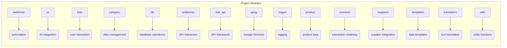

# <input code>

```
# Оглавление

1. [webdriver](#webdriver)
2. [ai](#ai)
3. [bots](#bots)
4. [category](#category)
5. [db](#db)
6. [endpoints](#endpoints)
7. [fast_api](#fast_api)
8. [goog](#goog)
9. [logger](#logger)
10. [product](#product)
11. [scenario](#scenario)
12. [suppliers](#suppliers)
13. [templates](#templates)
14. [translators](#translators)
15. [utils](#utils)

# Модули

## webdriver
Модуль для работы с веб-драйверами и автоматизацией действий в браузере.

## ai
Модуль для интеграции с искусственным интеллектом, включая взаимодействие с различными ИИ-моделями.

## bots
Модуль для создания и управления ботами, которые взаимодействуют с пользователями.

## category
Модуль для работы с категориями товаров или данных.

## db
Модуль для работы с базами данных, включая создание, чтение и обновление данных.

## endpoints
Модуль для создания и обработки API эндпоинтов, которые взаимодействуют с клиентами.

## fast_api
Модуль для использования FastAPI в проекте, включая маршрутизацию запросов и конфигурацию.

## goog
Модуль для работы с сервисами Google, такими как Google Cloud или API.

## logger
Модуль для логирования, предоставляет функциональность для записи логов и ошибок.

## product
Модуль для работы с продуктами, включая обработку данных о товарах и услугах.

## scenario
Модуль для моделирования и выполнения сценариев взаимодействия.

## suppliers
Модуль для работы с поставщиками, включая интеграцию с внешними системами.

## templates
Модуль для работы с шаблонами данных и их генерации.

## translators
Модуль для перевода текста с использованием различных инструментов и API.

## utils
Утилитарный модуль, включающий различные вспомогательные функции для проекта.
```

# <algorithm>

This code provides a table of contents and descriptions for various modules within a software project.  There's no specific algorithm as such; it's a structured documentation.  The workflow is the organization and readability of the code base.

# <mermaid>



**Explanation of Dependencies:**

There are no explicit dependencies shown in this code snippet. The mermaid diagram simply represents the modular structure and organization.  Each module likely has dependencies on other modules (e.g., `db` might rely on a database driver), but that information is not present in this documentation.

# <explanation>

The code is a markdown file acting as a documentation for a Python project. It lists various modules (e.g., `webdriver`, `ai`, `db`) and provides brief descriptions of their purposes.  This is a crucial part of code maintenance and understanding.

* **Imports:**  There are no imports in this code snippet itself, as it's only documentation.  Any imports necessary for the modules would be contained *within* the Python files corresponding to each module.

* **Classes, Functions, Variables:** These are not present in the code; again, this is simply documentation outlining *what* functions and classes might exist within the different modules.

* **Potential Errors/Improvements:**  No errors or specific areas for improvement are apparent in the documentation.  Better structure would be to link specific modules/files to the documentation to make it more useful and to avoid ambiguity.

**Relationships with Other Parts of the Project:**

The relationships are implicitly defined by the modular structure, but without code, the precise relationships are unclear. For example, `fast_api` might use `endpoints`, `logger`, and potentially other modules, these dependencies are not defined in this documentation alone.

**In Summary:**

This documentation is excellent for project overview and navigation but requires accompanying code for a deeper analysis of its functionality.  It's a crucial first step in documenting the project's architecture and provides structure and context for the modules.