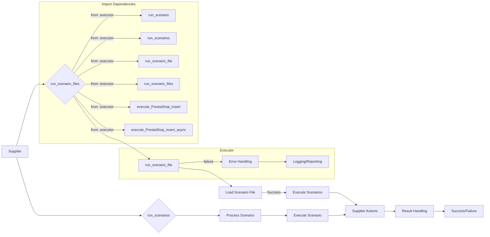

```MD
# Code Explanation for hypotez/src/scenario/__init__.py

## <input code>

```python
## \file hypotez/src/scenario/__init__.py
# -*- coding: utf-8 -*-\
#! venv/Scripts/python.exe
#! venv/bin/python/python3.12

"""
.. module: src.scenario 
	:platform: Windows, Unix
	:synopsis: Module with scenario execution functions: `run_scenario_files`, `run_scenarios`  
Scenario executor for suppliers.
----


The logic executed is as follows:
<pre>
  +-----------+
  |  Scenario |
  +-----------+
        |
        | Defines
        |
        v
  +-----------+
  | Executor  |
  +-----------+
        |
        | Uses
        |
        v
  +-----------+        +-----------+
  |  Supplier | <----> |  Driver   |
  +-----------+        +-----------+
        |                     |
        | Provides Data        | Provides Interface
        |                     |
        v                     v
  +-----------+        +-----------+
  |  PrestaShop       | Other Suppliers |
  +-----------+        +-----------+
</pre>
@code
s = Supplier('aliexpress')

run_scenario_files(s, 'file1')

s = Supplier('aliexpress')
scenario_files = ['file1', ...]
run_scenario_files(s, scenario_files)


scenario1 = {'key': 'value'}
run_scenarios(s, scenario1)


list_of_scenarios = [scenario1, ...]
run_scenarios(s, list_of_scenarios)


@endcode
Example of a scenario file:
```json
{
  "scenarios": {

    "feet-hand-treatment": {
      "url": "https://hbdeadsea.co.il/product-category/bodyspa/feet-hand-treatment/",
      "name": "Foot and Hand Care",
      "condition": "new",
      "presta_categories": {
        "default_category": 11259,
        "additional_categories": []
      }
    },

    "creams-butters-serums-for-body": {
      "url": "https://hbdeadsea.co.il/product-category/bodyspa/creams-butters-serums-for-body/",
      "name": "Creams, Butters, and Serums for Body",
      "condition": "new",
      "presta_categories": {
        "default_category": 11260,
        "additional_categories": []
      }
    }
}
```
```python

For detailed information on the scenario dictionary, read here: ...

When the program is started via main(), the following sequence of execution occurs:
@code
s = Supplier('aliexpress')

s.run()

s.run('file1')

scenario_files = ['file1', ...]
s.run(scenario_files)


scenario1 = {'key': 'value'}
s.run(scenario1)


list_of_scenarios = [scenario1, ...]
s.run(list_of_scenarios)
```
"""
MODE = 'dev'
from .executor import (
    run_scenario, 
    run_scenarios, 
    run_scenario_file, 
    run_scenario_files, 
    execute_PrestaShop_insert, 
    execute_PrestaShop_insert_async,
)
```

## <algorithm>

The code defines functions for executing scenarios.  A `Supplier` object (likely representing a data source) is used to manage the execution. The main logic seems to be centered around handling scenarios from files and dictionaries.

* **Step 1: Initialization**: A `Supplier` object is created, likely to initialize connections or resources related to data sourcing.
* **Step 2: Scenario Execution (File-based):** `run_scenario_files` function takes a `Supplier` object and list/string of scenario file paths.  It iterates through the files, loading the scenario data, and calls the execution functions.  An example would be reading `file1` and executing the scenarios described within that file.
* **Step 3: Scenario Execution (Dictionary-based):** `run_scenarios` function is called with a `Supplier` object and either a single scenario or a list of scenarios. These scenarios are processed individually, executing the actions they define.  Example would be executing scenario data stored in `scenario1`.

## <mermaid>



**Dependencies Analysis:**  The code imports functions from a `.executor` submodule (`hypotez/src/scenario/executor.py`). These imports suggest the existence of supporting functions for loading, processing and executing scenario data in a structured manner.  This implies that the `executor` module likely contains the core logic for interacting with the `Supplier` object and implementing the scenario logic itself. The diagram demonStartes the usage and interaction between modules, illuStarting the flow of data and control between functions.


## <explanation>

* **Imports:** The line `from .executor import ...` imports functions related to scenario execution from the `executor` module within the same package (`scenario`). This suggests a modular design where the `scenario` module orcheStartes the execution process and relies on the `executor` module to perform the actual work. This organization promotes code reusability and maintainability.  The imported functions are likely handling the low-level interactions with the PrestaShop API or other components.

* **Classes (implied):** The code mentions a `Supplier` class. This is not defined directly, but implied to exist within the `.executor` module.  This class likely handles the interaction and communication with the specific data source. This class would have attributes for data sources and methods to acquire data.

* **Functions:**
    * `run_scenario_files`, `run_scenarios`: These functions are used to execute scenarios from files and dictionaries, respectively.  They likely handle file loading, data parsing, and passing the data to the actual execution logic provided by the `executor` module.

    * `run_scenario`, `run_scenario_file`, etc.: These functions within the `executor` module are responsible for performing the core work of executing scenarios, making API calls, or any other action defined in a scenario.


* **Variables:** The `MODE` variable is used to control program behavior (e.g., debugging).


* **Potential Errors/Improvements:**
    * **Error Handling:** The current code lacks explicit error handling.  Adding `try...except` blocks around file loading, data parsing, and API calls would significantly enhance robustness.  Logging errors to a log file would allow the developer to analyze issues in a more convenient way.

    * **Data Validation:** Input validation could be added to ensure that the input files and dictionaries meet expected formats. Incorrect data formats could lead to unexpected behaviour or exceptions.

    * **Documentation:** Comments and docstrings could be improved in the executor module to clarify the purpose, arguments, and return values of the functions used for execution.


* **Relationships:** The code directly depends on the `hypotez/src/scenario/executor.py` module for performing tasks. The code acts as a higher-level orcheStartor, calling functions within the `executor` module to execute individual scenarios. This relationship implies a dependency where changes in the `executor` module might affect the operation of the `scenario` module.