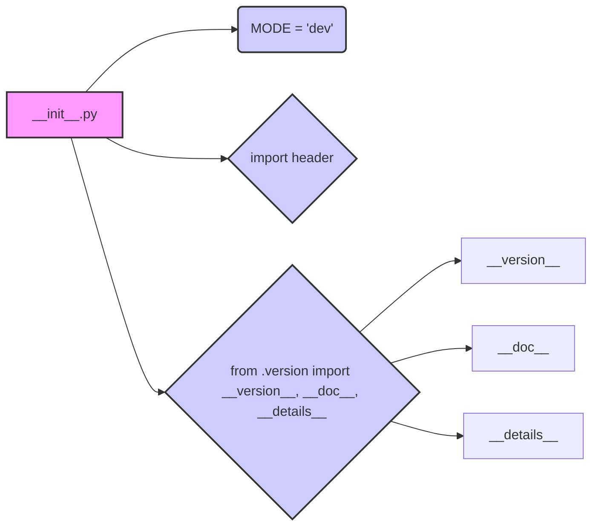

```MD
# Code Analysis of hypotez/src/templates/__init__.py

## <input code>

```python
## \file hypotez/src/templates/__init__.py
# -*- coding: utf-8 -*-\n#! venv/Scripts/python.exe\n#! venv/bin/python/python3.12\n\n"""
.. module: src.templates 
	:platform: Windows, Unix
	:synopsis:

"""
MODE = 'dev'

"""
	:platform: Windows, Unix
	:synopsis:

"""


"""
	:platform: Windows, Unix
	:synopsis:

"""


"""
  :platform: Windows, Unix

"""
"""
  :platform: Windows, Unix
  :platform: Windows, Unix
  :synopsis:
"""MODE = 'dev'
  
""" module: src.templates """


""" HERE SHOULD BE A DESCRIPTION OF THE MODULE OPERATION ! """

import header 
...

from packaging.version import Version
from .version import __version__, __doc__, __details__ 
```

## <algorithm>

The provided code snippet is an `__init__.py` file, typically used for initializing a Python package or module.  It's a configuration file rather than an algorithm in itself. The workflow is largely about importing other modules and setting a mode variable.

```
+-----------------+
| Initialization |
+-----------------+
|     MODE = 'dev'   |  
+-----------------+
| Import Statements |
+-----------------+
| Import header     |   
+-----------------+
| Import version    |
+-----------------+
```

**Example:**

The code sets `MODE = 'dev'` to likely control execution based on different modes (e.g., development, production). The `import header` statement pulls in a potentially crucial module, and `from .version import ...` imports version information.


## <mermaid>



**Dependency Analysis:**

* `from packaging.version import Version`: This line imports the `Version` class from the `packaging` library.  This library is likely used for handling and comparing software versions in a structured way.  There's a dependency on the `packaging` library.
* `from .version import __version__, __doc__, __details__`: Imports variables related to the version from a module named `version.py` within the same directory as `__init__.py`. A `version.py` file will be required in the `hypotez/src/templates` folder.


## <explanation>

* **Imports:**
    * `import header`: Imports a module named `header`.  This is a crucial dependency that the `__init__.py` needs to function, it likely defines functions or classes necessary for the `templates` module's operations.  The precise nature of this dependency is unclear without seeing the `header.py` file.
    * `from packaging.version import Version`: Imports the `Version` class from the `packaging` library.  This is used for comparing and working with software versions. The `packaging` library isn't a part of the Python standard library, so it needs to be installed.
    * `from .version import __version__, __doc__, __details__`: Imports the `__version__`, `__doc__`, and `__details__` variables. These are often used for metadata about a Python package or module. They're likely defined in a file named `version.py` within the same directory.


* **Variables:**
    * `MODE = 'dev'`: A variable that stores the execution mode (likely 'dev' for development, 'prod' for production). This is a global variable in the `templates` module.

* **Classes/Functions (Absent):**  There are no classes or functions defined directly in this file. The main action is importing modules and defining a variable.

* **Potential Errors/Improvements:**

    * **Missing Module Documentation**: The docstrings are largely empty.  Adding meaningful docstrings to explain the purpose, usage, and any special circumstances around `header` and `version.py` would be highly beneficial.
    * **Missing `version.py`**:  The import `from .version import ...` implies a `version.py` file within the same directory that should be present.  This file contains the metadata necessary for these imports.
    * **Undefined `...`**:  The `...` indicates missing lines in the import section.  The complete imports will have to be reviewed to understand the full dependencies.
    * **Inconsistent Docstrings**: The docstrings within the code aren't consistent in style and format, making them less readable.


* **Relationship to Other Parts:**  This `__init__.py` acts as an entry point and imports `header` and version information. It links the `templates` module to other modules/packages in the `hypotez` project.


```
hypotez
├── src
│   └── templates
│       ├── __init__.py
│       └── version.py
│       └── header.py
│       └── ... other files
└── ... other modules
```

The `templates` module depends on `header.py` and `version.py`. The specific way the modules interact depends on the content of those files.