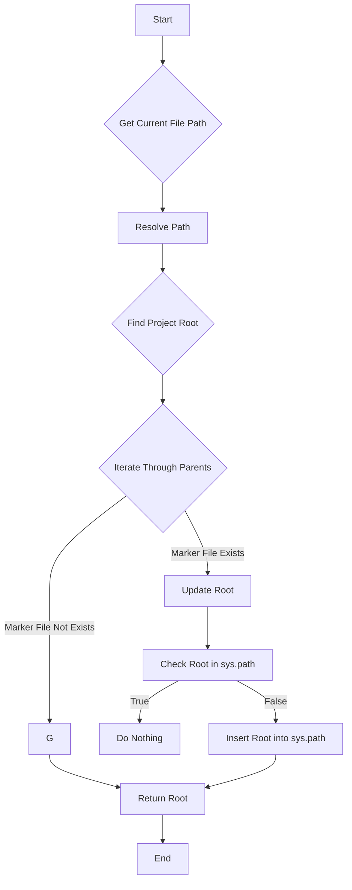

# Code Explanation for hypotez/src/templates/header.py

## <input code>

```python
## \file hypotez/src/templates/header.py
# -*- coding: utf-8 -*-\n#! venv/Scripts/python.exe\n#! venv/bin/python/python3.12\n\n"""
.. module: src.templates 
	:platform: Windows, Unix
	:synopsis:

"""

MODE = 'dev'


import sys
import json
from packaging.version import Version

from pathlib import Path
def set_project_root(marker_files=(\'pyproject.toml\', \'requirements.txt\', \'.git\')) -> Path:\n    """
    Finds the root directory of the project starting from the current file's directory,\n    searching upwards and stopping at the first directory containing any of the marker files.\n\n    Args:\n        marker_files (tuple): Filenames or directory names to identify the project root.\n    \n    Returns:\n        Path: Path to the root directory if found, otherwise the directory where the script is located.\n    """
    __root__:Path
    current_path:Path = Path(__file__).resolve().parent
    __root__ = current_path
    for parent in [current_path] + list(current_path.parents):
        if any((parent / marker).exists() for marker in marker_files):
            __root__ = parent
            break
    if __root__ not in sys.path:
        sys.path.insert(0, str(__root__))
    return __root__


# Get the root directory of the project
__root__ = set_project_root()
"""__root__ (Path): Path to the root directory of the project"""

from src import gs
```

## <algorithm>



**Example:**

If `__file__` points to `/path/to/project/src/templates/header.py`, the algorithm will traverse up the directory tree (`/path/to/project/src/templates`, `/path/to/project/src`, `/path/to/project`).  If `pyproject.toml` exists in `/path/to/project`, then `__root__` will be set to `/path/to/project`, and `/path/to/project` will be added to `sys.path`.


## <mermaid>

```mermaid
graph LR
    subgraph Project Structure
        A[hypotez] --> B(src);
        B --> C{templates};
        C --> D[header.py];
        B --> E[gs];
    end
    D --> F[set_project_root];
    F --> G[Path(__file__)];
    G -.-> H(Pathlib);
    F --> I[sys];
    F -.-> J(json);
    F --> K(packaging.version);
    F -.-> L(Path);
    subgraph Import Relationships
        I --> M[sys.path];
        K --> N[Version];
        J --> O[json];
        H --> P[Path];
    end
```

**Dependencies Analysis:**

- `pathlib`:  Provides object-oriented tools for working with file paths. Crucially used to navigate the file system and manipulate file paths.
- `sys`: Used for interacting with the Python interpreter's environment.  Importantly used to control the system path where Python looks for modules during import.
- `json`: For handling JSON data, though not directly used in this file, potentially relevant to other files in the `src` package.
- `packaging.version`: Used for working with software version numbers, not directly relevant to `header.py` but possibly used for package management or version checking.
- `gs`: Imports a module named `gs` from the `src` package. This suggests that `gs` is likely to be another module within the same project (`hypotez`).  Its function is not explained here, and understanding it requires analysis of the `src/gs.py` file.


## <explanation>

**Imports:**

- `sys`: Provides access to system-specific parameters and functions, like the path where Python modules are searched, which `set_project_root` utilizes.  Used to modify `sys.path`, ensuring the correct imports function from the project's root.
- `json`: Primarily used for working with JSON formatted data, although not explicitly used in this file. This suggests a potential usage elsewhere in the project.
- `packaging.version`: Used for comparing and working with software version numbers, which is a common task in projects that have multiple dependencies.
- `pathlib`: Provides an object-oriented way of working with files and directories.  Provides a more robust way of navigating directories and determining the project root, simplifying path manipulation and reducing the risk of errors associated with string-based path manipulation.
- `src.gs`: Imports a module named `gs` from the `src` package. This indicates a relationship and likely functional dependencies between this module and `gs`. The purpose of `gs` is undefined and needs further investigation.

**Functions:**

- `set_project_root(marker_files=...) -> Path`:
    - **Purpose:** Locates the root directory of a project by searching upward from the current file.
    - **Arguments:** `marker_files` (default `('pyproject.toml', 'requirements.txt', '.git')`) is a tuple of file/directory names used to identify the project's root. This allows flexibility in adjusting how the root is identified.
    - **Return value:** Returns a `Path` object representing the path to the root directory if found, otherwise returns the directory of the current file.
    - **Example:** If `__file__` is `/path/to/project/src/templates/header.py` and `pyproject.toml` exists in `/path/to/project`, the function will return a `Path` object representing `/path/to/project`. If no marker file is found, returns the `Path` object corresponding to `/path/to/project/src/templates`.
    - **Improvements:** Adding logging (e.g., using `logging`) to track the search process and indicate when the root is not found would be beneficial for debugging.


**Variables:**

- `MODE`: A string variable with the value `'dev'`. This likely controls the behavior of the project in different environments (development, production, etc.).
- `__root__`: A `Path` object representing the root directory of the project, determined by `set_project_root`. This variable is crucial to allow relative imports to work correctly throughout the project.


**Potential Improvements:**

- **Error Handling:**  The function could include better error handling, potentially using `try-except` blocks to deal with the case where the project root isn't found or if there is a problem reading files.
- **Robustness:** Adding checks to ensure the marker files actually exist in the directory before checking their content can add robustness. This would prevent errors if the marker files are expected but not present.

**Chain of Relationships:**

This `header.py` file likely serves as a bootstrapping mechanism for the project.  It defines the project's root directory, which is essential for Python to find other modules (`gs`) within the project's structure.  This process of setting the root is crucial for the correct import behavior within the `hypotez` project. Other modules within the `src` package may depend on this file to be able to function correctly.


This analysis provides a comprehensive understanding of the code's purpose, functionality, and its relationship with other parts of the `hypotez` project. Further analysis of the `gs` module would be beneficial for a complete understanding of the project's workflow.