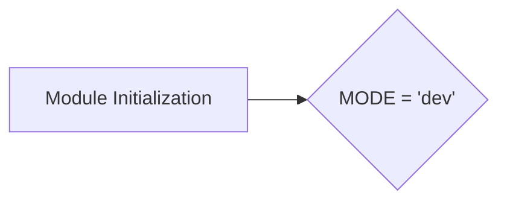
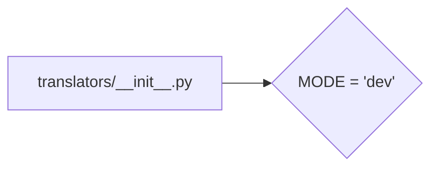

# Code Explanation for hypotez/src/translators/__init__.py

## <input code>

```python
## \file hypotez/src/translators/__init__.py
# -*- coding: utf-8 -*-\
#! venv/Scripts/python.exe
#! venv/bin/python/python3.12

"""
.. module: src.translators 
	:platform: Windows, Unix
	:synopsis:

"""
MODE = 'dev'
```

## <algorithm>

No significant algorithm is present in this file. It's an empty module file, primarily used for initialization. The code consists only of a global variable and docstring.  No data is processed; rather, it's a module-level setup.



## <mermaid>



**Dependencies:**

The file imports no other modules, making its dependencies trivial. The provided `mermaid` graph reflects this, showing the file (`translators/__init__.py`) defining a global variable (`MODE`).

## <explanation>

**Imports:**

There are no imports. This is an empty module, likely a placeholder for future translator-related classes and functions in the `hypotez/src/translators` folder. The absence of imports is completely normal for an initial file in a Python package.

**Classes:**

No classes are defined.

**Functions:**

No functions are defined.

**Variables:**

- `MODE`: A string variable assigned the value 'dev'. This likely represents a mode for the translator (or a related component) to operate in during development or testing.  Its use will depend on the rest of the codebase within the translator subpackage.

**Potential Errors/Improvements:**

- **Clarity:** While the docstring is present, a more specific description of the variable's purpose would be beneficial, even though no functions or classes exist.

**Relationships:**

The file is likely a part of the `hypotez` project's translator package. The `MODE` variable is a project-level configuration.  A later translator implementation (e.g., `translator_x.py`) in this package could use this variable for specific behavior changes (based on the 'dev', 'prod', or potentially other modes).


**In summary:** This file serves as a basic initialization for a Python package.  The `MODE` variable is probably used for conditional behavior in other Python files (e.g., using if/else statements based on its value), so it's an important piece to understand how the rest of the package will work.