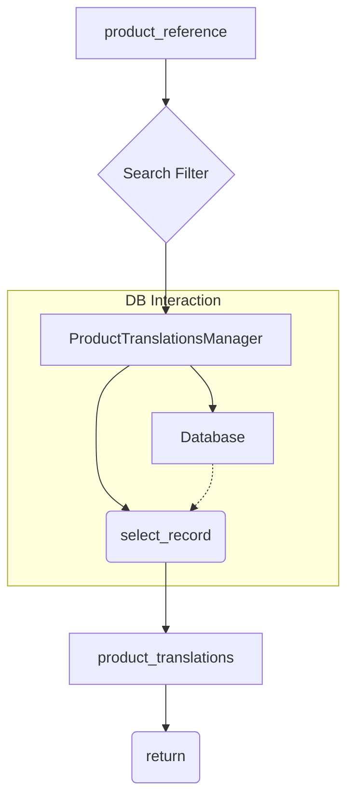

# <input code>

```python
## \file hypotez/src/translators/product_translator.py
# -*- coding: utf-8 -*-\
#! venv/Scripts/python.exe
#! venv/bin/python/python3.12

"""
.. module: src.translators 
	:platform: Windows, Unix
	:synopsis:

"""
MODE = 'dev'

"""
	:platform: Windows, Unix
	:synopsis:

"""


"""
	:platform: Windows, Unix
	:synopsis:

"""


"""
  :platform: Windows, Unix

"""
"""
  :platform: Windows, Unix
  :platform: Windows, Unix
  :synopsis:
"""MODE = 'dev'
  
""" module: src.translators """


""" Модуль управления переводами.
Слой связи между словарем полей товара, таблицей переводов и переводчиками

`get_translations_from_presta_translations_table(product_reference, credentials, i18n)`
    1. получает референс товара, параметры подключения к базе переводов престашоп и язык перевода в формате en_EN, he_HE, ru-RU 
    2. созадет условуе запроса
    3. возвращает результат
    

@todo
    1. Продумать какой нибудж парсер для en_EN, he_HE, ru-RU
"""


from pathlib import Path
from typing import List, Dict
...
from src import gs
from src.logger import logger
from src.utils import j_loads, j_dumps,  pprint
from src.db import ProductTranslationsManager
from src.ai.openai import translate
from src.endpoints.PrestaShop import PrestaShop


# def record(presta_fields:Dict, i18n:str = None, i:int = 0) -> Dict:
#     """ Вытаскивает из словаря полей престашоп 
#     `dict_product_fields` значения мультиязычных полей 
#     @param dict_product_fields престашоп словарь полей товара
#     @param i18n Локаль: en-US, ru-RU, he-IL
#     @param i индекс языка в мультиязычных полях
#     """
#     ...
#     # ... (rest of the function)
#     return record


def get_translations_from_presta_translations_table(product_reference: str, i18n: str = None) -> list:
    """Функция возвращает словарь переводов полей товара."""
    with ProductTranslationsManager() as translations_manager:
        search_filter = {'product_reference': product_reference}
        product_translations = translations_manager.select_record(**search_filter)
    return product_translations


def insert_new_translation_to_presta_translations_table(record):
    with ProductTranslationsManager() as translations_manager:
        translations_manager.insert_record(record)


def translate_record(record: dict, from_locale: str, to_locale: str) -> dict:
    """Функция для перевода полей товара."""
    translated_record = translate(record, from_locale, to_locale)
    ... # Добавить обработку переведенной записи
    return translated_record
```

# <algorithm>

**Workflow for `get_translations_from_presta_translations_table`:**

1. **Input:** `product_reference` (string), optional `i18n` (string).
2. **DB Interaction:** Connects to the `ProductTranslationsManager`.
3. **Query Creation:** Creates a filter dictionary `search_filter` with the `product_reference`.
4. **Record Selection:** Executes `select_record` with the filter, retrieving matching records from the database table.
5. **Output:** Returns the list of `product_translations` (a dictionary).

**Example:**

If `product_reference = "12345"`, the function queries the database for all translations associated with product ID "12345".  If no translations are found, an empty list is returned.

# <mermaid>



**Dependencies Analysis:**

- `from pathlib import Path`: Provides classes for working with file paths.
- `from typing import List, Dict`: Provides type hints for lists and dictionaries.
- `from src import gs`:  Imports from a package called `src`.  This is internal to the project,  `gs` likely provides some functionality related to Google services (e.g., Sheets) but without the code, that is purely speculative. 
- `from src.logger import logger`: Imports a logger from a `logger` module within the `src` package.  This is for logging messages and information to assist in debugging.
- `from src.utils import j_loads, j_dumps, pprint`: Imports utility functions for working with JSON strings, serializing/deserializing JSON data and formatted printing.
- `from src.db import ProductTranslationsManager`: Imports `ProductTranslationsManager` which is responsible for database interactions related to product translations.
- `from src.ai.openai import translate`: Imports a translation function from `translate`.  Likely utilizes OpenAI's API for translation.
- `from src.endpoints.PrestaShop import PrestaShop`: Likely imports a class for interacting with a PrestaShop API for retrieving product information.


# <explanation>

**Imports:**

- The imports from `src` packages indicate a modular structure.  This code likely belongs to a larger application (`hypotez`) that has a well-defined structure, using `src` to organize related Python modules,  making the code more organized and maintainable.  Each import is used for specific functions.

**Classes:**

- `ProductTranslationsManager`: This is a crucial class responsible for all interactions with the database related to product translations.  The `with ... as` statement ensures proper connection handling (likely a `contextmanager`).  Missing definition of `select_record` and `insert_record`.


**Functions:**

- `get_translations_from_presta_translations_table`: Takes a `product_reference` and optionally an `i18n` string.  It queries the database for translations associated with the `product_reference` and returns the results.  Critically important is the `with` statement in `ProductTranslationsManager()`, which ensures proper database connections are closed properly.
- `insert_new_translation_to_presta_translations_table`: Inserts a translation record into the database, using `ProductTranslationsManager`.  `record` must be a dictionary formatted for the database.
- `translate_record`: This function takes a `record`, `from_locale`, and `to_locale` to perform a translation using `translate`. Critically missing are the details of the translation and handling of the `translated_record` result.

**Variables:**

- `MODE`: A global variable, likely used for setting the application's operating mode (e.g., `'dev'` for development, `'prod'` for production).
- `product_reference`: A string representing the unique identifier of a product.
- `i18n`: An optional string representing the target language.


**Potential Errors and Improvements:**

- The `...` placeholders are a significant issue.  These sections need implementation to complete the functionality.  The code is incomplete.
- Missing error handling: The code lacks error handling (e.g., database connection errors, invalid input).
- Lack of input validation:  Input sanitization for `product_reference` and `i18n` is needed to prevent injection attacks if these values originate from user input.
- The `record` function is commented out but not removed.  This suggests either an earlier version or a placeholder that may need review.


**Chain of Relationships:**

- `product_translator.py` relies on `ProductTranslationsManager` (from `src.db`) for database interaction.
- `product_translator.py` interacts with external APIs through the `translate` function (from `src.ai.openai`).
-  `product_translator.py` may interact with `PrestaShop` module (from `src.endpoints.PrestaShop`) to obtain product information.


The code provides a framework for translating product data, but critical implementation details are missing, hindering the understanding and usability of the code.