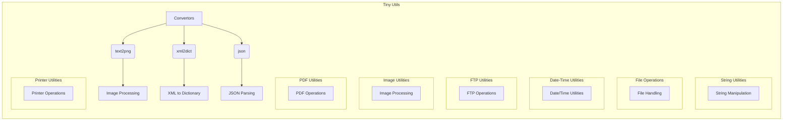

```MD
# Tiny Utils Code Explanation

## <input code>

```
# Tiny Utils

**Tiny Utils** is a utility library providing a collection of lightweight helper functions for various common tasks. This library includes utilities for data format conversion, text and file manipulation, string operations, date-time formatting, image processing, and more. It is organized into several modules for easy access to specific functionalities.

## Table of Contents

- [Tiny Utils](#tiny-utils)
  - [Table of Contents](#table-of-contents)
  - [Installation](#installation)
  - [Modules Overview](#modules-overview)
  - [Module Descriptions](#module-descriptions)
    - [Convertors](#convertors)
      - [Files:](#files)
    - [String Utilities](#string-utilities)
    - [File Operations](#file-operations)
    - [Date-Time Utilities](#date-time-utilities)
    - [FTP Utilities](#ftp-utilities)
    - [Image Utilities](#image-utilities)
    - [PDF Utilities](#pdf-utilities)
    - [Printer Utilities](#printer-utilities)
  - [Usage Examples](#usage-examples)
    - [Convert Text to PNG Image](#convert-text-to-png-image)
    - [Convert XML to Dictionary](#convert-xml-to-dictionary)
    - [Parse and Manipulate JSON](#parse-and-manipulate-json)
  - [Contributing](#contributing)
  - [License](#license)

## Installation

To use **Tiny Utils**, clone the repository and install any necessary dependencies as specified in the `requirements.txt` file.

```bash
git clone https://github.com/hypo69/tiny-utils.git
cd tiny_utils
pip install -r requirements.txt
```

## Modules Overview

This library contains several sub-modules, each handling a specific task:

- **Convertors**: Modules for converting data formats, such as text-to-image, webp-to-png, JSON, XML, Base64 encoding, and more.
- **String Utilities**: Tools for advanced string manipulation.
- **File Operations**: Functions for file handling and manipulation.
- **Date-Time Utilities**: Tools for date and time formatting.
- **FTP Utilities**: FTP file handling functions.
- **Image Utilities**: Basic image processing functions.
- **PDF Utilities**: PDF file manipulation and conversion.
- **Printer Utilities**: Functions for sending data to a printer.

## Module Descriptions

### Convertors

The `convertors` module contains utilities for converting data between formats. These modules can handle diverse data types, from CSV to JSON and text to images.

#### Files:

- **text2png.py**: Converts text data to a PNG image file.
- **tts.py**: Converts text to speech and saves it as an audio file.
- **webp2png.py**: Converts images from WebP format to PNG format.
- **xls.py**: Handles conversions and manipulations of XLS files.
- **xml2dict.py**: Converts XML data to a Python dictionary.
- **base64.py**: Encodes or decodes data using Base64 encoding.
- **csv.py**: Provides CSV parsing and manipulation tools.
- **dict.py**: Utilities for handling Python dictionaries.
- **html.py**: Converts HTML content to various formats.
- **json.py**: Utilities for JSON parsing and manipulation.
- **md2dict.py**: Converts Markdown content to a dictionary.
- **ns.py**: Specialized namespace conversion utilities.

... (rest of the code)
```

## <algorithm>

This code provides a high-level overview of the Tiny Utils library, not a step-by-step algorithm for a specific function.  It describes the structure and organization of the library, its modules, and their functionalities.  There's no procedural algorithm to diagram.


## <mermaid>



**Dependencies Analysis:**

The mermaid diagram above doesn't show specific import dependencies since it's only a high-level structure of the Tiny Utils library.  The code itself demonStartes use of various modules (e.g., `text2png`, `xml2dict`) which would import functions from specific submodules.  A more comprehensive dependency analysis would require the `requirements.txt` and the source code (e.g., `text2png.py`) of each submodule.


## <explanation>

This code is a README file, not executable code. It describes the organization, purpose, and modules of a Python library named "Tiny Utils."

- **Imports:**  The README file doesn't contain actual Python code imports. The text describes *how to install* the library by cloning and using `requirements.txt` for dependencies, but doesn't show code demonStarting those imports within functions.
- **Classes:** No classes are defined in the provided code snippet.  The README explains that the library likely uses classes inside its modules.
- **Functions:** The README mentions many functions available in various modules like `text2png.convert`, `xml2dict.convert`, and `json.parse` but doesn't show the code defining these functions.
- **Variables:**  The README explains variables like `text`, `output_path`, `xml_data`, and `json_data` are used in the examples, but the code defining their types isn't shown.
- **Potential Errors/Improvements:** This document is a good outline for the library's use and structure but doesn't demonStarte any practical code to verify correctness.  Missing from this file is the actual code of the functions from `tiny_utils`.  A more practical and complete analysis would be done on the source files (e.g., `text2png.py`) to evaluate correctness, efficiency, and potential errors.


**Relationships with Other Parts of the Project:**

The Tiny Utils library is likely a separate package organized into modules, submodules, and files.  The `.py` files (e.g., `text2png.py`) are likely the source code that implements the functionalities mentioned in the README. The `requirements.txt` file contains details of the external libraries this utility library requires.