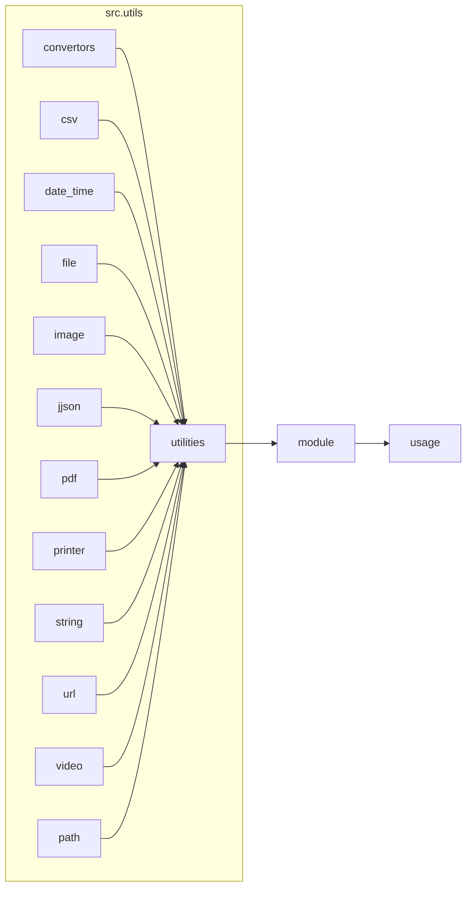

# <input code>

```python
# -*- coding: utf-8 -*-\
#! venv/Scripts/python.exe
#! venv/bin/python/python3.12

"""
Модуль для работы с утилитами
=========================================================================================

Этот модуль содержит набор небольших, полезных утилит, предназначенных для упрощения 
повседневных задач программирования. Модуль включает инструменты для конвертации данных, 
работы с файлами и формата вывода. Это позволяет ускорить разработку, предоставляя 
простые и переиспользуемые функции.

Пример использования
--------------------

Пример использования функций модуля `src.utils`:

.. code-block:: python

    from src.utils import csv2dict, json2xls, save_text_file

    # Конвертация CSV в словарь
    csv_data = csv2dict('data.csv')

    # Конвертация JSON в XLSX
    json_data = json2xls('data.json')

    # Сохранение текста в файл
    save_text_file('output.txt', 'Hello, World!')
"""

MODE = 'dev'

""" 
Коллекция небольших утилит, предназначенных для упрощения часто выполняемых задач программирования.
Включает инструменты для конвертации данных, работы с файлами и форматированного вывода.
"""


# Импорты утилит в алфавитном порядке
from .convertors import (
    TextToImageGenerator,
    base64_to_tmpfile,
    base64encode,
    csv2dict,
    csv2ns,
    decode_unicode_escape,
    dict2csv,
    dict2html,
    dict2ns,
    dict2xls,
    dict2xml,
    dot2png,
    escape2html,
    html2dict,
    html2escape,
    html2ns,
    html2text,
    html2text_file,
    json2csv,
    json2ns,
    json2xls,
    json2xml,
    md2dict,
    ns2csv,
    ns2dict,
    ns2xls,
    ns2xml,
    replace_key_in_dict,
    speech_recognizer,
    text2speech,
    webp2png,
    xls2dict
)

from .csv import (
    read_csv_as_dict,
    read_csv_as_ns,
    read_csv_file,
    save_csv_file
)

from .date_time import (
    TimeoutCheck
)

from .file import (
    get_directory_names,
    get_filenames,
    read_text_file,
    recursively_get_file_path,
    recursively_read_text_files,
    recursively_yield_file_path,
    remove_bom,
    save_text_file
)

from .image import (
    save_png,
    save_png_from_url
)

from .jjson import (
    j_dumps,
    j_loads,
    j_loads_ns
)

from .pdf import (
    PDFUtils
)

from .printer import (
    pprint
)

from .string import (
    ProductFieldsValidator,
    StringFormatter,
    normalize_string,
    normalize_int,
    normalize_float,
    normalize_boolean
)

from .url import (
    extract_url_params,
    is_url
)

from .video import (
    save_video_from_url
)

from .path import get_relative_path
```

# <algorithm>

The workflow is primarily about importing various utility functions and classes from different submodules (`convertors`, `csv`, `date_time`, `file`, `image`, etc.) within the `utils` package.  These functions provide specific functionalities like data conversion (CSV to dictionary, JSON to XLSX), file operations, string manipulation, and more.  There isn't a complex, step-by-step process in this file, but rather a collection of resources.

```
+-----------------+
| Import Utilities |
+-----------------+
    |
    V
+-----------------+
|   Functions     |
|   and Classes   |
+-----------------+
```

**Example:**

The `csv2dict` function might take a CSV file path as input and return a dictionary representation of the data.

# <mermaid>



**Dependencies Analysis:**

This code imports various modules,  organized into submodules.  These submodules (`convertors`, `csv`, etc.)  are likely to contain more specific utility functions/classes, and each individual utility function or class is likely to have specific import requirements.  Import statements organize dependencies and ensure the necessary functions are available when called upon by the usage of these modules.

# <explanation>

* **Imports:** This file primarily imports utility functions and classes from various submodules within the `src.utils` package.  These imports organize related functionality into logical groups (conversion, file handling, date/time, string manipulation, etc.).  There are various imports to support different types of data processing.

* **Classes:**  The code imports classes like `TextToImageGenerator`, `PDFUtils`, `StringFormatter` etc. These classes provide structured ways to encapsulate specific functionality.

* **Functions:** The imported functions (`csv2dict`, `json2xls`, `save_text_file`, `read_csv_as_dict`, etc.) provide concrete utility operations.

* **Variables:** `MODE` is a variable set to 'dev'. This likely controls configuration options or behavior of the utilities, but it's used within this module and not explicitly imported.

* **Potential Errors/Improvements:** There's no clear error handling or validation of input data in the imported functions. Error handling should be included to check if file paths exist, data is correctly formatted, and to prevent exceptions when processing various inputs.  Adding input validation could prevent unexpected errors at the usage level.


**Relationship with Other Parts of the Project:**

This `utils` module is a supporting module likely used by other modules (for example, the user interface of a program) in the project, supplying common tools for general data manipulation, file processing, and format conversion.  The code implies that other packages in the project (`src.data`, `src.presentation`, etc.) utilize functions in `utils` for specific tasks.