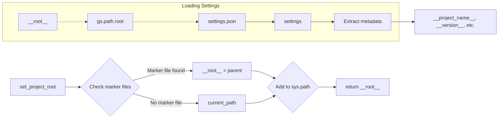

# Code Explanation for hypotez/src/logger/header.py

## <input code>

```python
## \file hypotez/src/logger/header.py
# -*- coding: utf-8 -*-\
#! venv/Scripts/python.exe
#! venv/bin/python/python3.12

"""
.. module: src.logger 
	:platform: Windows, Unix
	:synopsis:

"""
MODE = 'dev'

"""
	:platform: Windows, Unix
	:synopsis: Модуль определяющий корневой путь к проекту. Все импорты строятся относительно этого пути.
    :TODO: В дальнейшем перенести в системную переменную"""

import sys
import json
from packaging.version import Version

from pathlib import Path
def set_project_root(marker_files=('pyproject.toml', 'requirements.txt', '.git')) -> Path:
    """
    Finds the root directory of the project starting from the current file's directory,
    searching upwards and stopping at the first directory containing any of the marker files.

    Args:
        marker_files (tuple): Filenames or directory names to identify the project root.
    
    Returns:
        Path: Path to the root directory if found, otherwise the directory where the script is located.
    """
    __root__:Path
    current_path:Path = Path(__file__).resolve().parent
    __root__ = current_path
    for parent in [current_path] + list(current_path.parents):
        if any((parent / marker).exists() for marker in marker_files):
            __root__ = parent
            break
    if __root__ not in sys.path:
        sys.path.insert(0, str(__root__))
    return __root__


# Get the root directory of the project
__root__ = set_project_root()
"""__root__ (Path): Path to the root directory of the project"""

from src import gs

settings:dict = None
try:
    with open(gs.path.root / 'src' /  'settings.json', 'r') as settings_file:
        settings = json.load(settings_file)
except (FileNotFoundError, json.JSONDecodeError):
    ...

doc_str:str = None
try:
    with open(gs.path.root / 'src' /  'README.MD', 'r') as settings_file:
        doc_str = settings_file.read()
except (FileNotFoundError, json.JSONDecodeError):
    ...


__project_name__ = settings.get("project_name", 'hypotez') if settings  else 'hypotez'
__version__: str = settings.get("version", '')  if settings  else ''
__doc__: str = doc_str if doc_str else ''
__details__: str = ''
__author__: str = settings.get("author", '')  if settings else ''
__copyright__: str = settings.get("copyrihgnt", '')  if settings else ''
__cofee__: str = settings.get("cofee", "Treat the developer to a cup of coffee for boosting enthusiasm in development: https://boosty.to/hypo69")  if settings else "Treat the developer to a cup of coffee for boosting enthusiasm in development: https://boosty.to/hypo69"
```

## <algorithm>

1. **`set_project_root(marker_files)`**:
    * Takes a tuple of marker files/directories (`pyproject.toml`, `requirements.txt`, `.git`) as input.
    * Starts from the current file's directory.
    * Traverses up the directory tree (`current_path` and its parents).
    * Checks if any of the marker files exists in the current directory.
    * If a marker file is found, sets `__root__` to the current directory and breaks the loop.
    * Adds the root directory to `sys.path` if it's not already there.
    * Returns the `__root__` path.

   * **Example:** If the current file is located in `hypotez/src/logger/header.py`, the function will search for `pyproject.toml`, `requirements.txt`, and `.git` in:
      1. `hypotez/src/logger`
      2. `hypotez/src`
      3. `hypotez`
      4. ...

2. **Initialization**:
   * Calls `set_project_root()` to get the project root directory. Stores it in `__root__`.

3. **Loading settings**:
    * Attempts to open `gs.path.root / 'src' / 'settings.json'`.
    * Loads the JSON content into the `settings` dictionary.
    * Handles `FileNotFoundError` and `json.JSONDecodeError`.

4. **Loading documentation**:
    * Attempts to open `gs.path.root / 'src' / 'README.MD'`.
    * Reads the content into `doc_str`.
    * Handles `FileNotFoundError` and `json.JSONDecodeError`.


5. **Extracting project metadata**:
   * Extracts project name, version, documentation, author, copyright, and coffee link (or defaults if not found) from the `settings` dictionary into various global variables (e.g., `__project_name__`, `__version__`).

## <mermaid>



**Dependency Analysis (for mermaid):**

* `pathlib`: Used for working with file paths (`Path`).
* `json`: Used for loading JSON data from `settings.json`.
* `packaging.version`: Used for (potentially) working with versions, though it isn't used directly here.
* `sys`: Used to modify the Python path (`sys.path`).
* `src.gs`:  Essential dependency for `gs.path.root`, defining the path manipulation system within the project.  This relationship is crucial for the project's structured file access.


## <explanation>

* **Imports**:
    * `sys`: Provides access to system-specific parameters and functions, particularly for manipulating the Python path (`sys.path`).
    * `json`: Used for serializing and deserializing JSON data from the `settings.json` file.
    * `packaging.version`: Used for handling versioning information (though it appears unused here).
    * `pathlib`: Facilitates working with file paths in a more object-oriented manner.
    * `src.gs`: Used for obtaining the project root path.  This dependency clearly suggests a common structure and interaction between various parts of the project concerning path management.
* **Classes**: No classes are defined.
* **Functions**:
    * `set_project_root()`: Finds the project root directory by looking for marker files. Crucial for organizing imports and locating project resources. It takes a tuple of marker files (defaults to `pyproject.toml`, `requirements.txt`, `.git`) and returns the path to the root directory.  This is excellent for cross-platform compatibility and maintainability.
* **Variables**:
    * `MODE`: A constant, likely used for configuration settings.
    * `__root__`: Stores the path to the project root. A global variable.
    * `settings`: A dictionary to store settings loaded from `settings.json`.  Handles potential errors during loading.
    * `doc_str`: Stores the content of the project's README.  Handles potential errors during loading.
    * Global variables like `__project_name__`, `__version__`, etc.: Used to store project metadata for potential use in other parts of the project.  They use the `settings` dictionary for values, and have default values.
* **Potential Errors/Improvements**:
    * Error handling is good in the file opening/loading sections.
    * `gs.path.root` is likely a custom class/function; more context would be necessary for a complete analysis. If it handles relative paths and manages the project's root differently across platforms, that’s a good practice for maintainability.
    * The use of magic strings like `'src'` within the file paths can make the code less readable in the future if the project structure changes.
    * Consider using a dedicated configuration management system (like `configparser` or a more sophisticated solution) instead of a JSON file for configuration if the configuration grows more complex.


**Relationship Chain**:
The code in `hypotez/src/logger/header.py` relies on the `gs` module (presumably in the `src` package) for handling paths (`gs.path.root`). This implies a dependency and a shared structure in the project. The `settings.json` file defines configuration, which is used to determine important aspects of the project at runtime. This file in turn relies on the project root being established by the `set_project_root` function. The `set_project_root` function in turn ensures correct referencing of the relevant file paths to the entire project (and thus the entire codebase). The project's overall structure seems to be modular with shared path handling.
```