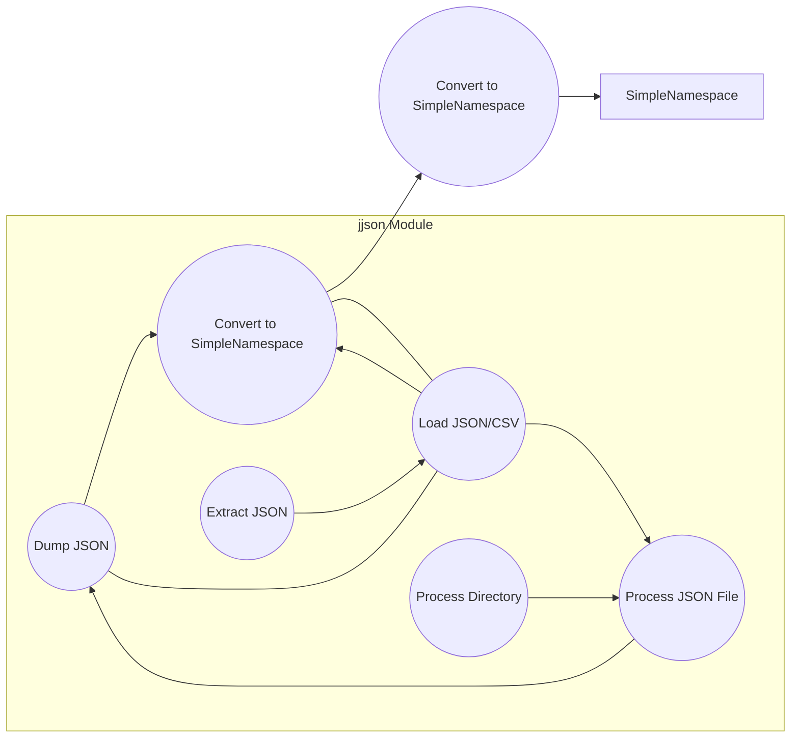

# Analysis of `hypotez/src/utils/jjson.py`

## <input code>

```python
# -*- coding: utf-8 -*-\n#! venv/Scripts/python.exe\n#! venv/bin/python/python3.12\n
"""
.. module: src.utils 
	:platform: Windows, Unix
	:synopsis: Module for handling JSON and CSV files, including loading, dumping, and merging data.
 This module provides functions to:
- **Dump JSON data**: Convert JSON or SimpleNamespace objects into JSON format and write to a file, or return the JSON data as a dictionary.
- **Load JSON and CSV data**: Read JSON or CSV data from a file, directory, or string, and convert it into dictionaries or lists of dictionaries.
- **Convert to SimpleNamespace**: Convert loaded JSON data into SimpleNamespace objects for easier manipulation.
- **Merge JSON files**: Combine multiple JSON files from a directory into a single JSON file.
- **Parse Markdown**: Convert Markdown strings to JSON format for structured data representation.

The functions in this module handle various aspects of working with JSON and CSV data, ensuring that data is loaded, saved, and merged efficiently and effectively.
"""
# ... (rest of the code)
```

## <algorithm>

The code provides functions for handling JSON and CSV data, including loading, dumping, and merging.

**j_dumps:**
1. Takes JSON-compatible data (dict, SimpleNamespace, list of dicts, list of SimpleNamespaces) and optional file path, mode, and error handling flag as input.
2. Checks if input `data` is a string and attempts to repair it using `repair_json`.
3. Recursively converts SimpleNamespaces to dicts using `_convert`.
4. Handles different file modes (`w`, `a+`, `+a`).
5. If the mode is `a+` or `+a` and the file exists, reads existing data.
6. Updates the existing data according to the mode.
7. Writes the data to the specified file or returns it as a dictionary.

**j_loads:**
1. Takes JSON data as input, checks for file path, directory or string input.
2. Loads data from files based on type (JSON/CSV):
   - If file is a directory, loads all JSON files in it.
   - If file is a CSV, loads CSV data using pandas.
   - If file is a string, attempts to parse as JSON.
3. Has helper functions for cleaning string input and merging dictionaries.
4. Handles `FileNotFoundError` and other exceptions during loading.

**j_loads_ns:**
1. Calls `j_loads` to load the data.
2. Converts the loaded data to `SimpleNamespace` objects or list of `SimpleNamespace` objects using `dict2ns`.
3. Returns the `SimpleNamespace` or list of `SimpleNamespace` or None if an error occurred.

**process_json_file:**
1. Loads JSON data from a file using `j_loads`.
2. Replaces the `name` key with `category_name`.
3. Saves the modified data to the same file using `j_dumps`.

**recursive_process_json_files:**
1. Recursively processes all JSON files within a directory using `process_json_file`.

**extract_json_from_string:**
1. Searches for JSON content enclosed in ```json ``` markers in a Markdown string.
2. Extracts and returns the JSON string if found, otherwise returns an empty string.

## <mermaid>



## <explanation>

### Imports

- `datetime`, `copy`, `math`, `pathlib`, `typing`: Standard Python libraries for date/time handling, object copying, mathematical functions, file paths, and type hinting.
- `json`: Standard library module for working with JSON data.
- `os`, `re`: Standard library modules for operating system interaction and regular expressions.
- `pandas as pd`: Used for handling CSV data.
- `json_repair`: Third-party library for repairing malformed JSON data. Crucial for robustness.
- `src.logger`, `src.utils.printer`, `src.utils.convertors.dict`: Custom modules for logging, printing, and dictionary conversion. These are likely part of a larger project.
- `collections.OrderedDict`:  Preserves the order of elements in dictionaries when loading JSON data.
- `types.SimpleNamespace`: A way to create object-like structures from dictionaries for easier access.

### Classes

No classes are defined. Only functions.

### Functions

- `j_dumps`:  Dumps JSON data to a file or returns it as a dictionary. Crucial for saving processed data. Accepts different input types (dict, SimpleNamespace, list of dicts, list of SimpleNamespaces) and various parameters for file handling, including appending and updating existing files.
- `j_loads`: Loads JSON or CSV data from a file, directory or string. It's the inverse of `j_dumps`, handling different file types (JSON, CSV) and directories effectively. Very important for importing existing data.
- `j_loads_ns`: Loads JSON/CSV data and converts it to `SimpleNamespace` objects.  Useful for accessing the data using object attributes.
- `process_json_file`: Processes a single JSON file, replacing 'name' key with 'category_name' and overwrites the file. This is likely part of a data transformation pipeline.
- `recursive_process_json_files`: Processes all JSON files recursively within a directory. This is extremely useful for mass processing of data.
- `extract_json_from_string`: Extracts JSON data from a Markdown string. Helps in extracting data from rich text documents.

### Variables

- `MODE`: A string representing the current mode (e.g., 'dev', 'prod').
- `logger`, `pprint`: Likely variables from the custom `src.logger` and `src.utils.printer` modules, used for logging and formatted printing respectively.
- Many other variables are used for intermediate data storage and temporary values (e.g., `existing_data`, `json_path`, `csv_data`).


### Potential Errors and Improvements

- **Error Handling:** The code includes extensive error handling using `try-except` blocks. This is generally good practice. However, consider adding more specific error messages and logging for different situations, like missing files in a directory.
- **Input Validation:**  More validation for file types, existing data structure compatibility (e.g., merging lists with dicts) in `j_dumps`, and potentially different types of input (`SimpleNamespace`, `list` etc) in `j_loads` could further enhance robustness.
- **Readability:** While the code is generally well-commented, it could use more descriptive variable names to increase readability.
- **`repair_json` dependency:** The code relies on an external library (`json_repair`).  Ensure `json_repair` is installed and documented correctly in the project's setup process.  This is an important security consideration.
- **JSON Validation:** Consider using a robust JSON validator (like `jsonschema`) to ensure the validity of the JSON data being read/written to prevent unexpected behavior.  A basic validation step in `j_loads` could help prevent malformed data.


### Relationships with other parts of the project

This module (`hypotez/src/utils/jjson.py`) is likely part of a larger project. The `src.logger` and `src.utils.printer` imports indicate it interacts with a logging and output system and other utility functions within the `src.utils` package. The function `dict2ns` potentially exists in a `convertors` submodule.  This suggests a clear modular structure with different parts of the application, such as data loading and processing, handling different aspects of the data.
```