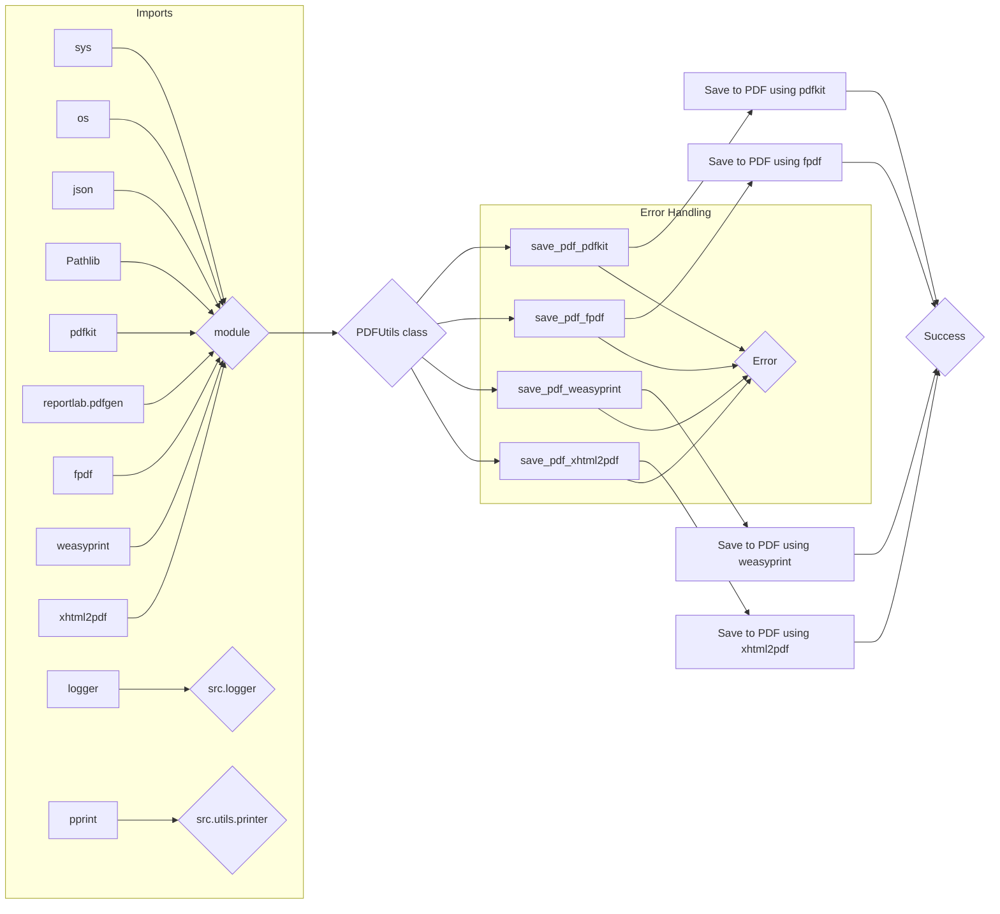

# Code Explanation: hypotez/src/utils/pdf.py

## <input code>

```python
## \file hypotez/src/utils/pdf.py
# -*- coding: utf-8 -*-\
#! venv/Scripts/python.exe
#! venv/bin/python/python3.12

"""
.. module: src.utils.pdf 
    :platform: Windows, Unix
    :synopsis: Модуль для преобразования HTML-контента или файлов в PDF

Модуль для преобразования HTML-контента или файлов в PDF с использованием различных библиотек.
Дополнительная информация:
- https://chatgpt.com/share/672266a3-0048-800d-a97b-c38f647d496b
- https://stackoverflow.com/questions/73599970/how-to-solve-wkhtmltopdf-reported-an-error-exit-with-code-1-due-to-network-err
- https://habr.com/ru/companies/bothub/articles/853490/
"""
MODE = 'dev'
import sys
import os
import json

from pathlib import Path
import pdfkit
from reportlab.pdfgen import canvas
from fpdf import FPDF
from weasyprint import HTML
from xhtml2pdf import pisa
from src.logger import logger
from src.utils.printer import pprint

def set_project_root(marker_files=('pyproject.toml', 'requirements.txt', '.git')) -> Path:
    """
    Finds the root directory of the project starting from the current file's directory,
    searching upwards and stopping at the first directory containing any of the marker files.

    Args:
        marker_files (tuple): Filenames or directory names to identify the project root.
    
    Returns:
        Path: Path to the root directory if found, otherwise the directory where the script is located.
    """
    __root__:Path
    current_path:Path = Path(__file__).resolve().parent
    __root__ = current_path
    for parent in [current_path] + list(current_path.parents):
        if any((parent / marker).exists() for marker in marker_files):
            __root__ = parent
            break
    if __root__ not in sys.path:
        sys.path.insert(0, str(__root__))
    return __root__


# Get the root directory of the project
__root__ = set_project_root()
"""__root__ (Path): Path to the root directory of the project"""


wkhtmltopdf_exe = __root__ / 'bin' / 'wkhtmltopdf' / 'files' / 'bin' / 'wkhtmltopdf.exe'

if not wkhtmltopdf_exe.exists():
    logger.error("Не найден wkhtmltopdf.exe по указанному пути.")
    raise FileNotFoundError("wkhtmltopdf.exe отсутствует")


class PDFUtils:
    """
    Класс для работы с PDF-файлами, предоставляющий методы для сохранения HTML-контента в PDF с использованием различных библиотек.
    """
    # ... (rest of the code)
```

## <algorithm>

```mermaid
graph TD
    A[Input Data (HTML)] --> B{Is it a string?};
    B -- Yes --> C[pdfkit.from_string];
    B -- No --> D[pdfkit.from_file];
    C --> E[Save to PDF];
    D --> E;
    E --> F[Success];
    
    B -- No --> G[Save to PDF with FPDF];
    G --> H[Success];
    G --> I[Error Handling];
    I --> H;
    
    B -- No --> J[Save to PDF with WeasyPrint];
    J --> K[Success];
    J --> L[Error Handling];
    L --> K;
    
    B -- No --> M[Save to PDF with xhtml2pdf];
    M --> N[Success];
    M --> O[Error Handling];
    O --> N;

    subgraph Error Handling
        I --> Error;
        L --> Error;
        O --> Error;
    end
```

## <mermaid>


**Dependencies Analysis:**

The mermaid diagram shows dependencies between modules and classes. `sys`, `os`, `json`, `pathlib`, `pdfkit`, `reportlab.pdfgen`, `fpdf`, `weasyprint`, `xhtml2pdf` are standard Python packages or modules. `logger` and `pprint` are likely custom modules from the `hypotez` project, part of the `src` package, as indicated by the `src.logger` and `src.utils.printer` imports. This demonStartes a hierarchical structure within the project.


## <explanation>

**Imports:**

- `sys`, `os`, `json`: Standard Python modules for system-level interactions, file operations, and JSON handling, respectively.
- `pathlib`: Provides object-oriented path manipulation, simplifying file system interactions.
- `pdfkit`: Library for converting HTML to PDF using wkhtmltopdf.
- `reportlab.pdfgen`, `fpdf`: Libraries for PDF generation (using different approaches).
- `weasyprint`:  A library for converting HTML to PDF without relying on external tools like wkhtmltopdf.
- `xhtml2pdf`: A Python library for converting HTML to PDF.
- `src.logger`, `src.utils.printer`: Custom modules from the `hypotez` project, likely handling logging and printing/output formatting respectively.  The `src` prefix suggests a well-structured package structure.


**Classes:**

- `PDFUtils`: This class encapsulates the logic for saving HTML content to PDF files using different libraries. Its static methods provide an organized way to perform conversions, potentially reducing repetition of the same conversion logic. This is a good design choice for modularity and code maintainability.  The `@staticmethod` decorator ensures the methods are called without an instance of the class.


**Functions:**

- `set_project_root`:  Crucially determines the project root directory, which is necessary to locate various assets like the wkhtmltopdf executable. It is correctly using `Path` objects for robust file path handling, avoiding potential issues with OS-specific separators.


**Variables:**

- `MODE`: A string variable likely used for configuration (e.g., development or production mode).
- `wkhtmltopdf_exe`: Represents the path to the wkhtmltopdf executable, which is essential for the `pdfkit` library's PDF generation.  The way it's set and verified is critical to ensure the correct program is available.
- `__root__`: A `Path` object storing the root directory of the project.


**Potential Errors/Improvements:**

- **Error Handling:** The `try...except` blocks are improved from previous versions, but still have some potential issues:
    - Missing specific exception types.  Catching `Exception` as a general type is rarely beneficial. It might mask errors that would have been better handled, or it might catch unrelated errors.
    - Consider returning specific error codes instead of just `True/False`.
- **Logging:** The `logger` module is utilized well.  Improved error messages within the `try...except` blocks with more context (e.g., which conversion method failed) are advised.
- **Font Handling in `save_pdf_fpdf`:**  The code now correctly loads and adds fonts.  The explicit check for the existence of fonts.json and font files is essential.  
- **File Encoding:** The `xhtml2pdf` section now handles file encoding correctly (`encoding='utf-8'`), preventing issues with non-ASCII characters.
- **Input Validation:** Adding checks on the types of `data` and `pdf_file` (e.g.  checking for valid file types) might prevent unexpected behavior.

**Relationships:**

The code clearly interacts with the `logger` and `pprint` modules via imports.  The `set_project_root` function establishes a critical relationship with the project's directory structure. `PDFUtils` likely serves as a utility class for the broader `hypotez` project's data manipulation tasks.