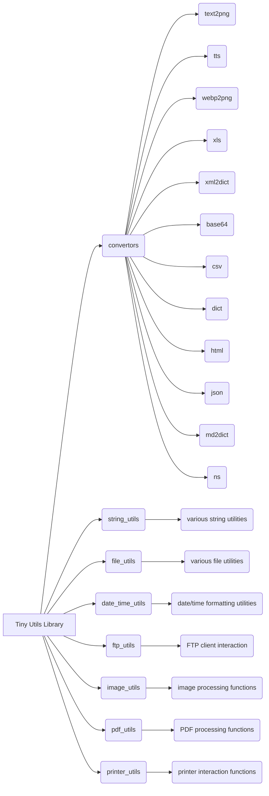

```MD
# Tiny Utils Code Explanation

## <input code>

```
# Tiny Utils
# ... (rest of the README file)
```

## <algorithm>

No algorithm is presented in the code. The code is a README file describing a Python library, `Tiny Utils`.  It outlines the modules and functionalities of the library, not the algorithms used within those modules.  The README provides high-level descriptions of how the library is organized and what tasks it supports.  It doesn't include the actual code implementing these functions.

## <mermaid>



**Dependencies Analysis:**

The mermaid diagram depicts the structure of the `Tiny Utils` library, showcasing the modules (`convertors`, `string_utils`, etc.) and their relationships.  Import statements are *not* present in this README file, thus no dependency analysis can be performed for this particular file content.  The dependencies would be found in the `requirements.txt` file (mentioned in the code).  The relationships shown are based on the high-level organization described in the README, indicating which sections of the library address specific tasks.

## <explanation>

The provided code is a README file, not executable code.  It describes a Python library called "Tiny Utils" and its various modules.  Analysis focuses on the structure and content of this documentation.


* **Imports:** No import statements are present in this README; the import statements for the library itself would be included in the `.py` files within the project. The dependencies (libraries it relies on) are documented in the `requirements.txt` file.


* **Classes:** No classes are defined in this README. The `.py` files of the library will define classes.


* **Functions:** No functions are defined in this README.  The `.py` files within the `Tiny Utils` library contain function definitions.


* **Variables:** No variables are declared. The `.py` files contain variables used in the functions and classes.


* **Potential Errors/Improvements:** This README could be enhanced by:
    * Providing more detailed descriptions of the use cases and examples for each utility function.
    * Including clear and concise documentation for each module and its functionality (including parameters, return values, and error handling).
    * Using code examples for the function usage directly in the README.


* **Relationships with Other Parts of the Project:**
    * The README links to a `requirements.txt` file, which lists the external libraries required by the `Tiny Utils` library.
    * It implies relationships between modules based on the outline of utilities.  For instance, the `convertors` module is likely connected to `file_utils` through the handling of different file formats.


**Overall:** This README is a good starting point for understanding the library structure. However, a much more comprehensive understanding of the library would require examining the actual code within the `.py` files and possibly associated test suites, which are not included in the provided snippet.