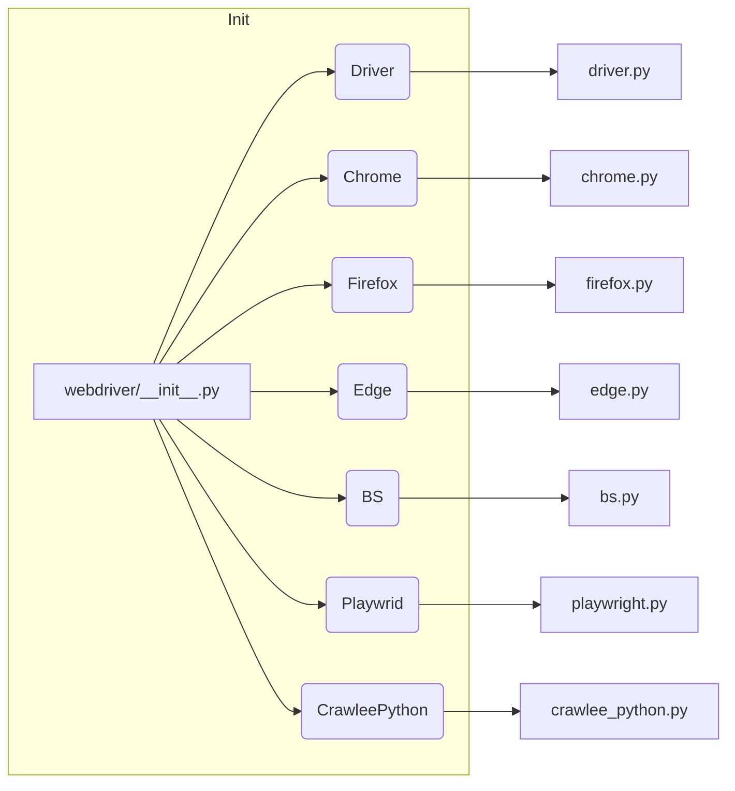

# <input code>

```python
## \file hypotez/src/webdriver/__init__.py
# -*- coding: utf-8 -*-\
#! venv/Scripts/python.exe
#! venv/bin/python/python3.12

"""
.. module: src.webdriver 
	:platform: Windows, Unix
	:synopsis:

"""
MODE = 'dev'


from .driver import Driver
from .chrome import Chrome
from .firefox import Firefox
from .edge import Edge
from .bs import BS
from .playwright import Playwrid
from .crawlee_python import CrawleePython
```

# <algorithm>

This Python file (`webdriver/__init__.py`) acts as a module initializer for the `webdriver` package.  It doesn't define any complex logic itself, but rather imports and exposes classes for different web driver implementations (Chrome, Firefox, Edge, etc.).

**Algorithm (Simplified):**

1. **Import:** The file imports classes from submodules within the `webdriver` package (e.g., `driver`, `chrome`, `firefox`).


# <mermaid>



**Dependency Analysis:**

The `webdriver/__init__.py` file acts as an import aggregator, pulling in classes from its submodules (`driver.py`, `chrome.py`, etc.).  The imports implicitly establish dependencies between the `webdriver` package and its internal components, indicating that the different driver types and the base `Driver` class are integral parts of this system.

# <explanation>

* **Imports:**
    * `from .driver import Driver`: Imports the `Driver` class from the `driver.py` module.  This is likely a base class or interface for all driver implementations, showcasing a potential Startegy for abstraction.
    * `from .chrome import Chrome`: Imports the `Chrome` class, presumably for interacting with the Chrome web browser.
    * Similar imports for `Firefox`, `Edge`, `BS` (likely for Beautiful Soup), `Playwrid` (presumably Playwright), `CrawleePython`.  These imports indicate the intended support for various web browser automation tools and potential data extraction libraries.
    * **Relationship with other `src.` packages:** These imports suggest that the `webdriver` package is part of a larger project (`hypotez`) within the `src` directory.  The precise relationships with other parts of the `hypotez` project aren't immediately apparent without examining the `driver.py`, `chrome.py`, etc. files.

* **Classes (Implicit):**
    * `Driver`:  A base class defining a common interface for interacting with web browsers.
    * `Chrome`, `Firefox`, `Edge`: Implementations of the `Driver` interface (or a similar abstraction) specific to the respective browsers.
    * `BS`: Likely the Beautiful Soup library for web scraping.
    * `Playwrid`: Likely Playwright browser automation library.
    * `CrawleePython`: Likely a custom class or module for web crawling.
    * **Interactions:**  The details of their interactions are not directly visible in this file.  The usage and interactions of these classes are defined within the `driver.py`, `chrome.py`, `firefox.py`, etc. files.

* **Functions (Implicit):**
    * No functions are defined within this `__init__.py` file.  The functions (and methods within the classes) for manipulating web browsers and interacting with them will exist in the imported submodule files.

* **Variables:**
    * `MODE = 'dev'`: A global variable presumably used for configuration settings (development mode). This could control the behavior of the webdriver components, such as logging or specific testing scenarios.

* **Potential Errors or Improvements:**
    * **Lack of Documentation:**  The docstrings are minimal, making it difficult to understand the exact purpose and intended usage of these classes in more detail.
    * **Error Handling:** The code doesn't show any error handling mechanisms, which could lead to unexpected behavior if something goes wrong during the interactions with the web drivers.
    * **Dependency Management:** The `venv` and shebang lines suggest use of virtual environments.  Best practices might include managing dependencies with a tool like `pip`.  This would enable better reproducibility and package compatibility.

* **Relationship with other parts of the project:**  This file forms a crucial part of the larger `hypotez` project by providing components for interacting with web browsers. The specific interactions and dependencies with other files and modules within the `hypotez` project need further investigation, examining `driver.py`, `chrome.py`, etc. to determine how these classes are used.