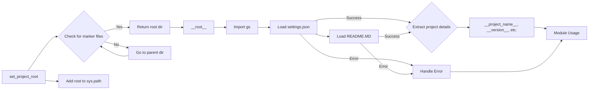

# Analysis of hypotez/src/webdriver/header.py

## <input code>

```python
## \file hypotez/src/webdriver/header.py
# -*- coding: utf-8 -*-\
#! venv/Scripts/python.exe
#! venv/bin/python/python3.12

"""
.. module: src.webdriver 
	:platform: Windows, Unix
	:synopsis:

"""
MODE = 'dev'

import sys
import json
from packaging.version import Version

from pathlib import Path
def set_project_root(marker_files=('pyproject.toml', 'requirements.txt', '.git')) -> Path:
    """ Finds the root directory of the project starting from the current file's directory,
    searching upwards and stopping at the first directory containing any of the marker files.

    Args:
        marker_files (tuple): Filenames or directory names to identify the project root.
    
    Returns:
        Path: Path to the root directory if found, otherwise the directory where the script is located.
    """
    __root__:Path
    current_path:Path = Path(__file__).resolve().parent
    __root__ = current_path
    for parent in [current_path] + list(current_path.parents):
        if any((parent / marker).exists() for marker in marker_files):
            __root__ = parent
            break
    if __root__ not in sys.path:
        sys.path.insert(0, str(__root__))
    return __root__


# Get the root directory of the project
__root__ = set_project_root()
"""__root__ (Path): Path to the root directory of the project"""

from src import gs

settings:dict = None
try:
    with open(gs.path.root / 'src' /  'settings.json', 'r') as settings_file:
        settings = json.load(settings_file)
except (FileNotFoundError, json.JSONDecodeError):
    ...

doc_str:str = None
try:
    with open(gs.path.root / 'src' /  'README.MD', 'r') as settings_file:
        doc_str = settings_file.read()
except (FileNotFoundError, json.JSONDecodeError):
    ...


__project_name__ = settings.get("project_name", 'hypotez') if settings  else 'hypotez'
__version__: str = settings.get("version", '')  if settings  else ''
__doc__: str = doc_str if doc_str else ''
__details__: str = ''
__author__: str = settings.get("author", '')  if settings else ''
__copyright__: str = settings.get("copyrihgnt", '')  if settings else ''
__cofee__: str = settings.get("cofee", "Treat the developer to a cup of coffee for boosting enthusiasm in development: https://boosty.to/hypo69")  if settings else "Treat the developer to a cup of coffee for boosting enthusiasm in development: https://boosty.to/hypo69"
```

## <algorithm>

**Step 1:** `set_project_root(marker_files)`
*   Input: A tuple of marker file names (e.g., `('pyproject.toml', 'requirements.txt', '.git')`).
*   Process: 
    1.  Start from the directory of the current file.
    2.  Iterate through parent directories until a directory contains any of the specified marker files.
    3.  If found, return the path to that directory.
    4.  If not found, return the path to the directory of the current file.
    5.  Add the root path to `sys.path` so that modules from the project can be imported.

**Step 2:** Initialization
*   Call `set_project_root` to determine project root.

**Step 3:** Loading Settings
*   Try to load settings from `gs.path.root / 'src' / 'settings.json'`.
*   Handle `FileNotFoundError` and `json.JSONDecodeError` if the file doesn't exist or has invalid JSON.

**Step 4:** Loading Documentation
*   Try to load documentation from `gs.path.root / 'src' / 'README.MD'`.
*   Handle `FileNotFoundError` and `json.JSONDecodeError` if the file doesn't exist or has an invalid format.

**Step 5:** Extracting Project Metadata
*   Extract `project_name`, `version`, `doc`, `author`, `copyright`, and `cofee` from the loaded `settings` dictionary.
*   Use default values if a key is missing or the settings are not loaded.


## <mermaid>



**Dependencies Analysis**:

*   `sys`, `json`, `packaging.version`: Standard Python libraries, used for system-level operations, handling JSON data, and versioning, respectively.
*   `pathlib`: For working with file paths in a platform-independent way.
*   `gs`: This import suggests a custom module (`gs`) from a package likely defining the `gs.path` object that handles paths within the project's structure.


## <explanation>

**Imports:**

*   `sys`: Provides access to system-specific parameters and functions, including the `sys.path` variable, which is crucial for finding modules.
*   `json`: For handling JSON data, used to load project settings from `settings.json`.
*   `packaging.version`: Provides tools for working with software versions.
*   `pathlib`: Provides an object-oriented way of working with paths.
*   `gs`: This is a custom module (likely in the `src` package) that likely provides utilities for path manipulation (`gs.path`), perhaps containing a class `gs.path`.

**Classes:**

*   There are no classes in this file.

**Functions:**

*   `set_project_root(marker_files)`:  This function takes a tuple of filenames or directory names as input. It locates the project root directory by starting from the current file's directory and checking its parent directories. It returns the path to the project root, adding it to `sys.path` to make the project's modules importable.

**Variables:**

*   `MODE`: A string, likely used for setting the development mode of the application.
*   `__root__`: A `Path` object representing the root directory of the project.
*   `settings`: A dictionary to store the project's settings loaded from `settings.json`.
*   `doc_str`: String storing the contents of the README.MD file, used for documentation.
*   `__project_name__`, `__version__`, `__doc__`, `__details__`, `__author__`, `__copyright__`, `__cofee__`:  These variables store the project's metadata, retrieved from the `settings` dictionary. They use default values if the settings are not loaded or a key is missing.

**Potential Errors/Improvements:**

*   Error handling is good in the `settings` and `README` loading. Consider using a more descriptive exception type to help with debugging, like `ProjectSettingsError`.
*   Error Handling: The code uses `...` to skip error handling in `try...except` blocks. This could indicate a missing or incomplete error handling Startegy. A better way would be to log an error, or take a corrective action.

**Relationships with Other Parts:**

*   The code relies on the `gs` module, specifically the `gs.path` object, to access the project's root directory.  This indicates a dependency on another part of the project (`src`). The settings are stored in a `settings.json` file, and it looks like the project structure is designed to support loading settings and other relevant data.
*   The code assumes the existence of a `settings.json` file and `README.MD` within the project's root structure.


```