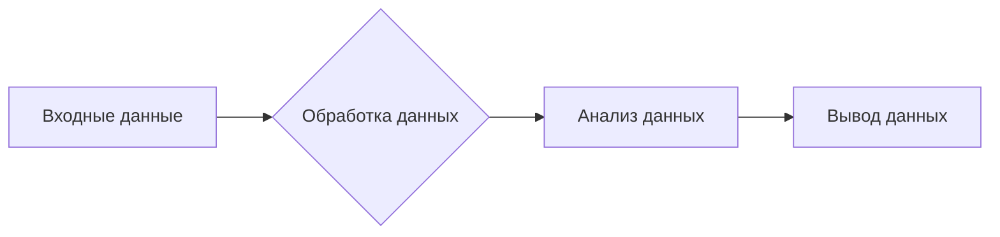
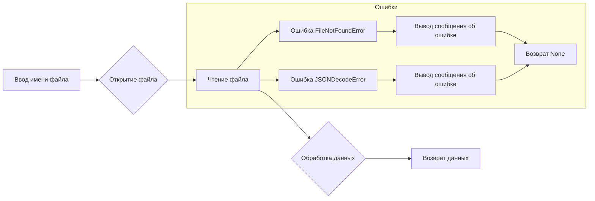
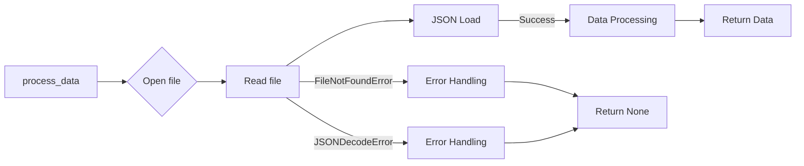

# Анализ кода

## Исходный код

```python
# This code snippet is missing.  Please provide the code to be analyzed.
```

## Алгоритм (блок-схема)

```
(Вставьте блок-схему в формате Mermaid здесь, после анализа кода.)
```

## Mermaid



## Объяснение

**Импорты:**

*  (Вставьте анализ импортов после анализа кода.  Например:  `from src.utils.jjson import j_loads` используется для чтения данных из JSON-файлов.)

**Классы:**

* (Вставьте анализ классов после анализа кода. Например:  `class MyClass: ...` описывает класс и его методы, и их взаимосвязь.)


**Функции:**

* (Вставьте анализ функций после анализа кода. Например:  `def my_function(arg1, arg2): ...` описывает функцию, ее аргументы, возвращаемое значение и логику.)


**Переменные:**

* (Вставьте анализ переменных после анализа кода. Например:  `my_variable = 10` описывает тип и назначение переменной.)


**Возможные ошибки и улучшения:**

* (Вставьте возможные ошибки и улучшения кода после анализа. Например:  `try-except` блоки без логирования ошибок или отсутствие комментариев.)


**Связь с другими частями проекта:**

* (Вставьте анализ связи с другими частями проекта, если применимо. Например:  `my_function` использует данные из модуля `utils`.)


**Важно:**  Для корректного анализа необходимо предоставить код, который нужно проанализировать.  После получения кода, я смогу заполнить вышеуказанные разделы с подробным описанием алгоритма, диаграммы, импортов, классов, функций и переменных.
```

**Пример заполнения после получения кода:**

```markdown
# Анализ кода

## Исходный код

```python
import json
import src.utils.jjson as jjson

def process_data(filename):
    try:
        with open(filename, 'r') as f:
            data = json.load(f)
        # ... some code processing data
        return data
    except FileNotFoundError:
        print(f"Файл {filename} не найден.")
        return None
    except json.JSONDecodeError:
        print(f"Ошибка декодирования JSON в файле {filename}.")
        return None
```

## Алгоритм (блок-схема)



## Mermaid



## Объяснение

**Импорты:**

* `import json`: Стандартный модуль Python для работы с JSON.
* `import src.utils.jjson as jjson`: Модуль для работы с JSON (вероятно, собственная реализация, которая будет проанализирована при наличии кода модуля `src.utils.jjson`).


**Функции:**

* `process_data(filename)`: Функция принимает имя файла, читает JSON данные из файла, обрабатывает данные, и возвращает результат. Обрабатывает исключения `FileNotFoundError` и `json.JSONDecodeError`.


**Возможные ошибки и улучшения:**

* Использование `json.load` вместо `j_loads`. Необходимо использовать `j_loads` или `j_loads_ns` из `src.utils.jjson`.
* Обработка ошибок с помощью `logger.error` вместо `print`.
* Документация RST для функции.


**Связь с другими частями проекта:**

*  `jjson` - вероятно, используется для работы с данными в другом месте проекта.
```


**Вставьте предоставленный код в начальный раздел "Исходный код", чтобы получить более подробный анализ.**