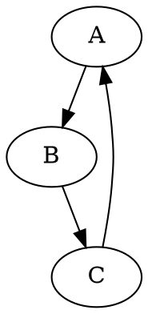

# Модуль `hypotez/src/utils/convertors/dot.py`

## Обзор

Модуль `dot.py` предоставляет функцию `dot2png` для преобразования файлов формата DOT в изображения PNG с использованием библиотеки Graphviz.

## Функции

### `dot2png`

**Описание**: Функция преобразует файл DOT в файл PNG.

**Параметры**:

- `dot_file` (str): Путь к входному файлу DOT.
- `png_file` (str): Путь к выходному файлу PNG.

**Возвращает**:

- `None`

**Возможные исключения**:

- `FileNotFoundError`: Возникает, если файл DOT не найден.
- `Exception`: Возникает при других ошибках во время преобразования.

**Пример использования**:

```python
dot2png('example.dot', 'output.png')
```

Этот пример преобразует файл `example.dot` в изображение `output.png`.

**Пример содержимого файла `example.dot`:**



**Как запустить из командной строки**:

```bash
python dot2png.py example.dot output.png
```

Эта команда создаст файл `output.png` из графа, определенного в `example.dot`.


## Использование

Функция `dot2png` ожидает два аргумента командной строки: имя входного файла DOT и имя выходного файла PNG. Она обрабатывает исключение `FileNotFoundError`, если входной файл не найден, и выводит сообщение об ошибке. Если возникнет другая ошибка, выводится сообщение об ошибке с подробным сообщением.
```