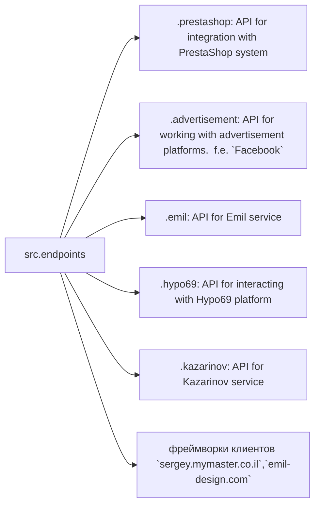

# Модуль конечных точек взаимодействия с потребителями данных

## Обзор

Модуль `endpoints` предоставляет реализацию API для взаимодействия с потребителями данных.  
Каждая поддиректория представляет собой отдельный модуль, реализующий API для определённого сервиса.  
Модуль `endpoints` включает подмодули для интеграции с различными системами потребителей,  
обеспечивая взаимодействие с внешними сервисами.

## Структура модуля



### Конечные точки для потребителей

# 1. **PrestaShop**
Интеграция с API PrestaShop. Использует стандартные api.

# 2. **Bots**
Подмодуль для управления интеграцией с ботами Telegram и Discord.

# 3. **Emil**
Подмодуль для интеграции с клиентом  https://emil-design.com (prestashop + facebook).

# 4. **Kazarinov**
Подмодуль для интеграции с поставщиком данных Kazarinov. (pricelist creator, facebook promotion)

## Описание модулей

### `prestashop`

**Описание**: Модуль предназначен для интеграции с системой электронной коммерции PrestaShop. Реализует функционал взаимодействия с заказами, товарами и клиентами.

**Основные функции**:
* Создание, редактирование и удаление товаров.
* Управление заказами и пользователями.


### `advertisement`

**Описание**: Модуль предоставляет API для управления рекламными платформами, включая создание кампаний и аналитические отчеты.

**Основные функции**:
* Управление рекламными кампаниями.
* Сбор и обработка данных аналитики.


### `emil`

**Описание**: Интерфейс для работы с сервисом Emil, предоставляющим API для обмена данными.

**Основные функции**:
* Обработка и отправка запросов в сервис.
* Сбор данных из API Emil.


### `hypo69`

**Описание**: API для взаимодействия с платформой Hypo69, предоставляющей специфические бизнес-решения.

**Основные функции**:
* Получение данных о клиентах.
* Работа с пользовательскими отчетами.


### `kazarinov`

**Описание**: Модуль для интеграции с сервисом Kazarinov. Поддерживает функционал аналитики и обмена данными.

**Основные функции**:
* Интеграция данных между системами.
* Создание отчетов и аналитика.


## Установка и использование

### Установка

Для начала работы убедитесь, что установлены все зависимости проекта. Используйте команду:

```bash
pip install -r requirements.txt
```

### Использование

Импортируйте нужный модуль в своем коде:

```python
from src.endpoints.prestashop import PrestashopAPI
from src.endpoints.advertisement import AdvertisementAPI
```

Далее настройте и используйте методы в зависимости от вашего кейса.


## Вклад в разработку

Если вы хотите внести изменения в модуль, соблюдайте следующие правила:

1. Используйте [PEP 8](https://peps.python.org/pep-0008/) для стиля кода.
2. Добавляйте тесты для нового функционала.
3. Оставляйте подробные комментарии к изменениям.

Для вопросов и предложений обращайтесь к владельцу репозитория или оставляйте комментарии в [Issues](#).