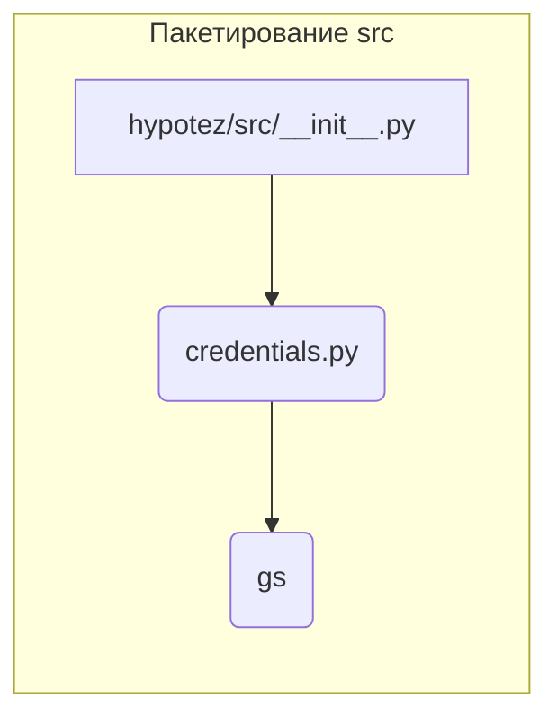

# <input code>

```python
## \file hypotez/src/__init__.py
# -*- coding: utf-8 -*-\
#! venv/Scripts/python.exe
#! venv/bin/python/python3.12

"""
.. module: src 
	:platform: Windows, Unix
	:synopsis:

Root of the project.
========================================================================================

This module provides a structured overview of various modules within the project,
detailing their primary functionalities and roles.

Usage Example
--------------------

.. code-block:: python

    # No usage example available for this module.
"""
MODE = 'dev'

from .credentials import gs
```

# <algorithm>

Этот файл `__init__.py` является инициализатором пакета `src`.  Он не содержит сложных алгоритмов, а скорее служит для импорта других модулей внутри пакета `src`. Алгоритм прост:

1. Импортирует модуль `gs` из подмодуля `credentials`.


# <mermaid>



# <explanation>

* **Импорты**: Файл `__init__.py` в директории `hypotez/src` импортирует модуль `gs` из подмодуля `credentials`. Это означает, что код, находящийся в файле `hypotez/src/credentials.py`, доступен для использования в любом другом модуле пакета `src`.  В данном случае `gs` вероятно содержит конфигурационные данные или настройки, связанные с Google Cloud Storage (или другими сервисами).  Связь с другими частями проекта:  `credentials.py` хранит данные, которые используются, вероятно, для взаимодействия с внешними системами (например, API Google Cloud).

* **Классы**: Нет классов.

* **Функции**: Нет функций.

* **Переменные**: `MODE = 'dev'`:  Переменная, вероятно, определяет режим работы (например, режим разработки `dev` или производство `prod`).  Это может использоваться для динамической загрузки разных конфигураций.

* **Возможные ошибки или области для улучшений**:  Нет явных ошибок.  Можно было бы добавить документирование в `__init__.py`, поясняя назначение модуля `src` и импортированных элементов.  Было бы полезно, если бы `credentials.py` или другой модуль, содержащий определение `gs`, был проанализирован, чтобы понять точное значение переменной `gs`.  Отсутствие примеров использования в документации может означать, что этот модуль предназначен для внутренней инициализации, и вызывающие его классы будут находиться в других частях приложения.

**Цепочка взаимосвязей с другими частями проекта**:

Этот файл `__init__.py` является точкой входа для других модулей внутри пакета `hypotez/src`. Он импортирует необходимые компоненты, обеспечивая доступ к их функциональности для других частей проекта. Проект, вероятно, содержит другие файлы (например, `app.py`, `main.py`), которые используют определения из `src/__init__.py` и `src/credentials.py`.  Полное понимание проекта требует анализа этих связанных файлов.