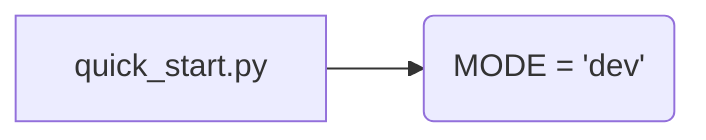

# <input code>

```python
## \file hypotez/src/_examples/quick_start.py
# -*- coding: utf-8 -*-\
#! venv/Scripts/python.exe
#! venv/bin/python/python3.12

"""
.. module: src._examples 
	:platform: Windows, Unix
	:synopsis:

"""
MODE = 'dev'

"""
	:platform: Windows, Unix
	:synopsis:

"""


"""
	:platform: Windows, Unix
	:synopsis:

"""


"""
  :platform: Windows, Unix

"""
"""
  :platform: Windows, Unix
  :platform: Windows, Unix
  :synopsis:
"""MODE = 'dev'
  
""" module: src._examples """


""" Quick start to `hypotez`

"""
```

# <algorithm>

К сожалению, предоставленный код не содержит исполняемого алгоритма. Он состоит из пустых строк, комментариев и документации.  Алгоритм не может быть описан в виде блок-схемы, так как нет операций и вычислений.

# <mermaid>



# <explanation>

Код представляет собой Python-файл `quick_start.py` в подпапке `_examples` внутри пакета `hypotez/src`.  Он не содержит функционального кода, а состоит в основном из комментариев и документационных строк.

* **Импорты:** Нет импортируемых библиотек или модулей.

* **Классы:** Нет определенных классов.

* **Функции:** Нет определенных функций.

* **Переменные:** Единственная переменная `MODE` имеет строковое значение 'dev'.  Ее значение не используется в коде.

* **Возможные ошибки или области для улучшения:**  Самый очевидный недостаток – отсутствие реального функционала.  Файл пуст, кроме метаданных, и не выполняет никаких действий.  Необходимо добавить код, который будет представлять собой функциональный алгоритм.  Комментарии должны быть сосредоточены на описании функционирования логики.


**Взаимосвязи с другими частями проекта:** Невозможно определить взаимосвязь с другими частями проекта без контекста.  Файл `quick_start.py` может быть частью более крупного проекта `hypotez`, но его роль без кода не определена.  Для анализа потребуется доступ к остальным файлам проекта.