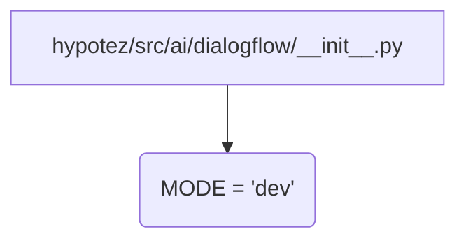

```MD
1. <input code>
```python
## \file hypotez/src/ai/dialogflow/__init__.py
# -*- coding: utf-8 -*-\
#! venv/Scripts/python.exe
#! venv/bin/python/python3.12

"""
.. module: src.ai.dialogflow 
	:platform: Windows, Unix
	:synopsis:

"""
MODE = 'dev'

"""
	:platform: Windows, Unix
	:synopsis:

"""


"""
	:platform: Windows, Unix
	:synopsis:

"""


"""
  :platform: Windows, Unix

"""
"""
  :platform: Windows, Unix
  :platform: Windows, Unix
  :synopsis:
"""MODE = 'dev'
  
""" module: src.ai.dialogflow """

""" HERE SHOULD BE A DESCRIPTION OF THE MODULE OPERATION ! 
https://habr.com/ru/articles/346606/
"""
```

2. <algorithm>
В данном файле нет алгоритма в виде последовательных шагов и обработки данных. Это скорее заготовка или пустой модуль, предназначенный для будущего добавления кода.  Файл содержит:
- описание документации (`"""Docstrings"""`),
- определение переменной `MODE = 'dev'`.


3. <mermaid>


4. <explanation>
- **Импорты**: В коде отсутствуют импорты. Это пустой модуль.  Связь с другими частями проекта определяется только в будущем, когда будут добавлены необходимые импорты и логика обработки.

- **Классы**: Нет классов.

- **Функции**: Нет функций.

- **Переменные**: `MODE = 'dev'`: Строковая константа, вероятно, определяющая режим работы (например, разработка `dev`, производство `prod`).  Значение 'dev' может быть использовано для настройки различных аспектов приложения, например, выбора протокола связи или уровня ведения журналов.

- **Возможные ошибки или области для улучшений**:
    - Отсутствует функциональность. Необходима реализация алгоритма диалогового взаимодействия с Dialogflow.
    - Не хватает описания. `"""HERE SHOULD BE A DESCRIPTION OF THE MODULE OPERATION !"""` требует заполнения.
    - Двойное определение `MODE = 'dev'`: В коде присутствует одна строка с `MODE = 'dev'` несколько раз.  Необходимо или удалить лишние определения, или, что более предпочтительно, сделать эту переменную глобальной константой.
    - Не хватает подключений к другим частям проекта.  Без импортов и функций, нет способа взаимодействовать с другими модулями или классами в проекте.

**Цепочка взаимосвязей с другими частями проекта**:

Файл `hypotez/src/ai/dialogflow/__init__.py`  будет взаимодействовать с другими частями проекта, когда в нем будет определена логика взаимодействия с Dialogflow. Это может быть подключение к API Dialogflow, обработка ответов от Dialogflow, взаимодействие с другими сервисами (например, база данных) и т. д. Без кода пока нет конкретной цепочки.   Связь будет определяться импортами, вызовами функций из других файлов и логикой работы.