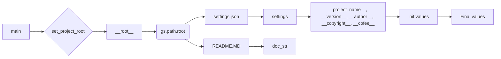

# <input code>

```python
## \file hypotez/src/ai/dialogflow/header.py
# -*- coding: utf-8 -*-
#! venv/Scripts/python.exe
#! venv/bin/python/python3.12

"""
.. module: src.ai.dialogflow 
	:platform: Windows, Unix
	:synopsis:

"""
MODE = 'dev'

"""
	:platform: Windows, Unix
	:synopsis:

"""


"""
	:platform: Windows, Unix
	:synopsis: Модуль определяющий корневой путь к проекту. Все импорты строятся относительно этого пути.
    :TODO: В дальнейшем перенести в системную переменную

"""

import sys
import json
from packaging.version import Version

from pathlib import Path
def set_project_root(marker_files=('pyproject.toml', 'requirements.txt', '.git')) -> Path:
    """
    Finds the root directory of the project starting from the current file's directory,
    searching upwards and stopping at the first directory containing any of the marker files.

    Args:
        marker_files (tuple): Filenames or directory names to identify the project root.
    
    Returns:
        Path: Path to the root directory if found, otherwise the directory where the script is located.
    """
    __root__:Path
    current_path:Path = Path(__file__).resolve().parent
    __root__ = current_path
    for parent in [current_path] + list(current_path.parents):
        if any((parent / marker).exists() for marker in marker_files):
            __root__ = parent
            break
    if __root__ not in sys.path:
        sys.path.insert(0, str(__root__))
    return __root__


# Get the root directory of the project
__root__ = set_project_root()
"""__root__ (Path): Path to the root directory of the project"""

from src import gs

settings:dict = None
try:
    with open(gs.path.root / 'src' /  'settings.json', 'r') as settings_file:
        settings = json.load(settings_file)
except (FileNotFoundError, json.JSONDecodeError):
    ...

doc_str:str = None
try:
    with open(gs.path.root / 'src' /  'README.MD', 'r') as settings_file:
        doc_str = settings_file.read()
except (FileNotFoundError, json.JSONDecodeError):
    ...


__project_name__ = settings.get("project_name", 'hypotez') if settings  else 'hypotez'
__version__: str = settings.get("version", '')  if settings  else ''
__doc__: str = doc_str if doc_str else ''
__details__: str = ''
__author__: str = settings.get("author", '')  if settings  else ''
__copyright__: str = settings.get("copyrihgnt", '')  if settings  else ''
__cofee__: str = settings.get("cofee", "Treat the developer to a cup of coffee for boosting enthusiasm in development: https://boosty.to/hypo69")  if settings  else "Treat the developer to a cup of coffee for boosting enthusiasm in development: https://boosty.to/hypo69"
```

# <algorithm>

**Шаг 1:** Импорты.
- Импортируются необходимые модули: `sys`, `json`, `Version` из `packaging.version`, `Path` из `pathlib`.
- Импортируется `gs` из `src`.

**Шаг 2:** Функция `set_project_root`.
- Принимает кортеж `marker_files` (спискок файлов, по которым определяется корень проекта).
- Начинает поиск корня проекта от текущего файла (`__file__`) вверх по файловой системе.
- Проверяет наличие каждого файла из `marker_files` в каждом родительском каталоге.
- Если найден каталог, содержащий хоть один файл из `marker_files`, функция возвращает путь к этому каталогу.
- Если каталог не найден, возвращает путь к текущей директории.
- Добавляет корневой путь в `sys.path`, если он ещё там не присутствует, для корректного импорта модулей из `src`.

**Шаг 3:** Получение корневого пути.
- Вызывается функция `set_project_root` для получения корневого пути к проекту.
- Результат сохраняется в переменной `__root__`.

**Шаг 4:** Чтение настроек.
- Используя `gs.path.root` (предположительно, из модуля `gs`, который импортирован выше), пытается открыть файл 'settings.json' в корне проекта.
- Если файл найден и парсится без ошибок, то данные загружаются в переменную `settings`.
- Если файл не найден или имеет неправильный формат, переменная `settings` остаётся None.

**Шаг 5:** Чтение документации.
- Аналогично, пытается открыть файл 'README.MD' в корне проекта, читает его содержимое, если удалось, сохраняет в `doc_str`.
- Если файл не найден или имеет неправильный формат, переменная `doc_str` остаётся None.

**Шаг 6:** Получение метаданных.
- Получает значения из словаря `settings` с помощью метода `get()`, используя значения по умолчанию в случае отсутствия ключа.
- Присваивает значения переменным, определяющим имя проекта, версию, описание и др.

# <mermaid>



**Описание:**
- `main` – точка входа в скрипт.
- `set_project_root` – находит корень проекта.
- `__root__` – хранит путь к корню проекта.
- `gs.path.root` – путь к корню проекта, вероятно, из вспомогательного модуля `gs`.
- `settings.json`, `README.MD` – файлы, содержащие настройки и описание проекта, соответственно.
- `settings` – словарь, содержащий настройки проекта.
- `doc_str` – строка с содержимым файла `README.MD`.
- `__project_name__`, `__version__`, `__author__`, `__copyright__`, `__cofee__` – переменные, содержащие метаданные, полученные из настроек.
- `init values` - начальные значения для метаданных.
- `Final values` -  завершающие значения метаданных после обработки.


# <explanation>

**Импорты:**

- `sys`: используется для доступа к системным переменным, в том числе для добавления пути к корневой директории проекта в `sys.path`, что важно для корректного импорта модулей.
- `json`: используется для работы с файлом настроек `settings.json`.
- `packaging.version.Version`: нужен для работы с версиями пакетов. В этом коде он не используется.
- `pathlib.Path`: предоставляет удобный способ работы с путями к файлам и каталогам.
- `src.gs`: импортируется модуль `gs`, который, судя по имени, содержит функции для работы с файлами и каталогами проекта.

**Функции:**

- `set_project_root(marker_files)`: находит корневую директорию проекта. Она принимает кортеж файлов, которые должны присутствовать в корне проекта, и возвращает объект `Path` с путем к корню. Важно, что функция добавляет найденный путь в `sys.path`, это позволяет import'ить модули из директорий, находящихся выше текущей директории.

**Переменные:**

- `__root__`: хранит путь к корню проекта, полученный из функции `set_project_root`.
- `settings`: словарь, содержащий данные из `settings.json`
- `doc_str`: строка, содержащая содержимое файла README.MD.
- `__project_name__`, `__version__`, `__author__`, `__copyright__`, `__cofee__`: переменные содержащие значения из `settings.json` или значения по умолчанию.


**Возможные ошибки и улучшения:**

- **Обработка ошибок:** Блок `try...except` при чтении `settings.json` и `README.MD` обрабатывает `FileNotFoundError` и `json.JSONDecodeError`, что важно для устойчивости кода.

- **Переменные с двойным подчеркиванием:** Использование переменных с двойным подчеркиванием (`__root__`, `__project_name__`, etc.) в качестве глобальных переменных в файле, скорее всего, указывает на потенциальную проблему в архитектуре приложения. Лучше использовать обычные имена переменных.

- **Модуль `gs`:** Необходимо понимать назначение и использование `gs.path.root`, чтобы оценить зависимость от него. Без понимания внутренней логики `gs` трудно дать рекомендации по улучшению.

- **Отсутствие валидации:** Необходимо валидировать данные, получаемые из `settings.json`, чтобы избежать непредсказуемого поведения.

- **Константы:** Использование строки `MODE = 'dev'` выглядит как константа.  Лучше определить это как константу `MODE_DEV = 'dev'`.


В целом, код организован хорошо, в нем используется функция для нахождения корня проекта, что улучшает структуру и позволяет использовать код в разных частях проекта.  Однако необходимо лучше понять роль модуля `gs`, чтобы проанализировать полную функциональность и взаимосвязи с другими частями проекта.