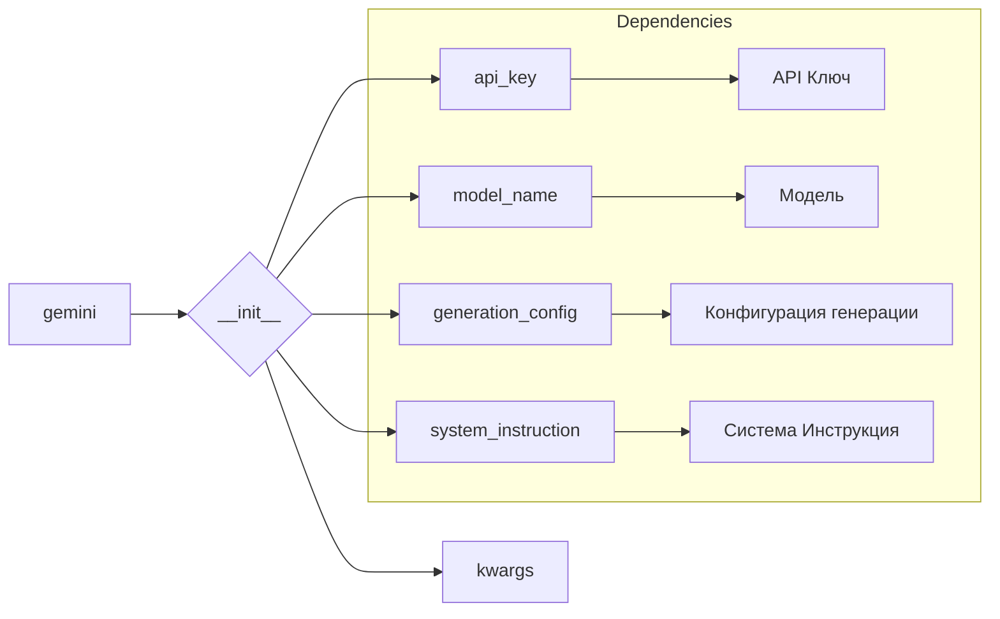

# Анализ кода класса `gemini`

## <input code>

```python
# Модель `gemini`.

## system_instruction 
Указание (промт, `prompt`), которое передется в модель при инициализации 
и будет верным на все время инстанса.
Не может быть изменено в инстанса 
```python
    def __init__(self, 
                 api_key: str, 
                 model_name: Optional[str] = None, 
                 generation_config: Optional[Dict] = None, 
                 system_instruction: Optional[str] = None, 
                 **kwargs):
        ...
```

## <algorithm>

Блок-схема отсутствует, так как предоставлен только фрагмент кода метода `__init__`.  Для построения блок-схемы необходим весь код метода.  Предполагается, что метод `__init__` инициализирует объекты класса `gemini`, принимая на вход различные параметры.

## <mermaid>



**Объяснение к диаграмме:**

Диаграмма показывает, что класс `gemini` инициализируется методом `__init__`, принимающим различные параметры, включая API-ключ, имя модели, конфигурацию генерации, системную инструкцию и другие ключевые параметры (`kwargs`).  Связи с другими компонентами (API-ключ, модель, конфигурация генерации, системная инструкция) показаны в поддиаграмме "Dependencies".  Предполагается, что данные параметры используются для взаимодействия с внешними сервисами или настройкой поведения модели.

## <explanation>

**Импорты:**

Фрагмент кода не содержит импортов.  Полный код необходим, чтобы определить, какие пакеты импортируются и как они связаны с другими частями проекта.

**Классы:**

Код описывает класс `gemini`.  Из фрагмента видно, что класс `gemini` имеет метод `__init__`, который принимает различные параметры.  Этот метод, предположительно, инициализирует внутренние состояния класса, такие как API-ключ, имя модели и системные инструкции.

**Функции:**

В данном фрагменте показан только метод `__init__`.  Для полного понимания функциональности необходим весь код.

**Переменные:**

Из фрагмента можно выделить следующие переменные: `api_key`, `model_name`, `generation_config`, `system_instruction`, `kwargs`.  Их типы явно указаны в аннотациях типов (например, `api_key: str`).  Переменные, вероятно, используются для хранения данных, необходимых для работы модели `gemini`.

**Возможные ошибки или области для улучшений:**

- Отсутствует информация о полном функционале класса.
- Нет информации о том, как эти параметры используются внутри класса.
- Не описано, как класс взаимодействует с другими компонентами проекта, например, с системами API или другими моделями.
- Необходимо определить, какие классы (если таковые существуют) используют этот класс `gemini` и как они взаимодействуют с ним.


**Цепочка взаимосвязей с другими частями проекта:**

Из комментариев понятно, что `gemini` взаимодействует с различными инструкциями (system_instruction, command_instruction), хранящимися в `src/ai/prompts` и `instruction` у клиентов, а также с серверными end-points (`src.endpoints`).  Для построения полной цепочки необходимо изучить структуру папок `src/ai/prompts`, `instruction`, и `src.endpoints`.