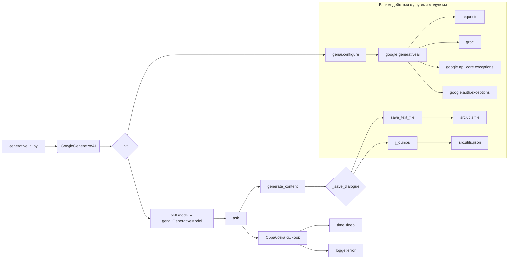

```MD
# <input code>

```python
## \file hypotez/src/ai/gemini/generative_ai.py
# -*- coding: utf-8 -*-
#! venv/Scripts/python.exe
#! venv/bin/python/python3.12

"""
.. module:: src.ai.gemini
   :platform: Windows, Unix
   :synopsis: Google generative AI integration
"""

MODE = 'dev'
import time
import json
from pathlib import Path
from datetime import datetime
from typing import Optional, Dict
from types import SimpleNamespace
import base64

import google.generativeai as genai
import requests

from grpc import RpcError
from google.api_core.exceptions import (
    GatewayTimeout,
    ServiceUnavailable,
    ResourceExhausted,
    InvalidArgument,
)
from google.auth.exceptions import DefaultCredentialsError, RefreshError
from src.logger import logger
from src import gs
from src.utils import pprint
from src.utils.file import read_text_file, save_text_file
from src.utils.date_time import TimeoutCheck
from src.utils.convertors.unicode import decode_unicode_escape
from src.utils.jjson import j_loads, j_loads_ns, j_dumps

timeout_check = TimeoutCheck()

class GoogleGenerativeAI:
    """
    Класс для взаимодействия с моделями Google Generative AI.
    """
    # ... (остальная часть кода)
```

# <algorithm>

**Шаг 1: Инициализация класса GoogleGenerativeAI.**

* Входные данные: `api_key`, `model_name` (опционально), `generation_config` (опционально), `system_instruction` (опционально).
* Действия: Устанавливает `api_key`, `model_name`, `generation_config`, `system_instruction`.  Формирует пути для логирования диалогов (`dialogue_log_path`, `dialogue_txt_path`) и истории (`history_dir`, `history_txt_file`, `history_json_file`). Инициализирует модель `genai.GenerativeModel` с заданными параметрами.
* Выходные данные: Экземпляр класса `GoogleGenerativeAI` с настроенными параметрами.

**Шаг 2: Отправка запроса `ask`.**

* Входные данные: `q` (запрос), `attempts` (количество попыток).
* Действия: Цикл с количеством итераций `attempts`.  Внутри цикла:
    * Попытка отправить запрос `generate_content` модели.
    * Обработка ошибок (исключений `requests.exceptions.RequestException`, `GatewayTimeout`, `ServiceUnavailable`, `ResourceExhausted`, `DefaultCredentialsError`, `RefreshError`, `ValueError`, `TypeError`, `InvalidArgument`, `RpcError`, `Exception`).  В случае ошибки, вывод лога и пауза (экспоненциальный бэк-офф).
    * Сохранение ответа в `dialogue` и возвращение ответа.
* Выходные данные: Текстовый ответ модели (`response.text`) или `None` в случае ошибки.


**Шаг 3: Сохранение диалога (`_save_dialogue`).**

* Входные данные: `dialogue` (список сообщений).
* Действия: Сохраняет диалог в текстовый файл (`self.history_txt_file`) и JSON файл (`self.history_json_file`).
* Выходные данные:  Ничего не возвращает.

**Шаг 4:  Методы `start_chat`, `chat`, `describe_image` (не реализованы).**

Эти методы не представлены в описанном алгоритме подробно, но по имеющемуся коду можно сделать предположения о последовательности действий, которые они выполняют.  `start_chat`, например, инициализирует чат, а `chat` и `describe_image` направлены на выполнение определенных задач.


# <mermaid>



# <explanation>

**Импорты:**

* `google.generativeai`:  Библиотека для взаимодействия с API Google Generative AI.
* `requests`:  Для выполнения HTTP-запросов (например, к Google API).
* `grpc`:  Библиотека для использования gRPC (распределенный вызов процедур).
* `google.api_core.exceptions`:  Обработка исключений Google Cloud Platform.
* `google.auth.exceptions`: Обработка исключений связанных с аутентификацией.
* `src.logger`: Модуль для логирования, вероятно, частью вашей собственной структуры проекта.
* `src.gs`:  Вероятно, содержит вспомогательные функции для работы с Google Cloud Storage.
* `src.utils`:  Папка с утилитами, которые используются в проекте.
* `src.utils.file`, `src.utils.date_time`, `src.utils.convertors.unicode`, `src.utils.jjson`: Вспомогательные функции для работы с файлами, временем, преобразованием строк и JSON соответственно, вероятно частью пакета `src.utils`.
* `time`, `json`, `pathlib`, `datetime`, `typing`, `types`, `base64`: Стандартные библиотеки Python.

**Классы:**

* `GoogleGenerativeAI`: Класс для взаимодействия с моделями Google Generative AI.  Атрибуты хранят ключи API, название модели, конфигурацию генерации, пути к файлам логов и истории, саму модель, и системную инструкцию.  Методы `ask`, `_save_dialogue`, `describe_image` предоставляют интерфейс для работы с моделью.

**Функции:**

* `__init__`: Конструктор класса, настраивает модель GoogleGenerativeAI.
* `__post_init__`:  Настраивает модель после создания экземпляра.  Это важно, если `api_key` был задан позже.
* `config`: Возвращает конфигурацию из файла `generative_ai.json`
* `ask`: Отправляет запрос модели и обрабатывает ответы и ошибки.  Обрабатывает различные исключения и применяет экспоненциальный бэк-офф для повторных попыток.
* `_save_dialogue`: Сохраняет диалог в текстовые и JSON файлы.
* `describe_image`: Отправляет изображение модели для анализа.

**Переменные:**

* `MODE`:  Переменная, хранящая текущий режим работы (в данном случае "dev").
* `timeout_check`: Объект для контроля таймаутов.


**Возможные ошибки и улучшения:**

* **Обработка ошибок:** Код хорошо обрабатывает различные исключения, но можно добавить более подробные сообщения об ошибках или улучшить логирование.  Возможно, лучше было бы использовать отдельный класс для исключений, чтобы выделить этот функционал.
* **Параметризация:**  Можно было бы сделать конфигурацию (например, пути к файлам истории и логов) параметризуемой, чтобы не привязываться к жёстким путям.
* **Максимальное количество попыток:**  Фиксированное количество попыток (`attempts`) в `ask` может быть недостаточно.  Необходимо подумать о более гибком и адаптируемом под условия подключении.
* **Управление ресурсами:** Если используется ресурс (например, API-ключ), то стоит предусмотреть механизм освобождения ресурсов (например, при выходе из программы или при длительном отсутствии ответа).
* **Пути к файлам:** Пути к файлам (`dialogue_txt_path`, `history_dir` и т.д.)  можно считывать из файла конфигурации, чтобы избежать жестко заданных констант.
* **Документация:** Добавьте более подробную документацию к методам и классам для лучшего понимания их функциональности.

**Связь с другими частями проекта:**

* `src.logger`, `gs`, `src.utils` и `src.utils.*` являются частью общей структуры проекта.  Они предоставляют вспомогательные функции для работы с логами, Google Cloud Storage, и различными утилитами, используемыми в программе.  Это указывает на структурированную разработку с выделением задач и модулей.


**Общий комментарий:**  Код хорошо организован, с подробной документацией и обработкой исключений.  Он демонстрирует подход, ориентированный на обработку ошибок при взаимодействии с внешними сервисами (API Google).